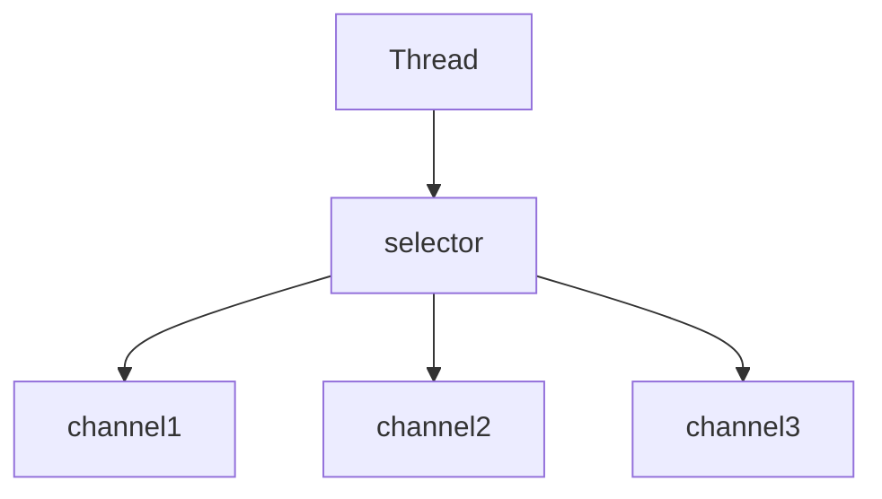

## NIO

>   Nio为non-blocking IO (非阻塞IO) 或New IO

### 三大组件

#### Channel

channel类似于stream，它是读写数据的双向通道，可以从channel降数据读入到buffer,也可以将buffer中的数据写入channel，而stream要么只能输入要么只能输出，channel比stream更底层

常见channel

-   FileChannel
-   DatagramChannel
-   SocketChannel
-   ServerSocketChannel

#### Buffer

buffer用于缓冲读写数据，常见buffer有

-   ByteBuffer
    -   MappedByteBuffer
    -   DirectByteBuffer
    -   HeapByteBuffer
-   ShortBuffer
-   IntBuffer
-   LongBugger
-   FloatBuffer
-   DoubleBuffer
-   CharBuffer

#### Selector

##### 服务器设计-多线程版设计

每个线程和socket一一对应，每个socket都需要一个线程来处理

缺点：

-   内存占用高
-   线程多导致线程上下文切换成本高
-   只适合连接时较少的场景，连接数多的时候会导致需要同时创建很多线程

##### 服务器设计-线程池版设计

每个线程可以重复使用，用来处理多个socket链接，不需要创建更多的线程

缺点：

-   阻塞模式下，一个线程只能处理一个socket连接
-   仅使用和短连接的场景，

#### 服务器设计-selector版

selector的作用就是配合一个现成来管理多个channel，获取这些channel上发生的事件，这些channel工作在非阻塞模式下，不会让线程阻塞在一个channel上，适合连接数比较多但是流量低的场景；

调用selector的select()方法会阻塞直到channel发生了读写就绪事件，这些事件发生，select()方法就会返回这些事件交给Thread来处理

