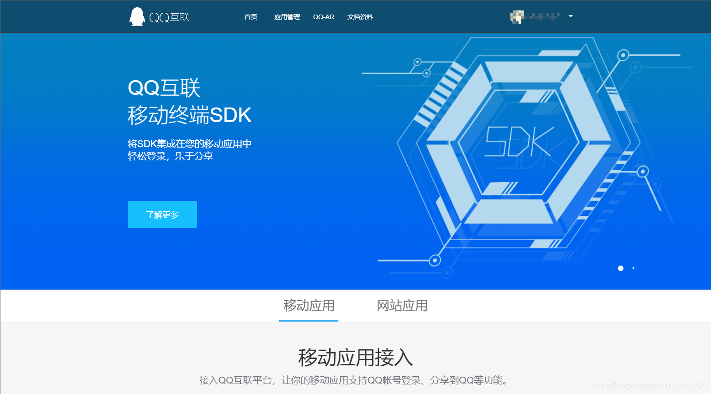
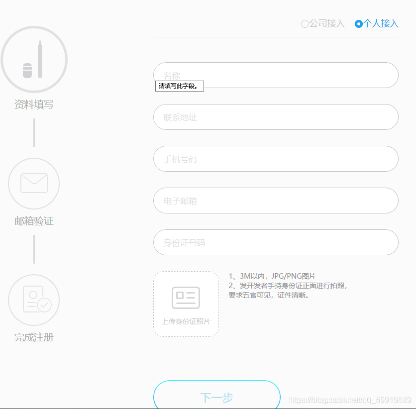
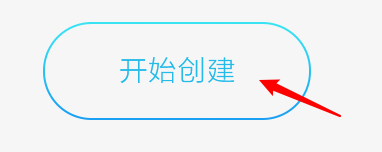
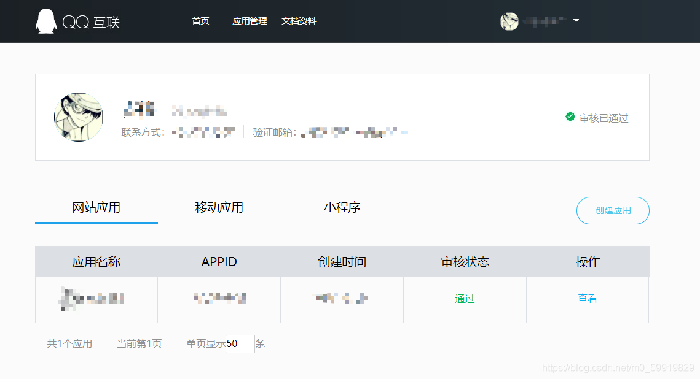
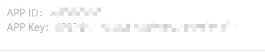
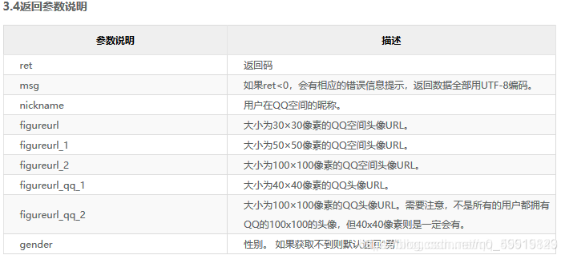
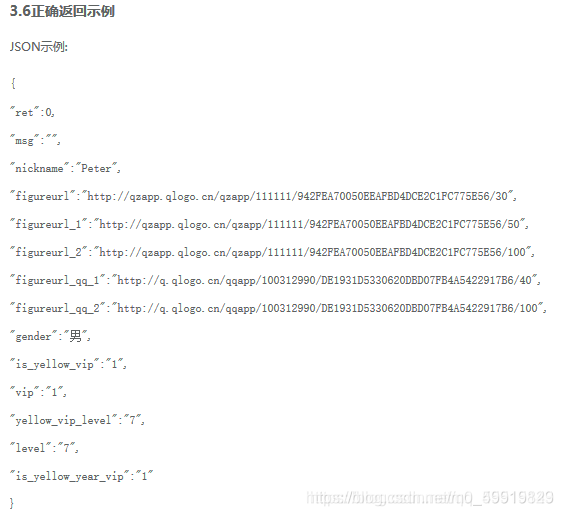
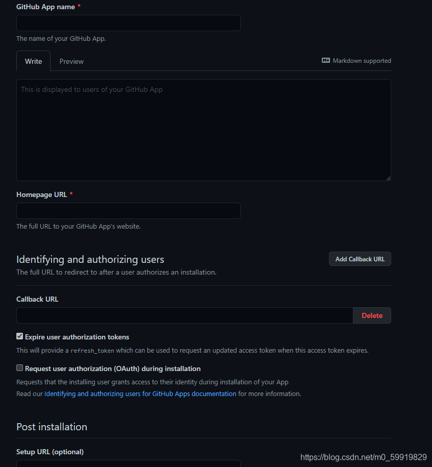

# 第三方登录

自建了一个网站，想要增加一个登录入口，但是自己实现登录又很麻烦， 那么就可以尝试使用第三方登录的方式。

谈到第三方登录就不得不提到OAuth，OAuth是Open Authorization的简写,它就是一种授权机制。数据的所有者告诉系统，同意授权第三方应用进入系统，获取这些数据。系统从而产生一个短期的进入令牌（token），用来代替密码，供第三方应用使用。
底层协议：
OAuth协议为用户资源的授权提供了一个安全、开放而又简易的标准。使用OAuth授权不会使第三方获取到到用户的帐号信息（如用户名与密码等），即第三方无需使用用户的用户名与密码就可以申请获得该用户资源的授权，因此OAuth是安全的。

此处简单介绍下第三方登陆的实现，此处以QQ登录和GitHub登录为例，其他第三方登录大同小异。建议申请GitHub的方式， 这个可以不用申请域名进行本地测试，如果使用QQ作为第三方登录的话申请比较严格，需要先申请域名并且备案，而备案一般需要一周到两周的时间，比较麻烦。

## QQ登录SDK方式

### 申请QQ互联

接入QQ互联，实现QQ一键登录。这个需要你提前备好域名，如果没有自己的网站的话，可以使用GitHub的测试，毕竟一个好的域名也挺贵的！！！


1 进入QQ互联官网点击头像创建提交申请
    


2 选择<mark>个人接入</mark>，按照步骤填写注册资料


创建成功通过后会显示接入的个人信息。

3 审核成功后点击下面的开始创建，按步骤完成创建过程。



4 创建成功后可以查看`APP ID` 和`APP key`,<mark>很重要</mark>


在应用管理界面可以查看如上信息，点击查看就可以看到如下关键信息。



下面的平台信息里可以看到网站地址和网站回调域,

### QQ登录实现

1. 新建登录页面

```html
<a href"/login">qq登录</a>
```

2. 配置`qqconnectconfig.properties`,与`application.properties`同一级

```properties
app_ID = 你的App ID
app_KEY = 你的App key
redirect_URI = 你的回调域
scope = get_user_info,add_topic,add_one_blog,add_album,upload_pic,list_album,add_share,check_page_fans,add_t,add_pic_t,del_t,get_repost_list,get_info,get_other_info,get_fanslist,get_idollist,add_idol,del_ido,get_tenpay_addr
baseURL = https://graph.qq.com/
getUserInfoURL = https://graph.qq.com/user/get_user_info
accessTokenURL = https://graph.qq.com/oauth2.0/token
authorizeURL = https://graph.qq.com/oauth2.0/authorize
getOpenIDURL = https://graph.qq.com/oauth2.0/me
addTopicURL = https://graph.qq.com/shuoshuo/add_topic
addBlogURL = https://graph.qq.com/blog/add_one_blog
addAlbumURL = https://graph.qq.com/photo/add_album
uploadPicURL = https://graph.qq.com/photo/upload_pic
listAlbumURL = https://graph.qq.com/photo/list_album
addShareURL = https://graph.qq.com/share/add_share
checkPageFansURL = https://graph.qq.com/user/check_page_fans
addTURL = https://graph.qq.com/t/add_t
addPicTURL = https://graph.qq.com/t/add_pic_t
delTURL = https://graph.qq.com/t/del_t
getWeiboUserInfoURL = https://graph.qq.com/user/get_info
getWeiboOtherUserInfoURL = https://graph.qq.com/user/get_other_info
getFansListURL = https://graph.qq.com/relation/get_fanslist
getIdolsListURL = https://graph.qq.com/relation/get_idollist
addIdolURL = https://graph.qq.com/relation/add_idol
delIdolURL = https://graph.qq.com/relation/del_idol
getTenpayAddrURL = https://graph.qq.com/cft_info/get_tenpay_addr
getRepostListURL = https://graph.qq.com/t/get_repost_list
version = 2.0.0.0
```

3. 导入SDK依赖

```xml
<!--QQ登录-->
<!-- https://mvnrepository.com/artifact/net.gplatform/Sdk4J -->
<dependency>
    <groupId>net.gplatform</groupId>
    <artifactId>Sdk4J</artifactId>
    <version>2.0</version>
</dependency>
```

4. 登录请求与回调请求

```java
	 //获取用户当前页面的url,方便返回登录之前的页面,
	private static String returnUrl = ""	
	/**
     * @Description: qq登录的入口
     */
    @GetMapping("/login")
    public ResponseEntity<Void> loginByQQ(HttpServletRequest request, HttpServletResponse response){
       
        returnUrl = request.getParameter("returnUrl");
        response.setContentType("text/html,charset=utf-8");
        try {
            response.sendRedirect(new Oauth().getAuthorizeURL(request));
            return ResponseEntity.ok().build();
        } catch (IOException | QQConnectException e) {
            LOGGER.warn("请求QQ登录失败, {}",e.getMessage());
        }
        return ResponseEntity.badRequest().build();
    }
    /**
     *
     * 此处的qqlogin必须与你的网站回调域一致
     * @Description: 登录获取数据
     */
    @RequestMapping("/qqlogin")
    public String login(HttpServletRequest request,HttpServletResponse response){
        User user = new User();
        try {
            AccessToken accessTokenObj = (new Oauth()).getAccessTokenByRequest(request);
            //用来或用户信息，get_user_info参数
          	String accessToken   = null;
            String openID = null;
            long tokenExpireIn = 0L;
            if (accessTokenObj.getAccessToken().equals("")) {
                LOGGER.error("没有获取到响应参数");
            }else {
                accessToken = accessTokenObj.getAccessToken();
                tokenExpireIn = accessTokenObj.getExpireIn();
                System.out.println(String.valueOf(tokenExpireIn));
                // 利用获取到的accessToken 去获取当前用的openid -------- start
                OpenID openIDObj =  new OpenID(accessToken);
                openID = openIDObj.getUserOpenID();

                UserInfo userInfo = new UserInfo(accessToken, openID);
                UserInfoBean userInfoBean = userInfo.getUserInfo();
                /*
				* 此处获取用户信息后可以重新保存用户部分信息用作登录展示
				* 比如写一个UserInfo类用于信息展示，将UserInfo对应的用户信息通过加密的方式保存到
				* Cookie中，由于每次请求都会携带Cookie，然后解密重新设置过期时间再进行加密保存。
				* 用户退出就可以将Cookie信息删除，这样就不需要依赖QQ登录本身保存的信息了。
				*/
                if (userInfoBean.getRet()==0){
                    //获取qq空间头像,暂不知怎么获取qq头像
                    user.setAvatar(userInfoBean.getAvatar().getAvatarURL50());
                    //用户openId,唯一标识
                    user.setOpenId(openID);
                    //用户qq昵称
                    user.setNickName(userInfoBean.getNickname());
                    //用户性别
                    user.setGender(userInfoBean.getGender());
                }else {
                    LOGGER.warn("很抱歉，我们没能正确获取到您的信息，原因是：{} ", userInfoBean.getMsg());
                }
            }
        } catch (QQConnectException e) {
            LOGGER.error("qq连接发生异常 {}",e.getMessage());
        }
        return "redirect:"+returnUrl;
    }
```

### 获取用户信息API

> get_user_info

通过上面的方法可以获取的用户信息较少，并且获取的头像是QQ空间的头像而不是QQ头像，如果没有QQ空间的话，那么就没有用户头像了。可以通过get_user_info获取用户更多的信息，比如QQ头像！

> 新建一个用户信息实体类



> 根据返回的json创建用户对象




### 用户信息获取测试

> 构建用户信息实体类

```java
/**
 *@JsonIgnoreProperties(ignoreUnknown = true) 忽略部分不能匹配的字段
 *@JsonProperty(value = "***")，因为获取的用户信息json不符合命名规范，所有需要添加字段映射
 * @author 苍晓
 */
@Data
@AllArgsConstructor
@NoArgsConstructor
@JsonIgnoreProperties(ignoreUnknown = true)
public class ResultInfo {
    private int ret;
    private String msg;
    @JsonProperty(value = "is_lost")
    private boolean isLost;
    private String nickname;
    private String gender;
    @JsonProperty(value = "gender_type")
    private String genderType;
    private String province;
    private String city;
    private String year;
    private String constellation;
    private String figureurl;
    @JsonProperty(value = "figureurl_1")
    private String figureUrl1;
    @JsonProperty(value = "figureurl_2")
    private String figureUrl12;
    @JsonProperty(value = "figureurl_qq_1")
    private String figureUrlQq1;
    @JsonProperty(value = "figureurl_qq_2")
    private String figureUrlQq2;
    @JsonProperty(value = "figureurl_qq")
    private String figureUrlQq;
    @JsonProperty(value = "figureurl_type")
    private String figureUrlType;
    @JsonProperty(value = "is_yellow_vip")
    private String isYellowVip;
    private int vip;
    @JsonProperty(value = "yellow_vip_level")
    private int yellowVipLevel;
    private int level;
    @JsonProperty(value = "is_yellow_year_vip")
    private String isYellowYearVip;

}
```

>RestTemplate配置

```java
/**
 * @author 苍晓
 */
@Configuration
public class RestTemplateConfig {
    
    @Bean
    public RestTemplate getRestTemplate(){

        RestTemplate restTemplate = new RestTemplate();
        MappingJackson2HttpMessageConverter mappingJackson2HttpMessageConverter = new MappingJackson2HttpMessageConverter();
      /*
      *经过尝试，此处需要加一个MediaType.TEXT_HTML的返回类型，否则一直报错，解析不了返回信息。
      */
        mappingJackson2HttpMessageConverter.setSupportedMediaTypes(Arrays.asList(MediaType.APPLICATION_JSON,
                MediaType.TEXT_HTML));
        restTemplate.getMessageConverters().add(mappingJackson2HttpMessageConverter);
        return restTemplate;
    }
}
```


> 测试获取用户信息

```java
@Autowired
private RestTemplate restTemplate;

private final String preUrl="https://graph.qq.com/user/get_user_info?" +
    "access_token=获取的登录用户AccessToken" +
    "&oauth_consumer_key=你的AppID" +
    "&openid=获取的登录用户的openID";
@Test
void qqInfo() {
    String object = this.restTemplate.getForObject(preUrl, String.class);
    ObjectMapper objectMapper = new ObjectMapper();
    try {
        ResultInfo resultInfo = objectMapper.readValue(object,ResultInfo.class);
        System.out.println(resultInfo);
    } catch (JsonProcessingException e) {
        e.printStackTrace();
    }
}
```

## GitHub登录非SDK方式

### 申请GitHub第三方登录

1. 登录后找到头像下的setting，然后选择Developer setting

  


1. 选择`New GitHub App` 填写相关信息

  


1. 点击`new client secret`生成client secret，记住Client ID和 Client Secret

### GitHub登录实现

```java
@Controller
public class GitHubLoginController {
    private static String CLIENT_ID = "申请的GitHub clientID";
    private static String CLIENT_SECRET = "申请的CLIENT_SECRET";
    private static String REDIRECT_URL = "http://127.0.0.1:8080/githubCallback";
    @Autowired
    private RestTemplate skipRestTemplate;
    private String state;
    @GetMapping("/githubLogin")
    public String  login() throws IOException {
        // Github认证服务器地址
        String url = "https://github.com/login/oauth/authorize";
        // 随机字符串，用于防止CSRF攻击
        state = String.valueOf(UUID.randomUUID()).replaceAll("-","");
        // 传递参数
        String param = "client_id=" + CLIENT_ID + "&state=" + state + "&redirect_uri=" + REDIRECT_URL;
        //请求Github认证服务器
        url = url + "?" + param;
        return "redirect:"+url;
    }

    /**
     * GitHub回调方法
     * @param code 授权码
     * @param state 发送时的随机字符串
     */
    @GetMapping("/githubCallback")
    public String  githubCallback(@RequestParam("code") String code, @RequestParam("state") String state) throws Exception {
        //1 验证state，如果不一致，可能被CSRF攻击
        if(!this.state.equals(state)) {
            throw new Exception("State验证失败");
        }

        // 2、向GitHub认证服务器申请令牌
        String tokenUrl = "https://github.com/login/oauth/access_token";
        // 申请令牌，
        Map<String,String> paramMap = new HashMap<>();
        paramMap.put("client_id",CLIENT_ID);
        paramMap.put("client_secret",CLIENT_SECRET);
        paramMap.put("code",code);
        String result = skipRestTemplate.postForObject(tokenUrl,paramMap,String.class);
		
        //3 申请资源
        String userUrl = "https://api.github.com/user";
        HttpHeaders headers = new HttpHeaders();
        //认证token放在报文头
        headers.set("Authorization", "token "+result.split("=")[1].split("&")[0]);
        HttpEntity<MultiValueMap<String, Object>> httpEntity = new HttpEntity<>(null, headers);
        ResponseEntity<String> responseEntity = skipRestTemplate.exchange(userUrl, HttpMethod.GET, httpEntity, String.class);
        // 4、输出用户信息
        String userInfo = responseEntity.getBody();
        System.out.println(userInfo);
        return "index.html";
    }
}
```

## SSL异常处理

参考链接https://www.cnblogs.com/qq931399960/p/11904157.html

因认证服务器是https请求，可能会报`SSLException`错误或报如下错误，请使用忽略SSL验证的方式请求

`Unexpected error: java.security.InvalidAlgorithmParameterException: the trustAnchors parameter must be non-empty`

```java
@Component
public class SecondSkipVerifyRestTemplateBuilder {
    @Bean("skipRestTemplate")
    public RestTemplate verifyCaRestTemplate() {
        RestTemplate rest = new RestTemplate();
        SSLConnectionSocketFactory ssLSocketFactory = null;
        try {
            ssLSocketFactory = sslFactory("PKCS12", "abc123");
        } catch (Exception e) {
            e.printStackTrace();
        }

        HttpComponentsClientHttpRequestFactory httpRequestFactory = new HttpComponentsClientHttpRequestFactory(
                HttpClients.custom().setSSLSocketFactory(ssLSocketFactory).build());
        // 设置传递数据超时时长
        httpRequestFactory.setReadTimeout(3000);

        rest.setRequestFactory(httpRequestFactory);

        return rest;
    }

    public SSLConnectionSocketFactory sslFactory(String keyStoreType, String keyPassword) {
        SSLConnectionSocketFactory sslConnectionSocketFactory = null;
        try {
            SSLContext sslcontext = SSLContexts.custom()
                    // //忽略掉对服务器端证书的校验
                    .loadTrustMaterial((TrustStrategy) (chain, authType) -> true).build();
            sslConnectionSocketFactory = new SSLConnectionSocketFactory(sslcontext, new String[] { "TLSv1.2" }, null,
                    SSLConnectionSocketFactory.getDefaultHostnameVerifier());
        } catch (Exception e) {
            e.printStackTrace();
        }
        return sslConnectionSocketFactory;
    }
}
```
