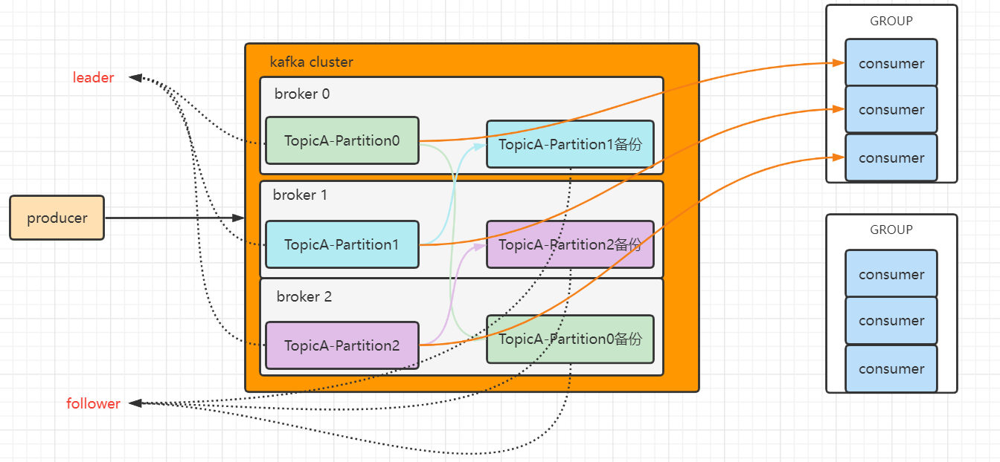
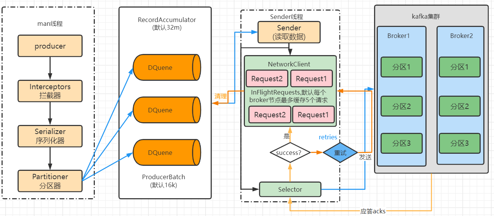

# Linux

## 虚拟机克隆

### 1、配置修改

###### 修改主机名

```shell
vim /etc/hostname
```

###### 修改静态IP

```shell
vim /etc/sysconfig/network-scripts/ifcfg-ens33
#修改IP
#修改UUID
uuidgen #生产UUID
#修改完成 重启网络
systemctl  restart  network
```

### 2、集群分发脚本xsync

##### scp(secure copy)安全拷贝

1. scp定义

   scp可以实现服务器雨服务器之间的数据拷贝

2. 基本语法

   ``` shell
   scp   -r   $pdir/$fname          $user@host:$pdir/$fname
   #命令 递归  要拷贝的文件路径/名称   目的地用户@主机：目的地路径/名称
   ```

##### rsync远程同步工具

rsync主要用于备份和镜像，具有速度快、避免复制相同内容和支持符号链接的优点。

rsync和scp的区别：用rsync做文件复制速度比scp快，rsync只对差异文件做更新。scp是把所有文件都复制过去

1. 基本用法

   ```shell
   rsync -av      $pdir/$fname           $user@host:$pdir/$fname
   #命令 选项参数  要拷贝的文件路径/名称   目的地用户@主机：目的地路径/名称
   rsync -av a.txt root@192.168.192.103:/opt/module/a.txt
   ```

   -a：归档拷贝

   -v：显示复制过程

##### xsync远程同步工具

```shell
#!/bin/bash
# 判断参数个数
if [ $# -lt 1 ]
then
	echo 缺少参数 !
	exit!
fi
# 遍历集群所有机器
for host in centos7 centos7_2 centos7_3
do
	echo =============== $host =================
	# 遍历所有目录，挨个发送
	for file in $@
	do
		#判断文件是否存在
		if [ -e $file ]
			then 
				#获取父目录
				pdir=$(cd -P $(dirname $file); pwd)
				#获取当前文件名称
				fname=$(basename $file)
				ssh $host "mkdir -p $pdir"
				rsync -av $pdir/$fname $host:$pdir
			else
				echo $file does not exists!
		fi
	done
done
```

### 3、jps: 未 找 到 命 令 

```shell
# 更新依赖
yum install java-1.8.0-openjdk-devel.x86_64
```

## 网络管理

WMware 提供的三种网络模式

- 桥接模式

  虚拟机直接连接外部物理网络的模式，直接起到了网桥的作用。这种模式下，虚拟机可直接访问外部网络，并对外部网络是可见的。

- NAT模式

  虚拟机和主键构建一个专用网络，并通过虚拟机网络地址转换（NAT）设备对IP进行转换。虚拟机通过共享主键IP可以访问外部网络，但外部网络无法访问虚拟机。

- 仅主机模式

  虚拟机只与主机共享一个专用网络，与外部网络无法通信。

### 网络配置

编辑 -> 寻网络编辑器，配置网络是要保持前面保持一致，192.168.192.XXX


#### 修改配置文件

1. ifconfig 查看网络接口配置

2. 使用 ping 命令测试主机连通性

3. 修改IP地址

   ```shell
   vim /etc/sysconfig/network-scripts/ifcfg-ens33
   ```

   修改内容

   ```shell
   TYPE="Ethernet"
   PROXY_METHOD="none"
   BROWSER_ONLY="no"
   #DHCP 将DHCP修改为static，动态获取改为静态IP地址
   BOOTPROTO="static"
   DEFROUTE="yes"
   IPV4_FAILURE_FATAL="no"
   IPV6INIT="yes"
   IPV6_AUTOCONF="yes"
   IPV6_DEFROUTE="yes"
   IPV6_FAILURE_FATAL="no"
   IPV6_ADDR_GEN_MODE="stable-privacy"
   NAME="ens33"
   UUID="35c2c24a-4bc3-496a-aea6-640f8acfd3b6"
   DEVICE="ens33"
   ONBOOT="yes"
   #IP 地址，添加静态IP
   IPADDR=192.168.192.100
   #配置网关 要和虚拟网络编辑器中的网关配置一致
   GATEWAY=192.168.192.2
   #配置域名解析器
   DNS1=192.168.192.2
   ```

   #### 配置主机名

   ```shell
   hostnamectl sethostname centos7
   #查看当前服务器主机名称：
   hostname
   修改主机名
   vim /etc/hostname
   ```

## Linux系统管理

### systemctl

1. 基本语法：`systemctl start|stop|status|restart 服务名`  `systemctl disable|enable服务名` 

2. centos7 保留NetworkManager服务， 关闭network服务；

### 系统运行级别


**查看默认级别**:

```shell
vim /etc/inittab
```

Linux系统有7种运行级别(runlevel):常用的是级别3和5

- 运行级别0:系统停机状态，系统默认运行级别不能设为0，否则不能正常启动
- 运行级别1:单用户工作状态，root权限，用于系统维护，禁止远程登陆
- 运行级别2:用户状态(没有NFS)，不支持网络
- 运行级别3:完全的多用户状态(有NFS)，登陆后进入控制台命令行模式运行级别4:系统未使用，保留
- 运行级别5:×11控制台，登陆后进入图形GUI模式
- 运行级别6:系统正常关闭并重启，默认运行级别不能设为6，否则不能正常启动

### 配置服务开机启动和关闭防火墙

列出所有服务名

```shell
systemctl list-unit-files
```

服务自启动开启关闭

```shell
systemctl disable|enable 服务名
systemctl status 服务名 或 systemctl status 服务名
#例：
systemctl disable|enable firewalld
systemctl status firewalld 或 systemctl status firewalld.service
```

### 关机重启

基本语法

1. sync	将数据有内存同步到硬盘中
2. halt    停机，关闭系统，但不断电
3. poweroff    关机，断电
4. reboot    重启， 等同于 shutdown -r now

```shell
#关机 默认一分钟之后关机
shutdown
#取消关机
shutdown -c 
#定时关机 
shutdown 18:00  shutdown 时间

shutdown -H 停机
shutdown -r 重启
shutdown now 立刻关机
```

## 常用命令

#### 1、帮助命令

##### 1.1、man 获得帮助信息

基本语法：[man  命令或配置文件]

```sh
eg:man ls
```

##### 1.2、help 获得shell内置命令帮助信息

一部分基础功能的系统命令是直接内嵌在shell中的，系统加载启动之后会随着shell一起加载，常驻系统内存中。这部分命令被称为“内置命令”；相应的其它命令被称为“外部命令”。

基本语法：help 命令 （获取shell内置命令的帮助信息）

```sh
eg:help cd
```

##### 1.3、常用快捷键

ctrl+c：停止进程

ctrl+l：清屏，等同于clear，彻底清屏：reset

tab：提示

上下键：执行过的命令

#### 2、文件目录类

##### pwd：显示当前工作目录绝对路径

##### ls：列出目录内容

##### cd：切换目录

##### mkdir：创建一个空的目录

make directory

```sh
eg:mkdir a
eg:mkdir -p a/b/c #-p：创建多层目录
```

##### rmdir：上次一个空目录

```sh
eg:mkdir a
eg:mkdir -p a/b/c #-p：删除多层空目录，如果abc都为空目录，则都删除
```

##### touch：创建一个空文件

##### cp：复制文件或目录

-r：递归复制整个文件夹

\cp：强制覆盖不提示

```sh
cp -r a b #将a文件夹复制到b目录
\cp -r a b #将a文件夹复制到b目录
```

##### rm：删除文件或目录

-r：递归删除

-f：不提示直接删除

```sh
rm -rf /a;
```

##### mv：移动文件与目录或重命名

##### cat：查看文件内容

##### more：文件内容分屏查看器‘

more是一个基于VI编辑器的文本过滤器，它以全屏幕的方式按业显示文本文件的内容。

space：向下翻一页

Enter：向上翻一行

q：退出more

ctrl+f：向下滚动一屏

ctrl+b：返回上一屏

=：输出当前行行号

:f：输出文件名和当前行的行号

```sh
more a.txt
```


##### less：分屏显示文件内容

less是用来分屏查勘表文件内容，它的功能和more类似，但比more更加强大，支持各种显示终端。less显示文件内容时，并不是一次将整个文件加载之后才显示，而是根据显示需要加载内容，对于显示大文件有叫搞效率。

q：退出less

space：向下翻一页

[pagedown]：向下翻一页

[pageup]：向上翻一页

/字符串：向下搜索[字符串]的功能；n：向下查找；N：向上查找

?字符串：向上搜索[字符串]的功能；n：向上查找N：N：向下查找

=：显示行号，字节数，百分比

g：调到文件开始位置

shift+g：调到文件结束位置

##### echo：输出内容到控制台

-e：支持反斜线控制字符转换

```sh
eg: echo -e "hello\nworld" #换行输出
eg: echo -e $PATH #换行输出
```

##### head：显示文件头部内容

默认查看文件前10行内容

-n：查看文件前n行内容

```sh
head -n info #查看info文件前n行内容
```

##### tail：输出文件尾部内容

默认查看文件最后10行内容

-n：查看文件最后n行内容

-f：实时追踪该文档的所有更新

```sh
tail -n info #查看info文件后n行内容
tail -f info #追踪info文件的所有更新
tail -nf info #查看info文件后n行内容并追踪
```

##### \>输出重定向>>追加

```sh
eg: ls / > info # 便利根目录输出到info文件中
eg: ls / >> info # 便利根目录追加输出到info文件中
```

##### ln 软链接

软链接也称为符号链接，类似于Windows的快捷方式，有自己的数据块，主要存放了链接其它文件的路径。

ln -s [源文件或目录] [软链接名] （给原文件创建一个软链接）

==如果使用rm -rf 软链接名/ 删除，会把软链接对于的真实目录下的内容删掉==

```sh
ln -s /opt/info info #链接到/opt/info目录
ln -s /opt/info/a.txt a.txt #链接到/opt/info/a.txt文件
ln -s /opt/info info #链接到/opt/info目录
cd info #进入链接info目录
cd -P info #进入链接的/opt/info目录
pwd  # 显示链接info
pwd -P #显示/opt/info目录
rm -rf info#删除软链接文件
rm -rf info/ #删除软链接和原始文件
```


##### history查看已经执行过的历史命令

history n 显示最后n个历史操作

-c：清空历史命令

!历史命令编号，执行对应的历史命令


```sh
history -c
history 10
!359
```

## 时间日期类命令

##### date显示当前时间

date：显示当前时间

date +%Y：显示年份

date +%m：显示月份

date +%d：显示日期

date +%S：显示当前秒

date +%s：显示时间戳

date "+%Y-%m-%d  %H:%M:%S"：显示日期，引号中的表述格式


##### date显示非当前时间

-d：显示之前或之后的时间

-s：设置当前时间

```sh
root@LAPTOP-R3Q9LUFD:/# date
2022年 09月 08日 星期四 21:55:18 CST
root@LAPTOP-R3Q9LUFD:/# date "+%Y-%m-%d %H:%M:%S"
2022-09-08 21:55:52
root@LAPTOP-R3Q9LUFD:/# date -d '-1 days ago'
2022年 09月 09日 星期五 21:56:53 CST
root@LAPTOP-R3Q9LUFD:/# date -d '-1 hours ago'
2022年 09月 08日 星期四 22:57:03 CST
root@LAPTOP-R3Q9LUFD:/# date -d '1 hours ago'
2022年 09月 08日 星期四 20:57:10 CST
root@LAPTOP-R3Q9LUFD:/# date -d '1 month ago'
2022年 08月 08日 星期一 21:57:23 CST
root@LAPTOP-R3Q9LUFD:/# date -d '1 Y ago'
date: 无效的日期 “1 Y ago”
root@LAPTOP-R3Q9LUFD:/# date -d '1 year ago'
2021年 09月 08日 星期三 21:57:34 CST
root@LAPTOP-R3Q9LUFD:/#
```


## 消息队列

### 应用场景

1. 缓冲/削封：有助于控制和优化数据流经过系统的速度，解决生产消息和消费消息处理不一致的情况
2. 解耦：运行你独立的修改或扩展两边的处理过程，只要确保他们遵守同样的接口约束；
3. 异步通信：允许用户将一个消息放入消息队列，但并不立即处理它，然后再需要的时候再处理。

### 模式

1. 点对点模式：

   - 主动拉去数据，消息收到后清除消息

     

2. 发布订阅模式：

   - 可以有多个topic

   - 消费者消费数据后不删除数据

   - 每个消费者想好独立，都可以消费到数据

     

## kafka

### kafka基础架构

1. 为了方便扩展，提高吞吐量，一个topic分为多个partition，每个partition只能由一个consumer消费
2. 配合分区设计，提出消费者组的概念，组内每个消费者并行消费
3. 为提高可用性，为每个partition增加若干个副本，生产和消费只针对leader，只有当leader挂了follower才有机会成为leader



### kafka安装部署

#### 配置server.properties文件

1. 修改node.id

   ```shell
   node.id=1
   #@前面的数字与node.id保持一致
   #controller.quorum.voters=1@hadoop102:9093,2@hadoop103:9093,3@hadoop104:9093
   controller.quorum.voters=1@centos7:9093,2@centos7_2:9093,3@centos7_3:9093
   ```

2. broker对外保留地址

   ```shell
   # Listener name, hostname and port the broker will advertise to clients.
   # If not set, it uses the value for "listeners".
   advertised.listeners=PLAINTEXT://centos7_3:9092
   ```

3. 修改log.dirs

   ```shell
   # A comma separated list of directories under which to store log files
   log.dirs=/opt/module/kafka/datas
   ```

#### 初始化集群数据目录

1. 生成存储目录唯一ID

   ```shell
   bin/kafka-storage.sh random-uuid
   ```

2. 用该ID格式化kafka存储目录

   ```shell
   bin/kafka-storage.sh format -t kOFw24HOQ4yKpMnrtsGu2Q -c /opt/module/kafka/config/kraft/server.properties
   ```

3. 启动kafka

   ```shell
   bin/kafka-server-start.sh -daemon config/kraft/server.properties
   ```

4. kafka启动集群失败(端口未开放)

   ```shell
   #查看端口是否开放
   firewall-cmd --query-port=9093/tcp
   #添加指定需要开放的端口：
   firewall-cmd --add-port=9093/tcp --permanent
   #对指定ip开放指定端口
   firewall-cmd --permanent --add-rich-rule="rule family="ipv4" source address="centos7" port protocol="tcp" port="6379" accept"
   #重载入添加的端口：
   firewall-cmd --reload
   #移除指定端口：
   firewall-cmd --permanent --remove-port=9093/tcp
   #重启防火墙
   systemctl restart firewalld.service
   #关闭防火墙
   systemctl stop firewalld.service
   ```


#### 启停脚本

```shell
#!/bin/bash
case $1 in
"start")
	for i in centos7 centos7_2 centos7_3
	do 
		echo "====== 启动 $i kafka"
		ssh $i "/opt/module/kafka/bin/kafka-server-start.sh -daemon /opt/module/kafka/config/kraft/server.properties"
	done
;;
"stop")
for i in centos7 centos7_2 centos7_3
	do 
		echo "====== 停止 $i kafka"
		ssh $i "/opt/module/kafka/bin/kafka-server-stop.sh"
	done
;;
esac
```

#### 集群执行命令

```shell
#!/bin/bash
# 判断参数个数
if [ $# -lt 1 ]
then
	echo 缺少参数 !
	exit!
fi
# 遍历集群所有机器
for host in centos7 centos7_2 centos7_3
do
	echo =============== 执行命令 $1 =================
    ssh $host "$1"		
done
```

### kafka命令操作

#### topic命令操作

| 参数                                            | 描述                               |
| ----------------------------------------------- | ---------------------------------- |
| --bootstrap-server <String:server toconnect to> | 连接的Kafka Broker主机名称和端口号 |
| --topic \<String:topic>                         | 操作的topic名称                    |
| --create                                        | 创建topic                          |
| --delete                                        | 删除topic                          |
| --altere                                        | 修改topic                          |
| --list                                          | 查看所有topic                      |
| --describe                                      | 查看topic详细描述                  |
| --partitions <Integer:of partitions>            | 设置分区数                         |
| --replication-factor<Integer:replication factor | 设置分区副本                       |
| --config \<String:name=value>                   | 更新系统默认的配置。               |

1. 查看当前服务器所以topic

   ```shell
   # 多台服务器逗号分隔
   bin/kafka-topics.sh --bootstrap-server centos7:9092,centos7_2:9092 --list
   ```

2. 创建first topic

   ```shell
   # 创建first topic 一个分区，三个副本
   bin/kafka-topics.sh --bootstrap-server centos7:9092 --topic first --create --partitions 1 --replication-factor 3
   ```

3. 删除topic

   ```shell
   bin/kafka-topics.sh --bootstrap-server centos7:9092 --topic first --delete
   ```

4. topic描述

   ```shell
   bin/kafka-topics.sh --bootstrap-server centos7:9092 --topic first --describe
   ```
   
5. 修改分区

   ```shell
   # 分区可以增加不可以减少
   bin/kafka-topics.sh --bootstrap-server centos7:9092 --topic first --alter --partitions 3
   ```

#### 生产者命令操作

1. 创建生产者

   ```shell
   bin/kafka-console-producer.sh --bootstrap-server centos7:9092 --topic first
   ```

#### 消费者命令操作

1. 创建消费者

   > 默认增量消费，不会消费历史消息

   ```shell
   bin/kafka-console-consumer.sh --bootstrap-server centos7:9092 --topic first
   ```

2. 创建消费者

   > 增加命令- -from beginning消费历史消息

   ```shell
   bin/kafka-console-consumer.sh --bootstrap-server centos7:9092 --topic first --fromom-beginning
   ```

### kafka生产者

#### 发送流程



- batch.size：只有数据累积到bach.size之后，sender才会发送数据，默认16k；
- linger.ms：如果数据迟迟未达到batch.size，sender等待linger.ms之后就会发送数据。单位：ms，默认0ms，表述没有延迟；
- 应答acks
  - 0：生产者发送过来的数据，不需要等待数据落盘就应答；
  - 1：生产者发送过来的数据，Leader收到数据后应答；
  - -1(all)：生产者发送过来的数据，Leader和isr队列里面的所有节点收齐数据后应答。-1和all等价

> leader维护了一个动态的in-sync replia set(ISR),意为何Leader保持同步的Follower+Leader集合(leader:0,isr:0,1,2)
>
> 如果Follower长时间未向Leader发送通信请求或同步数据，则该follower将被提出ISR。该时间有replica.lag.time.max.ms参数设定，默认30s.，例如2超时，(leader:0,isr:0,1)。

==**数据完全可靠条件 = ACK级别设置为-1 + 分区副本数大于等于2 + ISR里应答副本数量大于等于2**==

#### 异步发送

##### 普通异步发送

```java
public class CustomProducer {
    public static void main(String[] args) {
        Properties properties = new Properties();
        //连接集群
   properties.setProperty(ProducerConfig.BOOTSTRAP_SERVERS_CONFIG,"centos7:9092,192.168.192.102:9092,192.168.192.103:9092");
        //序列化
        properties.setProperty(ProducerConfig.KEY_SERIALIZER_CLASS_CONFIG, StringSerializer.class.getName());
        properties.setProperty(ProducerConfig.VALUE_SERIALIZER_CLASS_CONFIG, StringSerializer.class.getName());
        //创建kafka生产者
        KafkaProducer<String, String> kafkaProducer = new KafkaProducer<>(properties);

        for (int i = 0; i < 3; i++) {
            kafkaProducer.send(new ProducerRecord<>("first","cangxiao"+i));
        }
        //关闭kafka
        kafkaProducer.close();
    }
}
```

##### 带回调函数的异步发送

> 如果SpringBoot版本大于2.7会抛kafka异常：Cannot execute transactional method because we are in an error state
>
> 降低版本

```java
public class CustomProducerCallback {
    public static void main(String[] args) {
        Properties properties = new Properties();
        //连接集群
        properties.setProperty(ProducerConfig.BOOTSTRAP_SERVERS_CONFIG,"centos7:9092,192.168.192.102:9092,192.168.192.103:9092");
        //序列化
        properties.setProperty(ProducerConfig.KEY_SERIALIZER_CLASS_CONFIG, StringSerializer.class.getName());
        properties.setProperty(ProducerConfig.VALUE_SERIALIZER_CLASS_CONFIG, StringSerializer.class.getName());
        //创建kafka生产者
        KafkaProducer<String, String> kafkaProducer = new KafkaProducer<>(properties);

        for (int i = 0; i < 3; i++) {
            kafkaProducer.send(new ProducerRecord<>("first", "cangxiao" + i), new Callback() {
                @Override
                public void onCompletion(RecordMetadata recordMetadata, Exception e) {
                    if (e==null){
                        System.out.println("发送成功；主题："+recordMetadata.topic()+"分区："+recordMetadata.partition());
                    }
                }
            });
        }
        //关闭kafka
        kafkaProducer.close();
    }
}
```

> 事务执行

```java
public class CustomProducerCallback2 {
    public static void main(String[] args) {
//        Map<String,Object> config = new HashMap<>();
//        config.put(ProducerConfig.BOOTSTRAP_SERVERS_CONFIG,"centos7:9092,192.168.192.102:9092,192.168.192.103:9092");
//        config.put(ProducerConfig.ENABLE_IDEMPOTENCE_CONFIG,"true");
//        config.put(ProducerConfig.KEY_SERIALIZER_CLASS_CONFIG, StringSerializer.class.getName());
//        config.put(ProducerConfig.VALUE_SERIALIZER_CLASS_CONFIG, StringSerializer.class.getName());
//        config.put(ProducerConfig.TRANSACTIONAL_ID_CONFIG, "transaction_1");
        //创建事务
        Properties properties = new Properties();
        //连接集群
        properties.setProperty(ProducerConfig.BOOTSTRAP_SERVERS_CONFIG,"centos7:9092,192.168.192.102:9092,192.168.192.103:9092");
        //序列化
        properties.setProperty(ProducerConfig.KEY_SERIALIZER_CLASS_CONFIG, StringSerializer.class.getName());
        properties.setProperty(ProducerConfig.VALUE_SERIALIZER_CLASS_CONFIG, StringSerializer.class.getName());
        //必须设置事务id
        properties.setProperty(ProducerConfig.TRANSACTIONAL_ID_CONFIG, "transaction_1");

        //创建kafka生产者
        KafkaProducer<String, String> kafkaProducer = new KafkaProducer<>(properties);
        kafkaProducer.initTransactions();
        kafkaProducer.beginTransaction();

        for (int i = 0; i < 3; i++) {
            kafkaProducer.send(new ProducerRecord<>("first", "cangxiao" + i), new Callback() {
                @Override
                public void onCompletion(RecordMetadata recordMetadata, Exception e) {
                    if (e==null){
                        System.out.println("发送成功；主题："+recordMetadata.topic()+"分区："+recordMetadata.partition());
                    }
                }
            });
        }
        //关闭kafka
        kafkaProducer.commitTransaction();
        kafkaProducer.close();
    }
}
```

#### 同步发送

> 在最后调用get()方法变为同步发送

```java
 RecordMetadata recordMetadata = kafkaProducer.send(new ProducerRecord<>("first","cangxiao"+i)).get();
```

#### 生产者分区

##### kafka分区的好处

1. ==便于合理使用存储资源==，每个Partition在一个Broker上存储，可以把海量的数据按照分区且开个成一块一块数据存储在多个Broker上，合理控制分区的任务，可以实现==负载均衡的==效果。
2. ==提高并行度==，生产者可以以分区为单位发送数据，消费者可以以分区为单位进行消费

##### 发送消息分区策略

1. 如果指定了分区则使用指定分区

2. 如果没有指定分区但是指定了key，则使用key的hash值对分区数取模

3. 如果都没指定，则采用sticky partition(黏性分区)，会随机选择一个分区，并尽可能一直使用该分区，待该分区的batch已满或已完成，kafka再随机一个分区进行使用(和上一次的分区不同)

   如第一次随机选择0号分区，等0号分区当前批次满了（默认16k）或者linger.ms设置的时间到了，kafka再随机一个分区（如果还是0则会继续随机）

#### 自定义分区器

```java
public class MyPartitioner implements Partitioner {
    @Override
    public int partition(String topic, Object key, byte[] keyBytes, Object value, byte[] valueBytes, Cluster cluster) {
        if (value.toString().contains("hello")){
            return 1;
        }else {
            return 0;
        }
    }
    @Override
    public void close() {}
    @Override
    public void configure(Map<String, ?> configs) {}
}
```

#### 提高吞吐量

> 自定义配置参数

```java
public class CustomProducerParameters {
    public static void main(String[] args) {
        Properties properties = new Properties();
        //连接集群
     properties.put(ProducerConfig.BOOTSTRAP_SERVERS_CONFIG,"centos7:9092,192.168.192.102:9092,192.168.192.103:9092");
        //序列化
        properties.put(ProducerConfig.KEY_SERIALIZER_CLASS_CONFIG, StringSerializer.class.getName());
        properties.put(ProducerConfig.VALUE_SERIALIZER_CLASS_CONFIG, StringSerializer.class.getName());
        /*
            提高kafka吞吐量的四个参数
         */
        //缓冲区大小 RecordAccumulator 默认32m 32 * 1024 * 1024L
        properties.put(ProducerConfig.BUFFER_MEMORY_CONFIG, 64 * 1024 * 1024L);
        //批次大小 batch.size 默认16k
        properties.put(ProducerConfig.BATCH_SIZE_CONFIG, 16384 * 2);
        //linger.ms 等待时间 默认 0
        properties.put(ProducerConfig.LINGER_MS_CONFIG, 100);
        //压缩 compresssion.type 默认none,可配置gzip,snappy,lz4,zstd
        properties.put(ProducerConfig.COMPRESSION_TYPE_CONFIG, "snappy");
        //创建kafka生产者
        KafkaProducer<String, String> kafkaProducer = new KafkaProducer<>(properties);
        for (int i = 0; i < 3; i++) {
            kafkaProducer.send(new ProducerRecord<>("first","cangxiao"+i));
        }
        //关闭kafka
        kafkaProducer.close();
    }
}
```

#### ACK 应答级别

- 0：生产者发送过来的数据，不需要等待数据落盘就应答；
- 1：生产者发送过来的数据，Leader收到数据后应答；
- -1(all)：生产者发送过来的数据，Leader和isr队列里面的所有节点收齐数据后应答。-1和all等价

> leader维护了一个动态的in-sync replia set(ISR),意为何Leader保持同步的Follower+Leader集合(leader:0,isr:0,1,2)
>
> 如果Follower长时间未向Leader发送通信请求或同步数据，则该follower将被提出ISR。该时间有replica.lag.time.max.ms参数设定，默认30s.，例如2超时，(leader:0,isr:0,1)。

==**数据完全可靠条件 = ACK级别设置为-1 + 分区副本数大于等于2 + ISR里应答副本数量大于等于2**==

```java
//acks
properties.put(ProducerConfig.ACKS_CONFIG, "1");
//重试次数
properties.put(ProducerConfig.RETRIES_CONFIG, 3);
```

#### 数据去重

幂等性值Producer不论想Broker发送多少次重复数据，Broker都只会持久哈一条，保证不重复

精确一次 = 幂等性 + 至少一次（ack=-1 + 分区副本数>=2 + ISR里应答副本数量>=2）

重复判断标准：具有==<PID,Partition,SeqNumber>==相同主键消息提交时，Broker只会持久化一条，PID是kafka每次启动都会分配一个新的，Partition表述分区号，SeqNumber是单调自增的

所以幂等性==只能保证是在但分区单会话内不重复==

##### kafka事务

> 开启事务必须开启幂等性

Producer在使用事务功能前，必须先自定义一个唯一的transaction.id。有了transaction.id。即使客户端挂了，它重启后也能继续处理未完成的事务。


#### 数据有序


##### 数据乱序


