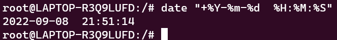
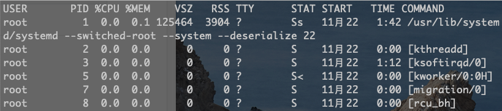

##   Linux

## 虚拟机克隆

### 1、配置修改

###### 修改主机名

```shell
vim /etc/hostname
```

###### 修改静态IP

```shell
vim /etc/sysconfig/network-scripts/ifcfg-ens33
#修改IP
#修改UUID
uuidgen #生产UUID
#修改完成 重启网络
systemctl  restart  network
```

### 2、集群分发脚本xsync

##### scp(secure copy)安全拷贝 

1. scp定义

   scp可以实现服务器雨服务器之间的数据拷贝

2. 基本语法

   ``` shell
   scp   -r   $pdir/$fname          $user@host:$pdir/$fname
   #命令 递归  要拷贝的文件路径/名称   目的地用户@主机：目的地路径/名称
   ```

##### rsync远程同步工具

rsync主要用于备份和镜像，具有速度快、避免复制相同内容和支持符号链接的优点。

rsync和scp的区别：用rsync做文件复制速度比scp快，rsync只对差异文件做更新。scp是把所有文件都复制过去

1. 基本用法

   ```shell
   rsync -av      $pdir/$fname           $user@host:$pdir/$fname
   #命令 选项参数  要拷贝的文件路径/名称   目的地用户@主机：目的地路径/名称
   rsync -av a.txt root@192.168.192.103:/opt/module/a.txt
   ```

   -a：归档拷贝

   -v：显示复制过程

##### xsync远程同步工具

```shell
#!/bin/bash
# 判断参数个数
if [ $# -lt 1 ]
then
	echo 缺少参数 !
	exit!
fi
# 遍历集群所有机器
for host in centos7 centos7_2 centos7_3
do
	echo =============== $host =================
	# 遍历所有目录，挨个发送
	for file in $@
	do
		#判断文件是否存在
		if [ -e $file ]
			then 
				#获取父目录
				pdir=$(cd -P $(dirname $file); pwd)
				#获取当前文件名称
				fname=$(basename $file)
				ssh $host "mkdir -p $pdir"
				rsync -av $pdir/$fname $host:$pdir
			else
				echo $file does not exists!
		fi
	done
done
```

### 3、jps: 未 找 到 命 令 

```shell
# 更新依赖
yum install java-1.8.0-openjdk-devel.x86_64
```

## 网络管理

WMware 提供的三种网络模式

- 桥接模式

  虚拟机直接连接外部物理网络的模式，直接起到了网桥的作用。这种模式下，虚拟机可直接访问外部网络，并对外部网络是可见的。

- NAT模式

  虚拟机和主键构建一个专用网络，并通过虚拟机网络地址转换（NAT）设备对IP进行转换。虚拟机通过共享主键IP可以访问外部网络，但外部网络无法访问虚拟机。

- 仅主机模式

  虚拟机只与主机共享一个专用网络，与外部网络无法通信。

### 网络配置

编辑 -> 寻网络编辑器，配置网络是要保持前面保持一致，192.168.192.XXX


#### 修改配置文件

1. ifconfig 查看网络接口配置

2. 使用 ping 命令测试主机连通性

3. 修改IP地址

   ```shell
   vim /etc/sysconfig/network-scripts/ifcfg-ens33
   ```

   修改内容

   ```shell
   TYPE="Ethernet"
   PROXY_METHOD="none"
   BROWSER_ONLY="no"
   #DHCP 将DHCP修改为static，动态获取改为静态IP地址
   BOOTPROTO="static"
   DEFROUTE="yes"
   IPV4_FAILURE_FATAL="no"
   IPV6INIT="yes"
   IPV6_AUTOCONF="yes"
   IPV6_DEFROUTE="yes"
   IPV6_FAILURE_FATAL="no"
   IPV6_ADDR_GEN_MODE="stable-privacy"
   NAME="ens33"
   UUID="35c2c24a-4bc3-496a-aea6-640f8acfd3b6"
   DEVICE="ens33"
   ONBOOT="yes"
   #IP 地址，添加静态IP
   IPADDR=192.168.192.100
   #配置网关 要和虚拟网络编辑器中的网关配置一致
   GATEWAY=192.168.192.2
   #配置域名解析器
   DNS1=192.168.192.2
   ```

   #### 配置主机名

   ```shell
   hostnamectl sethostname centos7
   #查看当前服务器主机名称：
   hostname
   修改主机名
   vim /etc/hostname
   ```

## Linux系统管理

### systemctl

1. 基本语法：`systemctl start|stop|status|restart 服务名`  `systemctl disable|enable服务名` 

2. centos7 保留NetworkManager服务， 关闭network服务；

### 系统运行级别


**查看默认级别**:

```shell
vim /etc/inittab
```

Linux系统有7种运行级别(runlevel):常用的是级别3和5

- 运行级别0:系统停机状态，系统默认运行级别不能设为0，否则不能正常启动
- 运行级别1:单用户工作状态，root权限，用于系统维护，禁止远程登陆
- 运行级别2:用户状态(没有NFS)，不支持网络
- 运行级别3:完全的多用户状态(有NFS)，登陆后进入控制台命令行模式运行级别4:系统未使用，保留
- 运行级别5:×11控制台，登陆后进入图形GUI模式
- 运行级别6:系统正常关闭并重启，默认运行级别不能设为6，否则不能正常启动

### 配置服务开机启动和关闭防火墙

列出所有服务名

```shell
systemctl list-unit-files
```

服务自启动开启关闭

```shell
systemctl disable|enable 服务名
systemctl status 服务名 或 systemctl status 服务名
#例：
systemctl disable|enable firewalld
systemctl status firewalld 或 systemctl status firewalld.service
```

### 关机重启

基本语法

1. sync	将数据有内存同步到硬盘中
2. halt    停机，关闭系统，但不断电
3. poweroff    关机，断电
4. reboot    重启， 等同于 shutdown -r now

```shell
#关机 默认一分钟之后关机
shutdown
#取消关机
shutdown -c 
#定时关机 
shutdown 18:00  shutdown 时间

shutdown -H 停机
shutdown -r 重启
shutdown now 立刻关机
```

## 常用命令

#### 1、帮助命令

##### 1.1、man 获得帮助信息

基本语法：[man  命令或配置文件]

```sh
eg:man ls
```

##### 1.2、help 获得shell内置命令帮助信息

一部分基础功能的系统命令是直接内嵌在shell中的，系统加载启动之后会随着shell一起加载，常驻系统内存中。这部分命令被称为“内置命令”；相应的其它命令被称为“外部命令”。

基本语法：help 命令 （获取shell内置命令的帮助信息）

```sh
eg:help cd
```

##### 1.3、常用快捷键

ctrl+c：停止进程

ctrl+l：清屏，等同于clear，彻底清屏：reset

tab：提示

上下键：执行过的命令

#### 2、文件目录类

##### pwd：显示当前工作目录绝对路径

##### ls：列出目录内容

##### cd：切换目录

##### mkdir：创建一个空的目录

make directory

```sh
eg:mkdir a
eg:mkdir -p a/b/c #-p：创建多层目录
```

##### rmdir：上次一个空目录

```sh
eg:mkdir a
eg:mkdir -p a/b/c #-p：删除多层空目录，如果abc都为空目录，则都删除
```

##### touch：创建一个空文件

##### cp：复制文件或目录

-r：递归复制整个文件夹

\cp：强制覆盖不提示

```sh
cp -r a b #将a文件夹复制到b目录
\cp -r a b #将a文件夹复制到b目录
```

##### rm：删除文件或目录

-r：递归删除

-f：不提示直接删除

```sh
rm -rf /a;
```

##### mv：移动文件与目录或重命名

##### cat：查看文件内容

##### more：文件内容分屏查看器‘

more是一个基于VI编辑器的文本过滤器，它以全屏幕的方式按业显示文本文件的内容。

space：向下翻一页

Enter：向上翻一行

q：退出more

ctrl+f：向下滚动一屏

ctrl+b：返回上一屏

=：输出当前行行号

:f：输出文件名和当前行的行号

```sh
more a.txt
```

##### less：分屏显示文件内容

less是用来分屏查勘表文件内容，它的功能和more类似，但比more更加强大，支持各种显示终端。less显示文件内容时，并不是一次将整个文件加载之后才显示，而是根据显示需要加载内容，对于显示大文件有叫搞效率。

q：退出less

space：向下翻一页

[pagedown]：向下翻一页

[pageup]：向上翻一页

/字符串：向下搜索[字符串]的功能；n：向下查找；N：向上查找

?字符串：向上搜索[字符串]的功能；n：向上查找N：N：向下查找

=：显示行号，字节数，百分比

g：调到文件开始位置

shift+g：调到文件结束位置

##### echo：输出内容到控制台

-e：支持反斜线控制字符转换

```sh
eg: echo -e "hello\nworld" #换行输出
eg: echo -e $PATH #换行输出
```

##### head：显示文件头部内容

默认查看文件前10行内容

-n：查看文件前n行内容

```sh
head -n info #查看info文件前n行内容
```

##### tail：输出文件尾部内容

默认查看文件最后10行内容

-n：查看文件最后n行内容

-f：实时追踪该文档的所有更新

```sh
tail -n info #查看info文件后n行内容
tail -f info #追踪info文件的所有更新
tail -nf info #查看info文件后n行内容并追踪
```

##### \>输出重定向>>追加

```sh
eg: ls / > info # 便利根目录输出到info文件中
eg: ls / >> info # 便利根目录追加输出到info文件中
```

##### ln 软链接

软链接也称为符号链接，类似于Windows的快捷方式，有自己的数据块，主要存放了链接其它文件的路径。

ln -s [源文件或目录] [软链接名] （给原文件创建一个软链接）

==如果使用rm -rf 软链接名/ 删除，会把软链接对于的真实目录下的内容删掉==

```sh
ln -s /opt/info info #链接到/opt/info目录
ln -s /opt/info/a.txt a.txt #链接到/opt/info/a.txt文件
ln -s /opt/info info #链接到/opt/info目录
cd info #进入链接info目录
cd -P info #进入链接的/opt/info目录
pwd  # 显示链接info
pwd -P #显示/opt/info目录
rm -rf info#删除软链接文件
rm -rf info/ #删除软链接和原始文件
```


##### history查看已经执行过的历史命令

history n 显示最后n个历史操作

-c：清空历史命令

!历史命令编号，执行对应的历史命令


```sh
history -c
history 10
!359
```

## 时间日期类命令

##### date显示当前时间

date：显示当前时间

date +%Y：显示年份

date +%m：显示月份

date +%d：显示日期

date +%S：显示当前秒

date +%s：显示时间戳

date "+%Y-%m-%d  %H:%M:%S"：显示日期，引号中的表述格式



##### date显示非当前时间

-d：显示之前或之后的时间

-s：设置当前时间

```sh
root@LAPTOP-R3Q9LUFD:/# date
2022年 09月 08日 星期四 21:55:18 CST
root@LAPTOP-R3Q9LUFD:/# date "+%Y-%m-%d %H:%M:%S"
2022-09-08 21:55:52
root@LAPTOP-R3Q9LUFD:/# date -d '-1 days ago'
2022年 09月 09日 星期五 21:56:53 CST
root@LAPTOP-R3Q9LUFD:/# date -d '-1 hours ago'
2022年 09月 08日 星期四 22:57:03 CST
root@LAPTOP-R3Q9LUFD:/# date -d '1 hours ago'
2022年 09月 08日 星期四 20:57:10 CST
root@LAPTOP-R3Q9LUFD:/# date -d '1 month ago'
2022年 08月 08日 星期一 21:57:23 CST
root@LAPTOP-R3Q9LUFD:/# date -d '1 Y ago'
date: 无效的日期 “1 Y ago”
root@LAPTOP-R3Q9LUFD:/# date -d '1 year ago'
2021年 09月 08日 星期三 21:57:34 CST
root@LAPTOP-R3Q9LUFD:/#
```

## 用户权限类命令

##### useradd 添加新用户

```shell
useradd zhangsan
#创建用户并指定用户主目录
useradd -d /home/zs zhangsan
```

##### passwd设置用户密码

```shell
passwd zhangsan
```

##### id 查看用户是否存在

```shell
id zhangsan
```

##### cat /etc/passwd查看创建类哪些用户

```shell
cat /etc/passwd
```

##### su 切换用户

```shell
#只切换用户不切换目录
su zhangsan
#切换用户的同时切换主目录
su - zhangsan
```

##### userdel删除用户

```shell
userdel zhangsan
```

##### who查看登录用户信息

```shell
[root@aliyun ~]# who
root     pts/0        2022-12-17 11:22 (113.116.158.13)
```

##### sudo 设置普通用户具有root权限

修改配置文件

```shell
vim /etc/sudoers

#修改配置
root    ALL=(ALL)       ALL
zhangsan        ALL=(ALL)       ALL
```

##### usermod修改用户

```shell
usermod -g group zhangsan
usermod --help
```

## 用户组管理命令

##### groupadd新增组

```shell
groupadd zs
```

##### groupdel删除组

```shell
groupdel zs
```

##### groupmod修改组

```shell
#groupmod -n 新组名 旧组名
groupmod -n zhangsan zs
```

##### cat /etc/group查看创建类哪些组

```shell
cat /etc/group
```

#### sudoers

```shell
## 配置用户具有root 
root    ALL=(ALL)       ALL
zhangsan	ALL=(ALL)	NOPASSWD:ALL
## Allows members of the 'sys' group to run networking, software, 
## service management apps and more.
# %sys ALL = NETWORKING, SOFTWARE, SERVICES, STORAGE, DELEGATING, PROCESSES, LOCATE, DRIVERS

## 配置用户组具有所有命令权限 只要属于wheel组的用户都可以使用sudo 执行命令
%wheel  ALL=(ALL)       ALL
```

## 文件权限类命令

### 文件属性和权限


1.   首位表示文件类型

     -   ~ 代表文件

     -   d 代表目录

     -   l 代表链接文档（link file）

2.   1~3位确定属主对该文件拥有的权限--users

3.   4~6位确定属组对该文件拥有的权限 --group

4.   7~9位确定其他用户对该文件拥有的权限 --other

##### rwx作用文件和目录的不同解释

1. 作用到文件：
-   **[r]**：代表可读(read:可以读取，查看
-   **[w]**：代表可写(write):可以修改，但是不代表可以删除该文件，删除一个文件的前
    提条件是对该文件所在的目录有写权限，才能删除该文件.
-   **[x]**：代表可执行(execute):可以被系统执行
1. 作用到目录：
-   **[r]**：代表可读(read:可以读取，ls查看目录内容
-   **[w]**：代表可写(wit:可以修改，目录内创建+删除+重命名目录
-   **[x]**：代表可执行(execute):可以进入该目录

### chmod修改权限

1.   chmod {ugoa}{+-=}{rwx} 文件或目录

     -   u 所有者 g 所有组  o 其他人  a  所有人
     -   \+ 怎讲权限  -  减少权限  =  赋予权限
     -   rwx 权限标识

     ```shell
     [root@aliyun mail]# chmod u=rwx cangxiao
     [root@aliyun mail]# ll
     -rwxrw---- 1 cangxiao mail 0 12月 17 11:44 cangxiao
     [root@aliyun mail]# chmod u-x cangxiao
     [root@aliyun mail]# ll
     -rw-rw---- 1 cangxiao mail 0 12月 17 11:44 cangxiao
     ```

2.   用数字更改权限

     **r=4 w=2 x=1   rwx=4+2+1=7**

     **-R** 递归修改权限，修改文件夹下面所有文件和文件夹

     ```shell
     [root@aliyun mail]# chmod 760 cangxiao
     [root@aliyun mail]# ll
     -rwxrw---- 1 cangxiao mail 0 12月 17 11:44 cangxiao
     [root@aliyun mail]# chmod 660 cangxiao
     [root@aliyun mail]# ll
     -rw-rw---- 1 cangxiao mail 0 12月 17 11:44 cangxiao
     ```

### chown改变所有者

**-R** 递归修改所有者

```shell
chown -R cangxiao /test
```

### chgrp改变所有组

**-R** 递归修改所有组

```shell
chgrp -R cangxiao /test
```

## 搜索查找命令

### find

find [目录] [选项]

-name 按照指定文件名查找

-user 查找属于指定用户的文件

-size 安装指定大小查找文件

```shell
find /root -name a.txt
find /root -user zhangsan
#按大小查找，没有等于
find /root -size +2M
find /root -size -2M
```

### locate

指令利用事先建立的系统中所有文件名称及路径的locate数据库实现快速定位给定的文件。Locate指令无需遍历整个文件系统，查询速度较快。为了保证查询结果的准确度，管理员必须定期更新locate时刻。

1.   基本语法

     `locate搜索文件`

2.   由于locate指令基于数据库进行查询，所以第一次运行前，必须使用updatedb指令创建locate数据库。

3.   案例实操

     ```shell
     updatedb
     locate tmp
     ```

### grep

grep 选项 查找内容 查找文件

-n 显示匹配行及行号

```shell
grep -n linux a.txt

wc test.txt
# 输出结果
7     8     70     test.txt
# 行数 单词数 字节数 文件名

grep -n linux a.txt | wc
```

## 压缩解压命令

### gzip/gunzip压缩

1.   只能压缩文件，不能压缩目录
2.   不保留源文件
3.   同时多个文件会产生多个压缩包

```shell
[root@aliyun opt]# gzip a.txt
[root@aliyun opt]# ll
-rw-r--r-- 1 root root  606 12月 18 11:43 a.txt.gz
[root@aliyun opt]# gunzip a.txt.gz
[root@aliyun opt]# ll
-rw-r--r-- 1 root root  957 12月 18 11:43 a.txt
```

### zip/unzip压缩

保留源文件

zip [选项] xxx.zip 压缩内容

unzip  [选项] xxx.zip 

-r 递归压缩，压缩目录

-d 指定解压后文件存放目录

```bash
[root@aliyun opt]# zip a.zip a.txt
  adding: a.txt (deflated 39%)
[root@aliyun opt]# ll
-rw-r--r--@ 1 root root   957B 12 18 11:47 a.txt
-rw-r--r--@ 1 root root   742B 12 18 11:49 a.zip
[root@aliyun opt]# zip -r a.zip a/
  adding: a/ (stored 0%)
  adding: a/a.zip (stored 0%)
  adding: a/a.txt (deflated 39%)
[root@aliyun opt]# ll
drwxr-xr-x@  4 root root   128B 12 18 11:49 a
-rw-r--r--@  1 root root   1.7K 12 18 11:49 a.zip
[root@aliyun opt]# ll unzip -d a/ a.zip
```

### tar打包

tar [选项] xxx.tar.gz 将要打包的内容

**-c：**产生.tar打包文件

**-v：**显示详细信息

**-f：**指定压缩后的文件名 **一般放最后**

**-z：**打包同时压缩

**-x：**解包.tar文件

**-C：**解压到指定目录

```bash
[root@aliyun test]# tar -zvcf temp.tar.gz a.txt b.txt
a.txt
b.txt
[root@aliyun test]# ll
总用量 16
-rw-r--r-- 1 root root 957 12月 18 11:43 a.txt
-rw-r--r-- 1 root root  25 12月 18 12:01 b.txt
-rw-r--r-- 1 root root 750 12月 18 12:16 temp.tar.gz
[root@aliyun test]# tar -zxvf temp.tar.gz  -C ../test/
a.txt
b.txt
[root@aliyun test]# ll
-rw-r--r-- 1 root root 957 12月 18 11:43 a.txt
-rw-r--r-- 1 root root  25 12月 18 12:01 b.txt
-rw-r--r-- 1 root root 750 12月 18 12:16 temp.tar.gz
```

## 磁盘管理命令

### du 磁盘占用

du 查看文件和目录占用磁盘空间

du：disk usage 磁盘占用

du 目录/文件

-h：以K、M、G为单位提高可读性

-a：不仅查看子目录大小，还要包括文件

-c：显示所有文件和子目录大小总和

-s：只显示总和

`--max-depth=n`：指定统计子目录的深度为第n层

```bash
[root@aliyun opt]# du -sh /
2.3G	/
[root@aliyun opt]# du -sh /root
210M	/root
[root@aliyun opt]# du -sh
44K	.
[root@aliyun opt]# du --max-depth=1 -ah
24K	./code
16K	./test
44K	.
[root@aliyun opt]#
```

### df磁盘空余空间

-h：以K、M、G为单位提高可读性

```bash
[root@aliyun opt]# df -h
文件系统        容量  已用  可用 已用% 挂载点
/dev/vda1        59G  2.3G   55G    5% /
devtmpfs        1.8G     0  1.8G    0% /dev
tmpfs           1.8G     0  1.8G    0% /dev/shm
tmpfs           1.8G  444K  1.8G    1% /run
tmpfs           1.8G     0  1.8G    0% /sys/fs/cgroup
tmpfs           361M     0  361M    0% /run/user/0
```

### lsblk设备挂在情况

-f：查看详细设备挂在情况，显示文件系统信息

```bash
[root@aliyun opt]# lsblk
NAME   MAJ:MIN RM SIZE RO TYPE MOUNTPOINT
vda    253:0    0  60G  0 disk
└─vda1 253:1    0  60G  0 part /

[root@aliyun opt]# lsblk -f
NAME   FSTYPE LABEL UUID                                 MOUNTPOINT
vda
└─vda1 ext4         1114fe9e-2309-4580-b183-d778e6d97397 /
```

### mount/umount挂在/卸载

```bash
#查看挂载卸载信息
cat /etc/fstab
```

### fdisk 分区

fdisk -l 查看磁盘分区详情

```bash
[root@aliyun opt]# fdisk -l

磁盘 /dev/vda：64.4 GB, 64424509440 字节，125829120 个扇区
Units = 扇区 of 1 * 512 = 512 bytes
扇区大小(逻辑/物理)：512 字节 / 512 字节
I/O 大小(最小/最佳)：512 字节 / 512 字节
磁盘标签类型：dos
磁盘标识符：0x000b2d99

   设备 Boot      Start         End      Blocks   Id  System
/dev/vda1   *        2048   125821079    62909516   83  Linux
```

### 扩展的磁盘分区

#### fdisk 添加新的磁盘分区

n 添加新的分区

p 选择主分区（e：扩展分区）

#### mkfs 创建文件系统

-t 指定当前文件系统类型

```bash
mkfs -t xfs /dev/sdb1
```

#### mount挂载到分区

```bash
mount /dev/sdb1 /home/cangxiao
```

#### umount卸载分区

```bash
umount/dev/sdb1
#或
umount /home/cangxiao
```

## 进程管理命令

### ps 查看当前系统集成状态

>   ps aux|grep xxx 查看系统中所有进程
>
>   ps -ef|grep xxx 可以查看字符进程之间的关系

**a：**的列出带有终端的所有用户的进程

**x：**列出当前用户的所有进程，包括没有终端的进程

**u：**的面向用户友好的显示风格

**-e：**日列出所有进程

**-u：**内列出某个用户关联的所有进程

**-f：**和显示完整格式的进程列表

```shell
[root@aliyun ~]# ps aux|less
[root@aliyun ~]# ps aux|grep redis
[root@aliyun ~]# ps -ef|grep redis
[root@aliyun ~]# ps -ef|less
[root@aliyun ~]# ps -ef|grep sshd
root      1159     1  0 11月22 ?      00:00:01 /usr/sbin/sshd -D
root     25402  1159  0 21:46 ?        00:00:00 sshd: root@pts/0
root     25608 25408  0 21:50 pts/0    00:00:00 grep --color=auto sshd #当前命令的进程
```



-   USER：该进程属于那个使用者账号的
-   PID ：该 进程 的号码
-   %CPU：该 进程 使用掉的 CPU 资源百分比
-   %MEM：该 进程 所占用的物理内存百分比
-   VSZ ：该 进程 使用掉的虚拟内存量 (Kbytes)
-   RSS ：该 进程 占用的固定的内存量 (Kbytes)
-   TTY ：该 进程 是在那个终端机上面运作，若与终端机无关，则显示 ?，另外， tty1是图形化终端，tt2-tty6 本地字符界面终端，若为 pts/0-255代表虚拟终端 。
-   STAT：该程序目前的状态，主要的状态有
    -   R ：运行状态
    -   S ：睡眠状态，但可被某些讯号 (signal) 唤醒。
    -   T ：暂停状态
    -   Z ：该程序应该已经终止，但是其父程序却无法正常的终止他，造成 zombie (疆尸) 程序的状态
    -   s：包含子进程
    -   l：多线程
    -   +：前台显示
-   START：该进程被触发启动的时间
-   TIME ：该进程实际使用 CPU 运作的时间
-   COMMAND：该程序的实际指令

### 终止进程

kill [选项] 进程ID   终止当前ID进程

killall 进程名称 通过进程名称终止进程，支持通配符，终止所有相关进程

**-9：**强迫进程立即终止

```shell
[cangxiao@aliyun ~]$ ps -ef|grep sshd
root      1159     1  0 Nov22 ?        00:00:01 /usr/sbin/sshd -D
root     25402  1159  0 21:46 ?        00:00:00 sshd: root@pts/0
cangxiao 25728 25700  0 21:52 pts/0    00:00:00 grep --color=auto sshd
[cangxiao@aliyun ~]$ ps -ef|grep sshd #新开窗口登录新用户
root      1159     1  0 Nov22 ?        00:00:01 /usr/sbin/sshd -D
root     25402  1159  0 21:46 ?        00:00:00 sshd: root@pts/0
root     25847  1159  0 21:53 ?        00:00:00 sshd: cangxiao [priv] #权限分离，特权监视
cangxiao 25852 25847  0 21:54 ?        00:00:00 sshd: cangxiao@pts/1
cangxiao 26128 25700  0 21:59 pts/0    00:00:00 grep --color=auto sshd
[cangxiao@aliyun ~]$ kill 25852 #终止一个进程
[cangxiao@aliyun ~]$ ps -ef|grep sshd
root      1159     1  0 Nov22 ?        00:00:01 /usr/sbin/sshd -D
root     25402  1159  0 21:46 ?        00:00:00 sshd: root@pts/0
cangxiao 26167 25700  0 21:59 pts/0    00:00:00 grep --color=auto sshd
[root@aliyun ~]# kill 1159  #终止守护进程sshd, 无法再通过ssh登录服务器
[root@aliyun ~]# ps -ef|grep sshd
root     25402     1  0 21:46 ?        00:00:00 sshd: root@pts/0
root     26275 25408  0 22:01 pts/0    00:00:00 grep --color=auto sshd
[root@aliyun ~]# systemctl start sshd  #重新启动sshd服务
```

### pstree查看进程树

**-p：**显示进程ID

**-u：**显示进程所属用户

```shell
yum install pstree

[root@aliyun ~]# pstree -p|less
[root@aliyun ~]# pstree -u |less
```

### top实时监控进程状态

参数选项：

**-d：**秒数指定top命令每隔几秒更新。默认是3秒在top命令的交互模式当中可以执行的命令；

**-i：**使top不显示任何闲置或者僵死进程；

**-p：**中通过指定监控进程D来仅仅监控某个进程的状态

操作命令：

**P：**以CPU使用率排序，默认就是此项

**M：**以内存的使用率排序

**N：**以PID排序

**q：**退出top

```shell
[root@aliyun ~]# top
top - 22:25:45 up 2 min,  1 user,  load average: 0.01, 0.01, 0.01
Tasks:  83 total,   1 running,  82 sleeping,   0 stopped,   0 zombie
%Cpu(s):  1.5 us,  1.2 sy,  0.0 ni, 97.3 id,  0.0 wa,  0.0 hi,  0.0 si,  0.0 st
KiB Mem :  3688724 total,  3371672 free,   124272 used,   192780 buff/cache
KiB Swap:        0 total,        0 free,        0 used.  3343188 avail Mem

  PID USER      PR  NI    VIRT    RES    SHR S  %CPU %MEM     TIME+ COMMAND
    1 root      20   0   43532   3832   2584 S   0.0  0.1   0:01.13 systemd
 1361 root      20   0  161880   2200   1588 R   0.3  0.1   0:00.02 top
 
[root@aliyun ~]# top -d 1 -i 一秒更新一次
```

#### 解释：

-   top - 22:25:45当前系统时间,
-   2 min系统已经运行了2分钟,
-   1 user用户登录数，
-   load average:  0.01, 0.01, 0.01三个数代表过去1分钟、5分钟、15分钟系统平均负载
-   Tasks:  83 total总进程数，
-   1 running正在运行的进程数,  R状态
-   82 sleeping睡眠的进程数, S状态
-   0 stopped停止的进程数,  T状态
-   0 zombie冻结进程数, Z状态
-   Cpu(s): 1.5%us用户进程占用CPU百分比,
-   0.1%sy系统进程占用CPU百分比,
-   0.0%ni用户进程空间内改变过优先级的进程占用CPU百分比,
-   97.3%id空闲CPU百分比, 0.0%wa[等待输入输出的CPU时间百分比,
-   0.0 wa wait,等待IO的CPU时间百分比
-   0.0%hi  硬件中断服务请求的CPU时间百分比
-   0.0%si, 软件中断服务请求的CPU时间百分比
-   0.0 st 被虚拟化设备的CPU时间百分比
-   Mem:3688724 total物理内存总量, 单位KB
-   124272 used使用的物理内存总量,
-   3371672 free空闲内存总量,
-   192780 buff/cache用作内核缓存的内存量
-   Swap: 0 total交换区总量,单位KB
-   0 used使用的交换区总量,
-   0 free空闲交换区总量
-   3343188 avail Mem缓冲的交换区总量

### netstatl显示网络状态和端口信息

>   netstat -anp|grep 进程号    查看进程网络信息
>
>   netstat -nlp|grep 端口号    查看网络端口占用情况

**-a：** 显示所有正在监听（listen）和为再监听的套接字（socket）

**-n：**拒绝显示别名，能显示数字的全部转化成数字

**-l：**仅列出在监听的服务状态

**-p：**显示那个进程在调用

```shell
[root@aliyun ~]# netstat -anp|less
Active Internet connections (servers and established)
Proto Recv-Q Send-Q Local Address           Foreign Address         State       PID/Program name
tcp        0      0 0.0.0.0:22              0.0.0.0:*               LISTEN      1396/sshd
tcp        0      0 0.0.0.0:8888            0.0.0.0:*               LISTEN      1410/python3
tcp        0      0 172.22.31.194:57504     100.100.30.26:80        ESTABLISHED 1272/AliYunDun
tcp        0      0 172.22.31.194:41274     106.75.114.217:443      TIME_WAIT   -
tcp        0      0 172.22.31.194:48292     100.100.0.70:443        TIME_WAIT   -
tcp        0     88 172.22.31.194:22        119.123.206.81:36089    ESTABLISHED 29013/sshd: root@pt
udp        0      0 0.0.0.0:68              0.0.0.0:*                           981/dhclient
udp        0      0 127.0.0.1:323           0.0.0.0:*                           599/chronyd
udp6       0      0 ::1:323                 :::*                                599/chronyd
```

-   Proto：协议
-   Recv-Q：连接到当前socket的用户程序还没有拷贝的字节数，已经接受但还没拷贝出来
-   Send-Q：已经发出去但远程主机还没有确认收到的字节数，可能丢失需要重新发送
-   Local Address：本地地址（0.0.0.0:22 监听本地所有地址对应的端口）
-   Foreign Address：远端地址

## 系统定时任务

### crontab服务管理

五个 * 代表 分、时、天、月、星期

```shell
systemctl restart crond
```

**-e：**编辑crontab定时任务

**-l：**查询crontab任务

**-r：**删除当前用户所有crontab任务

**-u**<用户名称>：指定要设定计时器的用户名称。

```shell
*/1 * * * * echo "hello,world" >> /opt/hello.txt  #每分钟追加一句hello world到hello.txt中
*/1 * * * * echo `date` " hello,world" >> /opt/hello.txt  #每分钟追加一句hello world到hello.txt中，并在前面打印当前时间
```


## 软件包管理

### RPM

RPM（ReHat Package Manager）RedHat软件包管理工具，

#### rpm 查询命令

rpm -qa 查询所有安装的 rpm 包

rpm -qi 查询所rpm软件包的详细信息

```shell
rpm -qa | grep  redis
rpm -qi redis
```

#### rpm安装命令

rpm -ivh RPM包全名

-i：install 安装

-v：--verbose 显示详细信息

-h：--hash进度条

--nodeps：安装前不检查依赖

#### rpm卸载命令 

rpm -e RPM软件包 （卸载软包）

rpm -e --nodeps 软件包（卸载时不检查依赖，其它使用此软件包的软件可能无法正常工作）

### YUM仓库配置

>   YUM(全称为Yellow dog Updater,Modified)是一个在Fedora和RedHat以及CentOS中的Shell前端软件包管理器。基于PM包管理，能够从指定的服务器自动下载RPM包并且安装，可以自动处理依赖性关系，并且一次安装所有依赖的软件包，无须繁琐地一次次下载、安装，

**-y：**不询问直接安装

常用参数：

**install：**安装pm软件包

**update：**更新rpm软件包

**check-update：**检查是否有可用的更新rpm软件

**remove：**删除指定的rpm软件包

**list：**显示软件包信息

**clean：**清理yum过期的缓存

**deplist：**显示yum软件包的所有依赖关系

```shell
[root@aliyun ~]#yum -y install java-1.8.0-openjdk.x86_64
[root@aliyun ~]#java -version
openjdk version "1.8.0_352"
OpenJDK Runtime Environment (build 1.8.0_352-b08)
OpenJDK 64-Bit Server VM (build 25.352-b08, mixed mode)
[root@aliyun ~]#rpm -qi java-1.8.0-openjdk-1.8.0.352.b08-2.el7_9.x86_64 #显示详细安装信息
```

yum配置文件

```shell
[root@aliyun ~]# less /etc/yum.repos.d/CentOS-Base.repo
```

#### 修改YUM镜像源

YUM源为国内镜像的网站，比如网易163，aliyun等

1.   安装wget,wget用来从指定的URL下载文件

     ```shell
     [root@aliyun ~]#yum install wget
     ```

2.   在/etc/yum.repos.d/目录下，备份默认的repos文件，

     ```shell
     [root@aliyun ~]#yum.repos.d]pwd/etc/yum.repos.d
     [root@aliyun ~]#yum.repos.d]cp dentos-Base.repoCentoS-Baserepo.backup
     ```

3.   下载网易163或者是aliyun的repos文件，

     ```shell
     [root@aliyun ~]#yum.repos.d]wgetehttp://mirrors.aliyun.com/repo/Centos-7.repo  #阿里云
     [root@aliyun ~]#yum.repos.d]wgethttp://mirrors.163.com/.help/Centos7-Base-163.repo  #163
     ```

4.   复制到对应目录替换原镜像源

