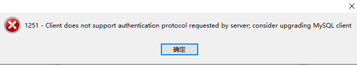
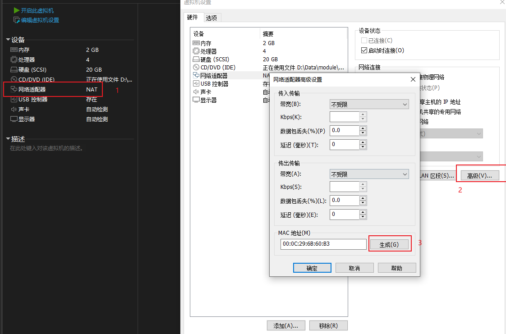
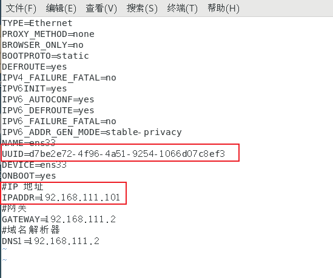
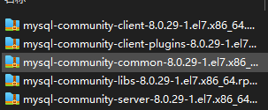
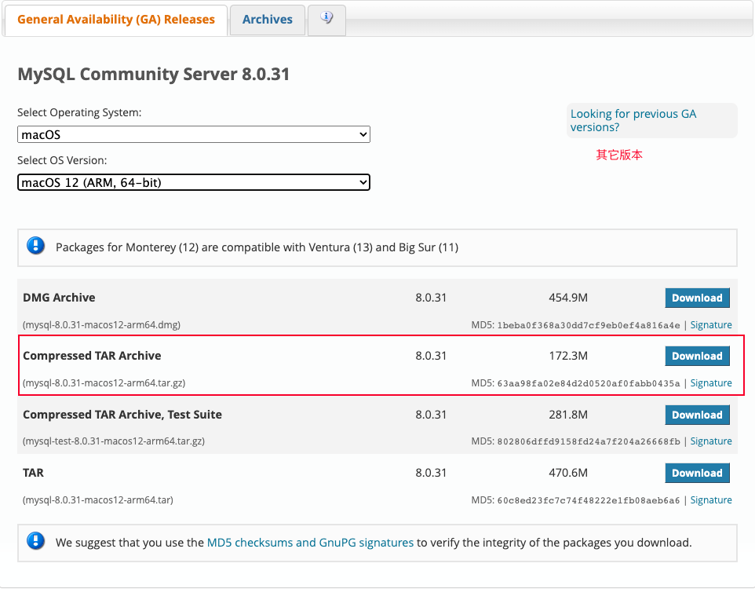
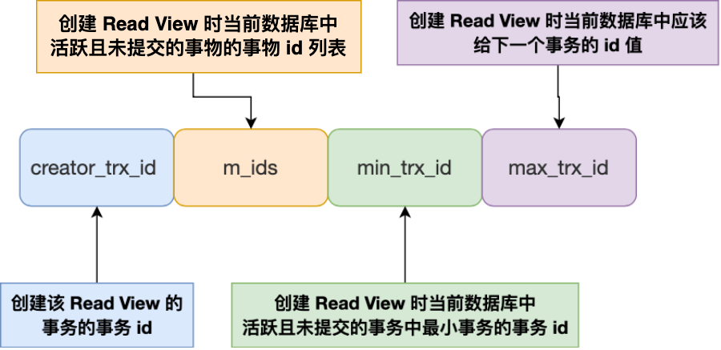

## MySQL基础

### MySQL环境搭建

#### MySQL的卸载

1. ##### 停止MySQL服务

    ```shell
    net stop mysql80 --(mysql服务名)
    ```

2. ##### 软件卸载

3. ##### 残余文件清理

    数据文件位置：C:\ProgramData\MySQL\MySQL Server 8.0

4. ##### 清理注册表

    打开注册表：`regedit`
    
    ```
    HKEY_LOCAL_MACHINE\SYSTEM\ControlSet001\Services\Eventlog(Application\MySQL服务 目录删除
    HKEY_LOCAL_MACHINE\SYSTEM\ControlSete01 \Services\MysQL服务 目录删除
    HKEY_LOCAL_MACHINE\SYSTEM\ControlSet002\Services\Eventlog \Application\MySQL服务 目录删除
    HKEY_LOCAL_MACHINE\SYSTEM\ControlSet802 \Services\MySQL服务 目录删除
    HKEY_LOCAL_MACHINE\SYSTEM\CurrentControlSet\Services\Eventlog\Application\MySQL服务  目录删除
    HKEY_LOCAL_MACHINE\SYSTEM\CurrentControlSet\Services\MySQL服务 目录删除
    ```
    
> 注册表中的ControlSetoo1,ControlSeto0o2,不一定是o01和oo2,可能是ControlSeto05、006之类

5. ##### 删除环境变量配置

### 配置文件

>  修改数据库默认字符集为utf8

修改mysql.ini

```sql
[mysql]
default-character-set=utf8 --默认字符集

[mysqld]

character-set-server=utf8
collation-server=utf8_general_ci
```

### MySQL 8.0连接问题

使用Navicat 连接MySQL 8.0 出现报错



出现这个原因是MySQL8之前的版本加密规则是mysql-native_password，而在MySQL8之后，加密规则是caching_sha2_password。解决问题方法有两种，

- 升级图形界面的工具版本
- 修改MySQL8用户登录的密码加密规则为 mysql-native_password

```sql
-- 修改方法
use mysql; --切换数据库
alter user  'root'@'localhost‘ identified with mysql_native_password by 'root'; -- 修改'root'@'localhost‘用户加密规则
flush privileges; --刷新权限
```

## Linux 下MySQL的安装使用

### Linux系统准备及工具准备

- 安装两台虚拟机

    - 克隆虚拟机操作

        - 修改Mac地址

            

        - 主机名

            ```shell
            vim /etc/hostname
            ```

        - IP地址

            

            ```shell
            vim /etc/sysconfig/network-scripts/ifcfg-ens33
            ```

        - UUID

            ```shell
            vim /etc/sysconfig/network-scripts/ifcfg-ens33
            ```


### MySQL的卸载

1. 关闭MySQL服务

    ```shell
    systemctl stop mysqld.service #
    ```

2. 查看当前MySQL 安装状况

    ```shell
    rpm -qa| grep -i mysql
    #或
    yum list installed | grep mysql
    ```

3. 卸载MySQL、卸载上述命令查询出的已安装程序

    ```shell
    yum remove mysql-xxx mysql-xxx
    ```

4. 删除MySQL相关文件

    ```shell
    find / -name mysql # 查询MySQL相关文件
    rm -rf xxx # 删除MySQL相关文件
    ```

5. 删除my.cnf

    ```shell
    rm -rf /etc/my.cnf
    ```


### MySQL安装

1. 解压下载的MySQL rpm安装包，上传需要的rpm包到Linux环境

    

2. 检查CentOS下MySQL依赖

    - 检查/tem临时目录的权限

        ```shell
        chmod -R 777 /tmp
        ```

    - 检查依赖,查看是否存在以下包

        ```shell
        rpm -qa|grep libaio
        
        rpm -qa|grep net-tools
        ```

3. 执行MySQL安装（严格按照顺序）

    ```shell
    rpm -ivh mysql-community-common-8.0.29-1.el7.x86_64.rpm
    rpm -ivh mysql-community-client-plugins-8.0.29-1.el7.x86_64.rpm
    rpm -ivh mysql-community-libs-8.0.29-1.el7.x86_64.rpm
    rpm -ivh mysql-community-client-8.0.29-1.el7.x86_64.rpm
    # 安装最后一个server报错需要icu-data-files
    rpm -ivh mysql-community-icu-data-files-8.0.29-1.el7.x86_64
    rpm -ivh mysql-community-server-8.0.29-1.el7.x86_64.rpm
    ```

    - rpm 是Redhat package Manager 缩写，通过rpm的管理，用户可以吧源代码包装成以rpm 为扩展名的文件形式
    - -i , --install 安装软件包
    - -v, --verbose 提供更多的详细信息输出
    - -h, --hash 软件包安装的时候列出哈希标记（和-v 一起使用），展示进度条

4. 安装报错

    > 使用命令： yum remove mysql-libs 解决， 清除安装过的依赖即可

    

    > 缺少包： mysql-community-icu-data-files-8.0.29-1.el7.x86_64
    >
    > 上传这个压缩包后执行命令：
    >
    > rpm -ivh mysql-community-icu-data-files-8.0.29-1.el7.x86_64

    

5. 查看mysql版本

    ```shell
    mysql --version #mysqladmin --version
    #查看是否安装成功
    rpm -qa|grep -i mysql # -i 不区分大小写
    ```

### 服务初始化

	为了保证数据库目录与文件的所有者为mysql登录用户，如果你是以root身份运行mysql服务，需要执行下面的命令初始化

```shell
mysqld --initialize --user=mysql
```

`--initialize` 选项默认以"安全"模式来初始化，则会为root用户生成一个密码并将 ==该密码标记为过期==，登录后需要设置一个新密码。生成的==临时密码==会在日志中记录

查看密码：

```shell
cat /var/log/mysqld.log
```

查看MySQL进程

```shell
ps -ef|grep -i mysql
```

### 查看MySQL是否开机自启

```shell
systemctl list-unit-files|grep mysqld.service #默认是enabled
```

如果不是enabled可以执行命令设置自启动

```shell
systemctl enable mysqld.service
```

如果不希望自启动，执行命令

```shell
systemctl disable mysqld.service
```

### 设置远程登录MySQL

1. 关闭Linux防火墙

    ```shell
    service iptables stop; # CentOS6
    ```

    ```shell
    systemctl start|status|stop firewalld
    systemctl enable firewalld # 设置开机启用防火墙
    systemctl disable firewalld # 设置开机关闭防火墙
    ```

2. 开放端口

    ```shell
    # 查看开放的端口号
    firewall-cmd --list-all
    #设置开放的端口号
    firewall-cmd -add-service=http --permanent
    firewall-cmd -add-port=3306/tcp --permanent
    ```

## Mac 下MySQL的安装使用

官网下载MySQL，可以下载dmg文件手动安装，也可以选择压缩包的方式，此处以压缩包的方式安装

[MySQL官网](https://dev.mysql.com/downloads/mysql/)



#### 解压

```shell
 sudo tar -zvxf mysql8-xxx
```

#### 初始化

 ```shell
 cd /usr/local/mysql/support-files
 sudo ./mysqld --initialize --user=mysql
 ```

#### 启动MySQL

```shell
 ./mysql.server start #启动
```

#### 修改密码

```shell
 ./bin/mysqladmin -u root -p password
```

如果这种修改方式报错，可以先进MySQL服务之后再用命令改

```shell
 ./mysql -u root -p 
 #输入刚刚生成的密码
 #执行命令修改密码：
 mysql> alter user 'root'@'localhost' indentifed by 'password'；
```

#### 配置MySQL环境变量

```shell
 $ sudo vim ~/.bash_profile
 PATH=".:$PATH:/usr/local/mysql/bin"
 PATH="$PATH:/usr/local/mysql/support-files"
```

## MySQL面试

#### MySQL聚簇索引和非聚簇索引

都是B+树的数据结构

- 聚簇索引：将数据存储于索引放到一块，并且时按照一定的顺序组织的找到索引也就找到了数据，数据的物理存放顺序和索引顺序时一致的，即：只要索引是相邻的，那么对于的数据一定也是相邻的存放在磁盘上。
- 非聚簇索引：叶子节点不存储数据，粗糙的数据行地址，也就是根据索引查找到数据行的位置还需要再去磁盘查找数据。

优点：

1. 查询通过聚簇索引可以直接获取数据，相比非聚簇索引需要二次查询（非覆盖索引的情况）效率更高；

   > 覆盖索引：要查询的字段就在索引上

2. 局促索引对于范围查询的效率很高，因为其数据是按照大小排列的；

3. 局促索引时候用在排序的场合，非聚簇索引不适合。

缺点：

1. 维护多余很昂贵，特别是插入新行或者正逐渐被更新导致腰分页（page split）的时候。建议在大量插入新行后，选择负载较低的时间段，通过OPTIMIZE_TABLE优化表，因为必须被移动的行数据可能造成碎片。使用独享空间可以弱化碎片；
2. 表因为使用UUID作为主键，使数据存储稀疏，这会出现聚簇索引有可能比全表扫描更慢，索引建设使用int的auto_increment作为主键；
3. 如果主键比较大，那辅助索引将会变得更大，因为辅助索引的叶子节点存储的是主键值，过长的主键值会导致非叶子节点占用更多的物理空间。

InnoDB 在创建聚簇索引时，会根据不同的场景选择不同的列作为索引：

- 如果有主键，默认会使用主键作为聚簇索引的索引键；
- 如果没有主键，就选择第一个不包含 NULL 值的唯一列作为聚簇索引的索引键；
- 在上面两个都没有的情况下，InnoDB 将自动生成一个隐式自增 id 列作为聚簇索引的索引键；

辅助索引访问数据需要二次查找，飞局促索引都是辅助索引，如复合索引，前缀索引，唯一索引，辅助索引叶子节点存储的是主键值，所以需要回表查询

MyISAM使用的是非聚簇索引，没有聚簇索引，非聚簇索引的两棵B+树看上去没什么不同，节点的结构完全一致只是存储的内容不同而已，主健索引B+树的节点存储了主键，辅助键索引B+树存储了辅助键。表数据存储在独立的地方，这两颗B+树的叶子节点都使用一个地址指向真正的表数据，对于表数据来说，这两个键没有任何差别。由于索引树是独立的，通过辅助键检系无需访问主键的系引树。

如果涉及到大数据量的排序、全表扫描、count（MylSAM会有单独的字段记录）之类的操作的话，还是MylSAM占优势些，因为索引所占空间小，,这些操作是需要在内存中完成的。

#### 索引设计原则

查询更快、占用空间更小

1. 适合索引的列是出现在where子句中的列，或者连接子句中指定的列
2. 基数较小的表，索引效果较差，没有必要在此列建立索引
3. 使用短索引，如果对长字符串列进行索引，应该指定一个前缀长度，这样能够节省大量索引空间，如果搜索词超过索引前缀长度，则使用索引排除不匹配的行，然后检查其余行是否可能匹配。
4. 不要过度建 索引。索引需要额外的磁盘空间，并降低写操作的性能。在修改表内容的时候，索引会进行更新甚至重构，索引列越多，这个时间就会越长。所以只保持需要的索引有利于查询即可。
5. 定义有外键的数据列一定要建立索引。
6. 更新频繁字段不适合创建索引
7. 若是不能有效区分数据的列不适合做索引列(如性别，男女未知，最多也就三种，区分度实在太低)
8. 尽量的扩展索引，不要新建索引。比如表中已经有a的索引，现在要加(a,b)的索引，那么只需要修改原来的索
   引即可。
9. 对于那些查询中很少涉及的列，重复值比较多的列不要建立索引。
10.  对于定义为text、image和bit的数据类型的列不要建立索引。

#### ACID靠什么保证

A（原子性）：由undo log 日子保证，它记录了需要回滚的日志信息，事务回滚时撤销已经执行的SQL；

C（一致性）：由其它三大特性保证，

I（隔离性）：由MVCC多版本并发控制和readview一致性视图保证；

D（持久性）：由内存和redo log 日志来保证，MySQL修改数据同时在内存和redo log记录这次的操作，宕机的时候可以从redo log恢复。redo log的刷盘会在系统空闲时进行

> InnoDB redo log 写盘，InnoDB事务进入prepare状态。如果前面 prepare 成功，bin1og 写盘，再继续将事务日志持久化到 bin1og，如果持久化成功，那么InnoDB事务则进入commit 状态(在 redo 1og里面写一个commit记录)

#### 什么是MVCC

> 只在READ COMMITTED 和REPEATABLE READ两个隔离级别下工作

多版本并发控制：读数据时通过类似快照的方式将数据保存，这样读锁和写锁就不冲突了，不同事务session只会看到自己特定的版本数据、版本链。

聚簇索引记录中有两个必要的隐藏列：

**trx_id**：用来存储每次对某条聚簇索引记录进行修改时的事务id；

**roll_pointer**：每次对哪条聚簇索引记录修改的时候，都会把老版本写入undo log中，这个roll_pointer就是存在了一个指针，指向这条聚簇索引记录的上一个版本位置，通过它来获得上一个版本的记录信息。

Read View 有四个重要的字段：



- m_ids ：指的是在创建 Read View 时，当前数据库中「活跃事务」的**事务 id 列表**，注意是一个列表，**“活跃事务”指的就是，启动了但还没提交的事务**。
- min_trx_id ：指的是在创建 Read View 时，当前数据库中「活跃事务」中事务 **id 最小的事务**，也就是 m_ids 的最小值。
- max_trx_id ：这个并不是 m_ids 的最大值，而是**创建 Read View 时当前数据库中应该给下一个事务的 id 值**，也就是全局事务中最大的事务 id 值 + 1；
- creator_trx_id ：指的是**创建该 Read View 的事务的事务 id**。

开始事务时创建readview,readview维护当前活动的事务id，即未提交的事务id，排序生成一个数组访问数据，获取数据中的事务id(获取的是事务id最大的记录)，对比readview：

如果在readview的左边(比readview都小)，可以访问(在左边意味着该事务已经提交)

如果在readview的右边(比readview都大）或者就在readview中，不可以访问，获取roll_pointer，取上一版本重新对比(在右边意味着，该事务在readview生成之后出现，在readview中意味着该事务还未提交)

已提交读隔离级别下的事务在每次查询的开始都会生成一个独立的ReadView,而可重复读隔离级别则在第一次读的时候生成一个ReadView，之后的读都复用之前的ReadView。

这就是Mysql的MVCC,通过版本链，实现多版本，可并发读·写，写-读。通过Readview生成策略的不同实现不同的隔离级别。

#### mysql主从同步原理

mysql主从同步的过程:

Mysql的主从复制中主要有三个线程: Master (bin1og dump thread) ， Slave(I/o thread . sQLthread） , Master—条线程和Slave中的两条线程。

- 主节点binlog，主从复制的基础是主库记录数据库的所有变更记录到binlog。binlog 是数据库服务器启动的那—刻起，保存所有修改数据库结构或内容的一个文件。
- 主节点 log dump线程，当binlog有变动时，log dump线程读取其内容并发送给从节点。·从节点I/O线程接收binlog内容，并将其写入到 relay log 文件中。
- 从节点的SQL线程读取relay log,文件内容对数据更新进行重放，最终保证主从数据库的一致性。

注:主从节点使用 binglog文件+ position偏移量来定位主从同步的位置，从节点会保存其已接收到的偏移量，如果从节点发生宕机重启，则会自动从position的位置发起同步。

> 由于mysql默认的复制方式是异步的，主库把日志发送给从库后不关心从库是否已经处理，这样会产生一个问题就是假设主库挂了，从库处理失败了，这时候从库升为主库后，日志就丢失了。由此产生两个概念。

##### 全同步复制

主库写入binlog后强制同步日志到从库，所有的从库都执行完成后才返回给客户端，但是很显然这个方式的话性能会受到严重影响。

##### 半同步复制

从库写入日志成功后返回ACK确认给主库，主库收到至少一个从库的确认救认为同步操作完成。


