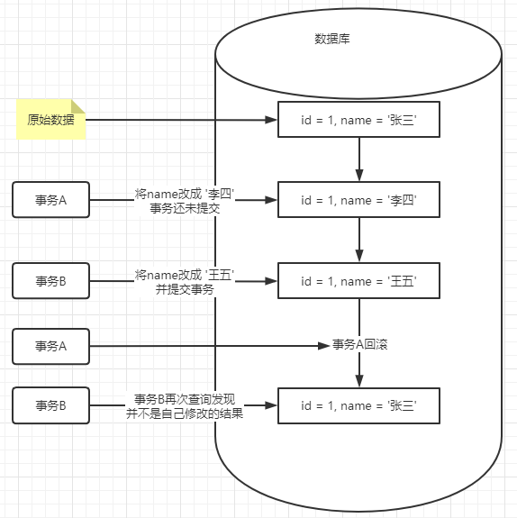
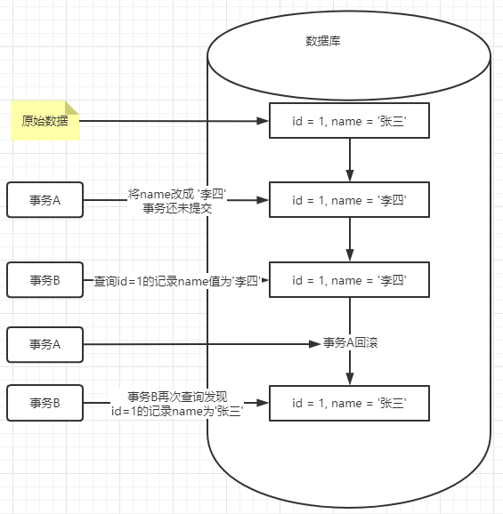
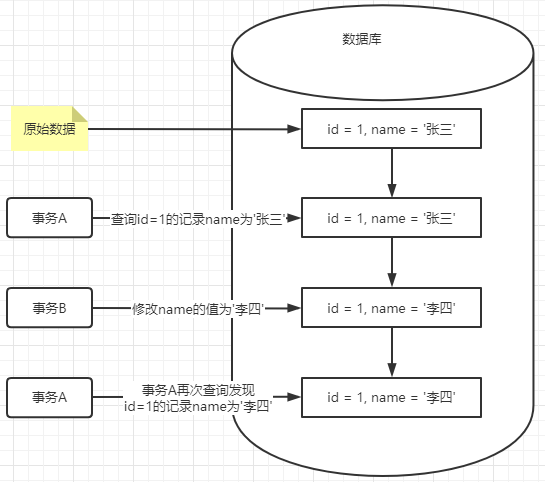
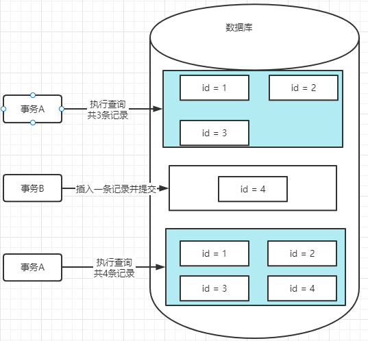

## MySQL事务原理

MySQL底层到底是如何实现事务的呢？ 其实使用了==MVCC多版本控制机制，事务隔离机制，锁机制==等来解决事务并发问题。如果数据库事务在并发过程中不做控制和处理，会产生那些影响呢？

### 脏数据

> 脏数据一般可以分为四种：脏写，脏读，不可重复读，幻读

#### 脏写

> 脏写是指一个事务修改并且提交的数据被另外一个事务回滚了

分析：假设有两个事务 A、B，事务 A 先开启事务，修改了数据库 id 为1 的记录，如将 name 改成了 ’李四‘，此时事务 A 还没有提交，这个时候事务B开启了，事务 B 将 id 为 1 的记录修改为 ‘王五’，并且事务 B 先与事务 A 提交事务。但是这个时候事务 A 不想修改了，或者在事务 A 内出现了异常，将自己修改的事务回滚了，此时 id 为1 的这条记录的 name 的值还是 ‘张三’；这就是脏写， 事务B已经写入的记录被事务 A 回滚掉了；

那 MySQL 是如何解决脏写的问题呢？ 猜对了，就是**锁**。在MySQL事务中对于涉及到的行会按照需要加锁，但是执行完并不会立马释放锁，只有当前事务提交的时候才会释放锁，所以当事务 A 要修改这条记录的之前，它会持有这条记录的写锁，而写锁是一种互斥锁，这时事务 B 开启想去修改 id = 1 的这条记录时也需要持有这条记录的锁，但由于事务 A 还没有提交，事务只能等待，当事务 A 执行完成，事务 B 才会开始执行。

#### 脏读

> 脏读是指一个事务读取到了另外一个事务还没有提交的数据

分析：还是假设有两个事务 A 、B。事务 A先开启了，并将 id = 1 的记录name 修改成了 ‘李四’，但是事务 A 还没有提交，此时事务 B 开启了，事务 B 查询这条  id = 1的这条记录，查询到name的值为‘李四’，然后按照这个值去执行其他业务操作，如果此时事务 A 回滚了之前的修改，那么事务 B 再次查询id= 1的记录发现name的值并不是‘李四’，这就是脏读。

#### 不可重复读

> 不可重复读是指前后读取同一条记录结果不一样

分析： 假设有两个事务A、B。事务 A 先开启查询了 id=1 的记录name的值是‘张三’，还没有执行任何操作，此时事务B开启了，修改了 id=1的记录，将name改为‘李四’，此时事务 A 再次查询这条记录，发现name的值变成了’李四‘，这就是不可重复读，前后读取同一条记录结果不一样。

#### 幻读

> 幻读是指前后读取到的记录的数量不一样

分析：幻读和不可重复读有点类似，不可重复读强调的是数据值不一样，重点是修改；而幻读强调的是记录的数量不一样，重点是新增和删除。

假设有两个事务A 、B，事务 A 先开启，并执行了SQL：`select * from student`，总共有3条记录，此时我事务 B 开启了，并想student表插入了一条记录，并提交了事务，此时事务 A 再次执行SQL：`select * from student`, 结果发现有4条记录，这就是幻读。这些问题会在不同的数据库的事务隔离级别下产生。

### 事务基本特性 

**原子性**：一个事务中的操作，要么全部成功，要么全部失败。

**一致性**：数据库库总是从一个一致性状态转换到另外一个一致性状态。

**隔离性**：一个事务的修改在提交前对其他事务是不可见的。

**持久性**：事务一旦提交，则所做的修改会永久的保存在数据库中。

### 事务隔离级别

事务的隔离级别有四种

1. Read uncommitted：读未提交，表示一个事务可以读取到另外一个事务未提交的修改；
2. Read Committed(RC)：读已提交，表示一个事务只能读到另外一个事务已经提交的修改；
3. Repeatable Read(RR)：可重复读，MySQL的默认隔离级别，表示只要事务还在进行中，彼此之间互不影响；
4. Serializable：串行化，表示所有的事务只能一个一个来，效率最低。

不同的隔离级别可能出现的问题

|           隔离级别            | 脏写 | 脏读 | 不可重复读 | 幻读 |
| :---------------------------: | :--: | :--: | :--------: | :--: |
|  Read uncommitted：读未提交   |  ✘   |  ✔   |     ✔      |  ✔   |
| Read Committed(RC)：读已提交  |  ✘   |  ✘   |     ✔      |  ✔   |
| Repeatable Read(RR)：可重复读 |  ✘   |  ✘   |     ✘      |  ✔   |
|     serializable：串行化      |  ✘   |  ✘   |     ✘      |  ✘   |

### 场景再现

1. 在一个事务A中删除统计数据记录
2. 去其他营业查询统计数据
3. 开启事务B批量插入数据并立即提交
4. 由于插入的数据和第一个事务中删除的数据在逻辑上是同一条数据，所以程序被卡在

分析：oracle 的默认隔离级别是读已提交，那么在事务A中，山除的数据还没有提交对事务B是不可见的，那事务B去插入数据时发现这条数据没有被删除，不是应该会报唯一键冲突吗，为什么会出现程序北卡主，事务长时间未提交？

事实上，当事务A删除这条记录的时候会绑定这条记录，拥有这条记录写锁，虽然删除语句已经执行完成，但是这把锁并没有被释放，只有当事务A提交时才会释放行锁，此时B要在这一行插入一条记录，那么也需要先获得这条记录的行锁，而写锁是一种互斥锁，只有当事务A释放锁喉事务B才能拿到锁，而事务B嵌套在事务A中，会互相等待释放资源，从而出现了死锁，死锁一般只有等待执行超时，在MySQL中有个死锁检测，在orcale中不知道有没有，好像没有查到，其实不仅是删除和插入会遇到这种死锁问题，包括update也会出现死锁；如果使用for update锁查也会出现死锁，

总结：当出现嵌套事务的时候应该考虑是否会产生事务冲突；

