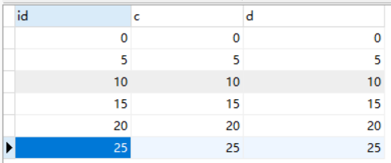
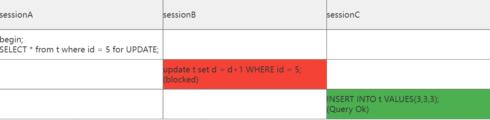
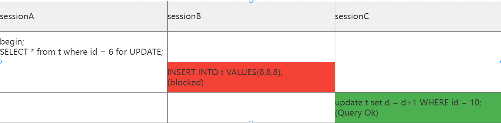
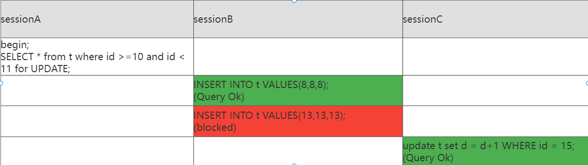
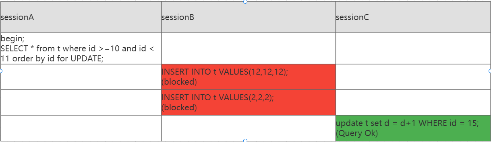
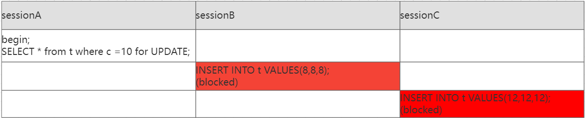
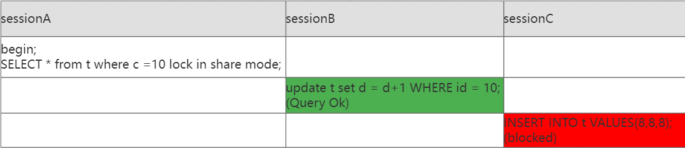
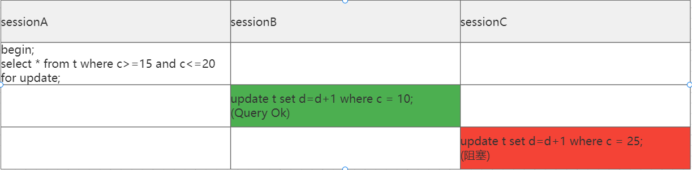
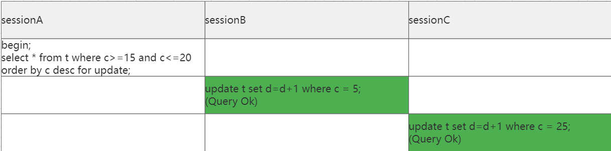

## MySQL是怎么加锁的

间隙锁在可重复读隔离级别下才有效，本文所有实验都是默认可重复读隔离级别，**MySQL版本：8.0.29**

加锁规则：两个原则、两个优化、一个bug

1. 原则1：**加锁的基本单位是 next-key lock**，它是由记录锁和间隙锁组合而成的，**next-key lock 是前开后闭区间，间隙锁是前开后开区间**
2. 原则2：查找过程中访问到的对象才会加锁；
3. 优化1：索引上的等值查询，给唯一索引加锁时，next-key lock会退化成行锁；
4. 优化2：索引上的等值查询，向右遍历时且最后一个不满足等值条件的时候，next-key lock会退化成间隙锁；
5. 一个bug：唯一索引上的范围查询会访问到不满足条件的第一个值为止，此记录也会加next-key lock；如果不满足条件则退化成间隙锁；
6. 由于加锁规则，升序查询和倒序查询时加锁记录会不一样。

```sql
CREATE TABLE `t` (
  `id` int NOT NULL,
  `c` int DEFAULT '0',
  `d` int DEFAULT '0',
  PRIMARY KEY (`id`),
  KEY `c` (`c`)
) ENGINE=InnoDB DEFAULT CHARSET=utf8mb4 COLLATE=utf8mb4_0900_ai_ci;
insert into values (0,0,0);
insert into values (5,5,5);
insert into values (10,10,10);
insert into values (15,15,15);
insert into values (20,20,20);
insert into values (25,25,25);
```



### 唯一索引等值查询

- **当查询的记录是存在时，next-key lock 会退化成「记录锁」**。

- **当查询的记录是不存在时，next-key lock 会退化成「间隙锁」**。

> 等值查询记录存在



sessionA的加锁过程：

1. 加锁的基本单位是 next-key lock，因此sessionA的加锁范围是(0, 5];
2. 由于是用唯一索引进行等值查询，且查询的记录存在，所以 **next-key lock 退化成记录锁，因此最终加锁的范围是 id = 5 这一行**。

所以sessionB更新id=5这条记录会被阻塞，而sessionC插入id=3这条记录时可以正常执行的。

>  等值查询记录不存在



sessionA的加锁过程：

1. 根据原则1，加锁的基本单位是 next-key lock，因此sessionA的加锁范围是(5, 10];
2. 根据优化2，查询的记录不存在，id=10是最后一个不满足等值条件，所以 **next-key lock 退化成间隙锁，因此最终加锁的范围是(5,10)**。

所以sessionB往间隙锁里插入id=8的这条记录会被阻塞，由于id=10是没有加锁的，所以sessionC更新id=10的这条记录可以正常执行。

### 唯一索引范围查询

范围查询和等值查询的加锁规则是不同的。如下两条语句

```sql
SELECT * from t where id >=10 for UPDATE;
SELECT * from t where id >=10 and id < 11 for UPDATE;
```

在逻辑上这两条语句是等价的，但是加锁规则不太一样



sessionA的加锁过程：

1. 根据原则1，加锁的基本单位是 next-key lock，最开始要找的第一行是 id = 10,因此sessionA的加锁范围是(5, 10]; 由于id是唯一索引且该记录是存在的，所以会退化成记录锁，最终只有id=10这一行加锁；

2. 由于是范围查找，会往后继续找，直到id=15这行记录才停下来，然后加 next-key lock (10, 15]，由于 id = 15 不满足 id < 11，所以会退化成间隙锁，加锁范围变为 (10, 15)。

   > 《MySQL实战45讲》中id=15这一行也加锁了，实测8.0.29版本没有加锁

所以sessionB往间隙锁里插入id=13的这条记录会被阻塞，而id=8是不在间隙锁范围内的，所以插入id=8的记录可以正常执行，更新id=15的这条记录也是可以正常更新的，不同版本加锁规则可能略微不同，大家可以用上述案例测试一下，看下你的 MySQL 版本和我的 MySQL 版本的加锁规则是否一致。

### 唯一索引范围倒序序查询

倒序是从大到小遍历所以加锁范围和顺序查询不同



sessionA的加锁过程：

1. 由于是倒序查询，先定位id < 11找到的第一行是 id = 15,因此sessionA的加锁范围是(15, 15]; 由于 id = 15 不满足 id < 11，所以会退化成间隙锁，加锁范围变为 (10, 15)；
2. 由于是范围查找，会往后继续找，由于【一个bug】直到id=5这行记录才停下来，然后加 next-key lock (0, 5]，所以最终加锁范围变为 (0, 15)的开区间。

### 非唯一索引等值查询

1. 当用非唯一索引进行等值查询的时候，**会在两个索引上加锁，一个是主键索引，一个是非唯一索引，但是对主键索引加锁时，由于扫描的是非唯一索引，只有满足查询条件的记录才会对它们的主键索引加记录锁**。
2.  for update加锁和 lock in share mode加锁加锁方式不同，如果是for update加锁，会顺便给主键加上索引，而 **lock in share mode只锁覆盖索引**，并不会对主键也加上锁；

- 当查询的记录**存在**时，由于不是唯一索引，索引再定位到第一条记录后还会向后继续扫描知道第一个不满足查询的条件为止，在扫描过程中会对访问到的二级索引加 next-key lock，而对于第一个不满足查询条件的二级索引，next-key lock会退化成间隙锁。同时，**在符合查询条件的记录的主键索引上加记录锁**。

> 查询的记录**存在 ** for update加锁



sessionA的加锁过程：

1. 根据原则1，加锁的基本单位是 next-key lock，首先定位到c = 10,因此sessionA的加锁范围是(5, 10]; 虽然记录存在但由于c是非唯一索，不会退化成记录锁，所以加锁范围是(5, 10]；
2. 由于c是非唯一索引，会往后继续扫描，直到c=15第一个不满足查询条件的记录才停下来，然后加 next-key lock (10, 15]，由于 c = 15 不满足 c = 10，所以会退化成间隙锁，加锁范围变为 (10, 15),所以最终加锁范围是(5,15)的开区间；
3. 扫描过程中，c=10这行存在记录，所以会在主键id=10上加行锁；

因此sessionA的select语句锁的范围是：   

1. 索引c上(5,15)左开右开区间
2. 主键索引id=10的记录锁

> 查询的记录**存在 ** lock in share mode加锁

 

sessionA的加锁过程：

1. 根据原则1，加锁的基本单位是 next-key lock，首先定位到c = 10,因此sessionA的加锁范围是(5, 10]; 虽然记录存在但由于c是非唯一索，不会退化成记录锁，所以加锁范围是(5, 10]；
2. 由于c是非唯一索引，会往后继续扫描，直到c=15第一个不满足查询条件的记录才停下来，然后加 next-key lock (10, 15]，由于 c = 15 不满足 c = 10，所以会退化成间隙锁，加锁范围变为 (10, 15),所以最终加锁范围是(5,15)的开区间；
3. 由于是lock in share mode加读锁，不会对主键加锁；

因此sessionA的select语句锁的范围是：   

1. 索引c上(5,15)左开右开区间

当查询的记录**不存在**时，扫描到第一个不满足查询条件的二级索引记录，该二级索引的 next-key lock会退化成间隙锁。因为不存在满足查询条件的记录，所以不会对主键索引加锁。

> 查询的记录**不存在**

### 非唯一索引范围查询

<span style="color: red;">范围查询定位第一条记录走【等值查询】</span>

找到第一个满足条件的加next-key lock

<span style="color: red;">普通索引范围查询，next-key lock 不会退化成间隙锁</span>



sessionA的加锁过程：

1. 默认查询升序，根据索引通过等值查询找到第一行是c=15,因此会加上next-key lock (10,15]和间隙锁(15,20),由于c不是唯一索引，并不会退化成记录锁；
2. 由于是范围查询，就会继续向后找存在的记录，找到第一个不符合条件的记录是c=25,所以会加上next-key lock (20,25]
3. 扫描过程中，c=15、20、25这三行都存在值，所以会在主键id上加三个行锁，三条记录中c=25不满足条件，不需要回表查询，所以主键索引上只有id=15、20这两个行锁；

因此sessionA的select语句锁的范围是：   

1. 索引c上(10,25] 左开右闭区间
2. 主键索引id=15、20两个行锁

### 非唯一索引范围倒序查询

<span style="color: red;">范围查询定位第一条记录走【等值查询】</span>



sessionA的加锁过程：

1. 降序查询，根据索引找到第一行是c=20,又由于定位第一条记录是走等值查询，因此会加上next-key lock (15,20]和间隙锁(20,25),由于c不是唯一索引，并不会退化成记录锁；
2. 由于是范围查询，还会继续向左遍历，找到第一个不符合条件的记录是c=10才停下来,所以会加上next-key lock (5,10]和间隙锁(10,15)
3. 扫描过程中，c=10、15、20这三行都存在值，所以会在主键id上加三个行锁，三条记录中c=10不满足条件，不需要回表查询，所以主键索引上只有id=15、20这两个行锁；

因此sessionA的select语句锁的范围是：

1. 索引c上(5,25) 左开右开区间
2. 主键索引id=10、15、20三个行锁

