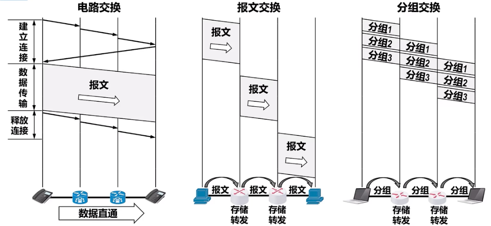
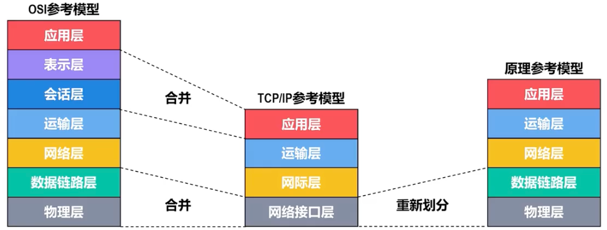
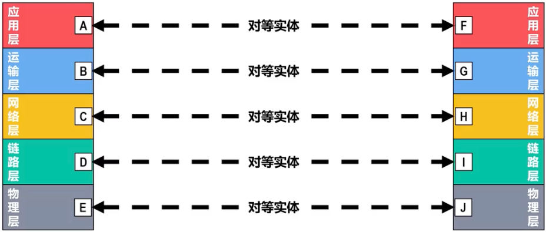
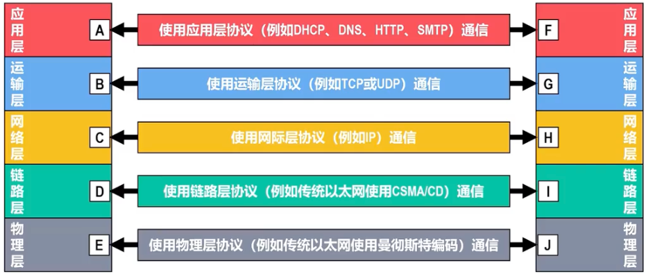
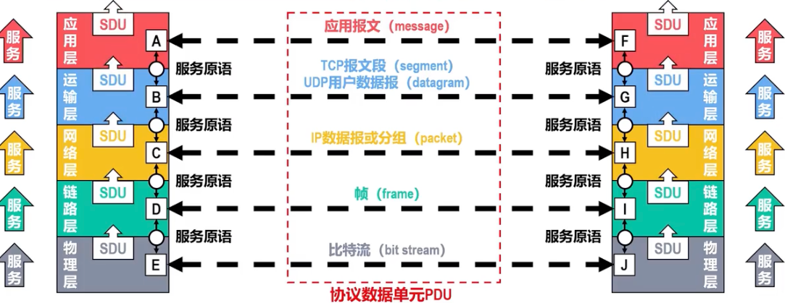
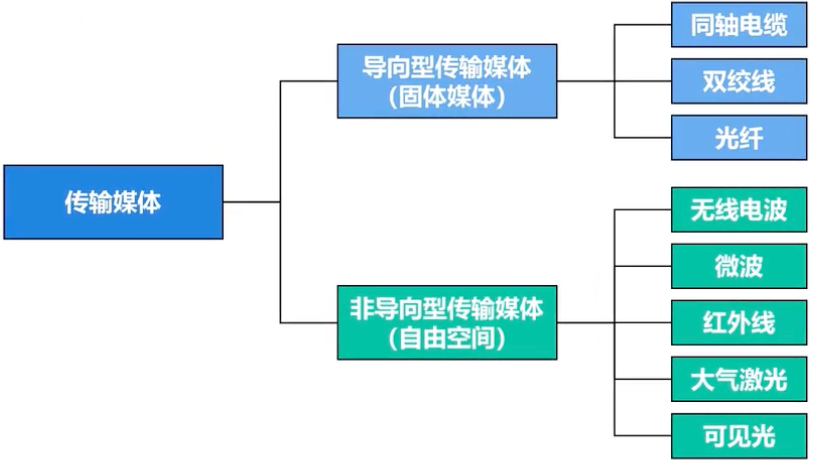

## ISP

因特网服务提供者 ISP（Internet Service Provider）

## 数据交换方式

### 电路交换

电路交换三个步骤：

1.   建立连接，分配通信资源
2.   通话，一直占用通信资源
3.   释放连接，归还通信资源

### 报文交换

-   报文交换时分组交换的前身，在报文交换中，<mark>报文被整个的发送</mark>，而不是拆分成若干个分组进行发送
-   交换节点将报文整体接收完成后才能查找转发表，将整个报文转发到下一个节点。
-   报文交换比分组交换带来的<mark>转发时延要长很多</mark>，需要交换节点具有<mark>更大的缓存空间</mark>.

### 分组交换

计算机之间的数据传送是突发式的，当使用电路交换来传送计算机数据时，其线路的传输效率一般会很低，线路上真正用来传送数据的时间往往不到10%甚至1%，所以不适合使用电路交换，需要使用分组交换的方式。

优点：

-   没有建立连接和释放连接的过程。
-   分组传输过程中逐段占用通信链路，有较高的通信线路利用率。
-   交换节点可以为每一个分组独立选择转发路由，使得网络有很好的生存性。

缺点：

-   分组首部带来了额外的传输开销。
-   交换节点存储转发分组会造成一定的时延。
-   无法确保通信时端到端通信资源全部可用，在通信量较大时可能造成网络堵塞。

### 三种交换方式对比

-   若要连续传送大量的数据，并且数据传送时间远大于建立连接的时间，则使用电路交换可以有较高的传输效率。然而<mark>计算机的数据传送往往是突发式的</mark>，采用电路交换时<mark>通信线路的利用率会很低</mark>。
-   报文交换和分组交换都<mark>不需要建立连接</mark>（即预先分配通信资源）,在传送计算机的突发数据时可以<mark>提高通信线路的利用率</mark>。
-   将报文构造成若干个更小的分组进行分组交换，比将整个报文进行报文交换的<mark>时延要小</mark>，并且还可以<mark>避免太长的报文长时间占用链路，有利于差错控制</mark>，同时具有更好的灵活性。

## 计算机网络性能指标

### 速率

-   比特（bit）是计算机中数据量的基本单位，一个比特就是二进制数字中的一个1或0.
-   数据量的常用单位有字节（byte）千字节（KB）、兆字节（MB）、吉子节（GB）、太字节（TB）
-   数据量单位中的K、M、G、T的数值是2^10^ 、2^20^ 、 2^30^ 、 2^40^
-   速率是指数据的传送速率（即每秒传送多少个比特），也称为数据率或比特率
-   速率的基本单位是比特/秒(bit/s,也有记为bps,即bit per second)，速率常用单位还有千比特/秒(kb/s或kbps)、兆比特/秒(Mb/s或Mbps)
-   速率单位中k、M、G、T的数值分别为10^3^ 、 10^6^、 10^9^ 、 10^12^

$$
【练习】有一个待发送数据块，大小为100MB，网卡的发送速率为100Mbps,则网卡发送完该数据块需要多长时间？\\
\dfrac{100MB}{100Mb/s} = \dfrac{MB}{Mb/s} = \dfrac{2^{20}}{10^6b/s} = \dfrac{2^{20} \times 8b}{10^6b/s} = 8.388608s \\
		估算时 \approx \dfrac{B}{b/s} = \dfrac{8b}{b/s} = 8s
$$

### 带宽

带宽在模拟信号系统中的意义

-   某个信号锁包含的各种不同频率成分所占据的频率范围
-   单位：Hz（kHz、MHz、GHz）

带宽在计算机网络中的意义

-   用来标识网络通信线路所能传送数据的能力，即在单位时间内从网络中的某一点到另一点所能通过的最高数据率
-   单位：b/s（kb/s、Mb/s、Gb/s、Tb/s）

### 吞吐量

吞吐量是指在单位时间内通过某个网络或接口的实际数据量。吞吐量常被用于对实际网络的测量，以便获知到底有多少数据量通过了网络

$吞吐量 = 上传速率 + 下载速率$

### 时延

时延是指数据从网络的一端传送到另一端锁耗费的时间，也称为延迟或迟延。数据可由一个或多个分组、深圳市一个比特构成

-   主机/路由器发送：发送时延

    $发送时延 = \dfrac{分组长度(b)}{发送速率(b/s)}$

    

-   链路传播：传播时延
    $$
    传播时延 = \dfrac{信道长度(m)}{信号传播速率(m/s)}\\
    自由空间：3.0 \times 10^8 \\
    铜        线：2.3 \times 10^8 \\
    光        纤：2.0 \times 10^8 \\
    $$
    
-   分组在路由器上排队：排队时延

-   路由器处理（如检查分组首部、查找转发接口）：处理时延

### 时延带宽积

时延带宽积是传播时延和带宽的乘积
$$
时延带宽积 = 传播时延 \times 带宽 = \dfrac{1km}{2\times10^8mm/s} \times 1Gb/s = 5000b
$$
链路的时延带宽积也称为<mark>以比特为单位的链路长度</mark>。

### 往返时间

往返时间（Round-Trip Time, <mark>RTT</mark>）是指从发送端发送数据分组开始，到发送端接受到接收端发送的相应确认分组为止，总共耗费的时间。

### 利用率

链路利用率：链路利用率是指某条链路有百分之几的时间是被利用的（即有数据通过）

网络利用率：网络利用率是指网络中所有的链路的链路利用率的加权平均。

### 丢包率

丢包率是指在一定时间内，传输过程中<mark>丢失的分组数量与中分组数量的比例</mark>。

分组丢失主要有以下两种情况：

-   分组在传输过程中出现误码，被传输路径中的节点交换机（例如路由器）或目的主机检测出误码而丢弃。-
-   节点交换机根据丢弃策略主动丢弃分组。

丢包率可以反映网络的拥塞情况：

-   无拥塞时路径丢包率为0。
-   轻度拥塞时路径丢包率为1%~4%。
-   严重拥塞时路径丢包率为5%~15%。

## 计算机体系结构

### 三种体系结构

OSI参考模型（法律标准）：应用层、表示层、会话层、运输层、网络层、熟路链路层、物理层。

TCP/IP参考模型（事实标准）：应用层、运输层、网际层、网络接口层

原理参考模型：应用层、运输层、网络层、数据链路层、物理层

为什么要分层

-   分层可以将复杂的问题转化为若干个较小的局部问题
-   高内聚、低耦合

### 体系结构中专用术语

#### 实体

-   实体是指任何可发送或接收信息的硬件或软件进程；

-   对等实体是指通信双方相同层次中的实体

    

#### 协议

-   协议是控制两个对等实体在“<mark>水平方向</mark>”进行“<mark>逻辑通信</mark>”的规则集合

-   协议三要素

    -   语法  定义锁交换信息的格式
    -   语义   定义通信双方所要完成的操作
    -   同步   定义通信双方的时序关系

    

#### 服务

-   在协议的控制，<mark>两个对等实体在水平方向的逻辑通信使得本层能够向上一层提供服务</mark>。

-   要使用本层协议，还需要下一层所提供的服务。

-   协议是水平的，服务是垂直的。

-   在同一体系中<mark>相邻两层实体交换信息的逻辑接口成为服务访问点SAP</mark>，用于区分不同的服务类型。

-   上层与下层交换的命令称为<mark>服务原语</mark>。

-   对等层次之间传送的数据包称为该层的<mark>协议数据单元（Protocol Data Unit, PDU）</mark>。

-   同一系统内层与层之间交换的数据包称为服<mark>务数据单元（Service Data Unit, SDU）</mark>。

    

## TCP/IP网络模型

### 应用层

### 传输层

### 网络层

#### 网际协议IP

网际协议（Interent Protoco，IP）是TCP/IP体系结构网际层中的核心协议。

#### IPv4地址机器编址方法

### 网络接口层

#### 物理层

##### 传输媒体

-   传输媒体是计算机网络设备之间的物理通路，也称为传输介质或传输媒介

-   传输媒体并<mark>不包含在计算机网络体系结构中</mark>

    

##### 传输方式

-   串行传输、并行传输

-   同步传输、异步传输

    -   同步方法；
        1.   外同步：在收发双方之间增加一条时钟信号
        2.   内同步：发送端将时钟信号编码发哦发送数据中一起发送（如曼彻斯特编码）
    -   异步传输
        1.   字节之间异步，即字节之间的时间间隔不固定
        2.   字节内的每个比特仍然要同步即各比特的持续时间是同步的

-   单向通信（单工）：单信道，只有乙方可以发送信息

-   双向交替通信（半双工）：双信道，双方都可以发送和接收信息，但同一时间只能有一方发送一方接收，不能同时发生

-   双向同时通信（全双工）：双信道，双方都可以同时发送和接收信息

    **单工电台中的单工是指双向交替通信而不是单向通信**

#### 数据链路层