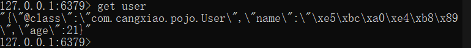

## Redis基础

### 初识Redis

> Redis诞生于2009年全称是Remote Dictionary Server,远程词典服务器，是一个基于内存的键值型NoSQL数据库。

特征：

- 键值(key-value)型，value支特多种不同数据结构，功能丰富
- 单线程(核心命令执行是单线程的)，每个命令具备原子性
- 低延迟，速度快（基于内存、O多路复用、良好的编码）。
- 支持数据持久化
- 支持主从集群、分片集群
- 支持多语言客户端

### 安装Redis

#### 普通下载方式

1. 下载命令

   ```shell
   # 下载Redis
   yum install redis/apt-get install redis
   ```

#### 源码下载方式

[Install Redis from Source]([https://redis.io/docs/getting-started/installation/install-redis-from-source/)

1. Redis是C语言编写的，一次需要安装Redis所需要的gcc依赖

   ```shell
   yum install -y gcc tcl
   ```

2. 下载安装包

   https://redis.io/download/

3. 安装包安装，下载安装包上传至Linux

   ```shell
   #解压Redis
   tar -zxvf redis-xxx.tar.gz
   ```

4. 编译Redis

   ```shell
   #进入Redis目录
   cd redis
   #编译 make：编译 make install 安装
   make && make install
   ```

### Redis启动

#### 默认启动

安装完成后在人员目录执行 `redis-server`命令即可启动redis

#### 指定配置启动

1. 要让Redis在后台启动则需要修改配置文件，进入Redis解压目录修改配置文件

   ```shell
   #先备份原配置文件
   cp redis.conf redis.conf.bak
   #修改配置问
   vim redis.conf
   ```

2. 修改redis.conf文件中的配置

   ```shell
   # 监听地址，默认是127.0.0.1，会导致只能在本地访问，修改为0.0.0.0则可以在任意IP访问
   #若要指定IP可以访问，则可以写对应IP地址，多个IP地址用空格分隔
   bind 0.0.0.0
   #守护进程修改为yes即可在后台启动
   daemonize yes
   #密码 设置后访问redis必须输入密码
   requirepass redis
   ```

3. Redis其它常见配置

   ```shell
   # 监听端口
   port 6379
   #工作目录，，默认是当前目录，也就是运行redis-server时的命令、日志、持久化等文件会保存在这个目录
   dir .
   #数据库数量，设置为1，代表只有一个库，默认16个库，编号 0~15
   databases 1
   # 设置Redis能够使用的最大内存
   maxmemory 512mb
   # 日志文件，默认为空，不记录日志，可以指定日志文件名
   logfile "redis.log"
   ```

#### 关闭redis

1. 停止redis服务

   ```shell
   redis-cli -a password shutdown
   ```

#### 开机自启

1. 新建一个系统服务文件

   ```shell
   vim /etc/systemd/system/redis.server
   ```

2. 文件内容

   ```shell
   [Unit]
   Description=redis-server
   After=network.target
   [Service]
   Type=forking
   ExecStart=/opt/module/redis/redis-server /opt/module/redis/redis.conf
   PrivateTmp=true
   [Install]
   WantedBy=multi-user.target
   ```

3. 重新加载服务

   ```shell
   systemctl daemon-reload
   ```

4. 用systemctl启停redis

   ```shell
   systemctl start redis 
   systemctl status redis 
   systemctl stop redis 
   #开机自启
   systemctl enable redis
   ```

### Redis客户端

#### Redis命令客户端

```shell
redis-cli [options] [commonds]
```

常见options有：

- `-h 127.0.0.1`: 指定连接Redis节点的IP地址，默认是127.0.0.1
- `-p 6379` :指定连接Redis节点的端口，默认是6379
- `-a 123456`：指定Redis的访问密码

commonds 就是Redis的操作命令

- `ping`：与Redis服务端做心跳测试，服务端正常返回`PONG`

#### Redis命令行操作

```shell
root@LAPTOP-R3Q9LUFD:/opt/module/redis# redis-server redis.conf
root@LAPTOP-R3Q9LUFD:/opt/module/redis# redis-cli
127.0.0.1:6379> ping
(error) NOAUTH Authentication required.
# 避免连接的时候输入密码警告，连接客户端之后在用auth [用户][密码] 认证
127.0.0.1:6379> auth 123456
OK
#心态测试
127.0.0.1:6379> ping
PONG
#关闭Redis服务
127.0.0.1:6379> shutdown [nosave|save]
```

##### Redis常用通用命令

- KEYS:查看符合模板的所有ky,不建议在生产环境设备上使用
- DEL:删除一个指定的key
- EXISTS:判断key是否存在
- EXPIRE:给一个key设置有效期，有效期到期时该key会被自动删除
- TTL:查看一个KEY的剩余有效期

## Redis数据类型

### String

#### 简介

String 类型就是字符串类型， key-value 结构，是Redis中最简单的存储类型，key 是唯一标识，value 是字符串， 根据字符串格式不同可分为三类，

- string：普通字符串
- int：整数类型，可以做自增、自减操作
- float：浮点类型，可以做自增、自减操作

不管那种格式，底层都是字节数组形式存储，只是编码方式不同，最大空间不能超过 `512M`。

#### 常用命令

- 基本操作

  ```shell
  #设置key-value类型的值
  127.0.0.1:6379> set name zhangsan
  OK
  127.0.0.1:6379> set age 18
  OK
  127.0.0.1:6379> get name
  "zhangsan"
  #重复设置覆盖之前的值
  127.0.0.1:6379> set name lisi
  OK
  127.0.0.1:6379> get name
  "lisi"
  ```

- 批量设置

  ```shell
  127.0.0.1:6379> mset k1 v1 k2 v2 k3 v3
  OK
  127.0.0.1:6379> mget name age k1 k2 k3
  1) "lisi"
  2) "18"
  3) "v1"
  4) "v2"
  5) "v3"
  ```

- 自增自减

  ==float类型没有自减操作==

  ```shell
  #将key中存储的数值自增 1
  127.0.0.1:6379> incr age
  (integer) 19
  127.0.0.1:6379> incr age
  (integer) 20
  #将key中存储的数值按指定步长自增
  127.0.0.1:6379> incrby age 2
  (integer) 22
  #将key中存储的数值自减 
  127.0.0.1:6379> decr age
  (integer) 21
  127.0.0.1:6379> decr age
  (integer) 20
  #将key中存储的数值按指定步长自减 
  127.0.0.1:6379> decrby age 2
  (integer) 18
  127.0.0.1:6379> set score 1.4
  OK
  127.0.0.1:6379> incrbyfloat score 3
  "4.4"
  127.0.0.1:6379> incrbyfloat score 0.6
  "5"
  ```

- 组合命令

  ```shell
  # setnx不存在则新增key-value,存在则不处理
  127.0.0.1:6379> setnx name zhangsan
  (integer) 0
  127.0.0.1:6379> get name
  "lisi"
  127.0.0.1:6379> setnx name2 wangwu
  (integer) 1
  127.0.0.1:6379> get name2
  "wangwu"
  # setex set和expire组合命令，设置key-value的同时指定过期时间
  127.0.0.1:6379> setex name2 10 zhangsan
  OK
  127.0.0.1:6379> ttl name2
  (integer) 3
  ```

- 其它操作

  ```shell
  # expire设置过期时间
  127.0.0.1:6379> expire k1 10
  (integer) 1
  # ttl 获取key剩余过期时间
  127.0.0.1:6379> ttl k1
  (integer) 8
  # 过期时间为-2 代表已过期
  127.0.0.1:6379> ttl k1
  (integer) -2
  #  过期时间为-1 代表永不过期
  127.0.0.1:6379> ttl age
  (integer) -1
  # 删除key
  127.0.0.1:6379> del k2
  (integer) 1
  # exists 查看指定key释放存在
  127.0.0.1:6379> exists name
  (integer) 1
  # key的分级存储 需要通过图形化界面查看
  127.0.0.1:6379> set redis:user:1 '{"id":1, "name":"lisi","age":18}'
  OK
  ```

### Hash

#### 简介

Hash 是一个键值对（key - value）集合，其value是一个无序字典，类似于Java中的HashMap结构，适合用来存储对象结构

#### 常用命令

- 基本操作

  ```shell
  #添加或修改hash类型key的filed的值
  127.0.0.1:6379> HSET redis:user:1 name zhangsan
  (integer) 1
  127.0.0.1:6379> HSET redis:user:1 age 18
  (integer) 1
  127.0.0.1:6379> HSET redis:user:1 sex man
  (integer) 1
  # hget 获取hash类型key的filed的值
  127.0.0.1:6379> hget redis:user:1 name
  "zhangsan"
  ```

- 批量操作

  ```shell
  #hmset 批量添加多个hash类型的key的filed的值
  127.0.0.1:6379> hmset redis:user:2 name zhangsan age 20 sex man
  (integer) 3
  #hmget 批量获取多个hash类型的key的filed的值
  127.0.0.1:6379> hmget redis:user:2 name age sex
  1) "zhangsan"
  2) "20"
  3) "man"
  #hgetall 获取一个hash类型的key中所有的filed和value
  127.0.0.1:6379> hgetall redis:user:1
  1) "name"
  2) "zhangsan"
  3) "age"
  4) "18"
  5) "sex"
  6) "man"
  #hkeys 获取一个hash类型的key中所有的filed
  127.0.0.1:6379> hkeys redis:user:1
  1) "name"
  2) "age"
  3) "sex"
  # 获取一个hash类型的key中所有的value
  127.0.0.1:6379> hvals redis:user:1
  1) "zhangsan"
  2) "18"
  3) "man"
  ```

- 自增

  ```shell
  127.0.0.1:6379> hincrby redis:user:1 age 1
  (integer) 19
  127.0.0.1:6379> hincrby redis:user:1 age 3
  (integer) 22
  127.0.0.1:6379> hincrbyfloat redis:user:1 age 1
  "23"
  127.0.0.1:6379> hincrbyfloat redis:user:1 age 1.5
  "24.5"
  127.0.0.1:6379> hincrbyfloat redis:user:1 score 1.5
  "12"
  127.0.0.1:6379> hincrbyfloat redis:user:1 score -1.5
  "10.5"
  ```

- 组合命令

  ```shell
  127.0.0.1:6379> HSETnx redis:user:1 name zhangsan
  (integer) 0
  127.0.0.1:6379> HSETnx redis:user:1 score 10.5
  (integer) 1
  ```

- 其它操作

  ```shell
  127.0.0.1:6379> hkeys redis:user:3
  1) "age"
  2) "name"
  3) "sex"
  # hdel删除一个hash类型的key中filed
  127.0.0.1:6379> hdel redis:user:3 sex
  (integer) 1
  127.0.0.1:6379> hkeys redis:user:3
  1) "age"
  2) "name"
  #删除一个key
  127.0.0.1:6379> del redis:user:3
  (integer) 1
  127.0.0.1:6379> hkeys redis:user:3
  (empty array)
  ```

### List

#### 简介

Redis中的List类型与ava中的LinkedList类似，可以看做是一个双向链表结构。既可以支持正向检索和也可以支持反向检索。
特征也与LinkedList类似：

- 有序
- 元素可以重复
- 插入和删除快
- 查询速度一般

常用来存储一个有序数据，例如：朋友圈点赞列表，评论列表等。

#### 常用命令

```shell
127.0.0.1:6379> lpush users zhangsan lisi wangwu
(integer) 3
127.0.0.1:6379> lpop users
"wangwu"
127.0.0.1:6379> lpop users
"lisi"
127.0.0.1:6379> lpop users
"zhangsan"
127.0.0.1:6379> lpop users
(nil)
127.0.0.1:6379> rpop users
(nil)
127.0.0.1:6379> lpush users zhangsan lisi wangwu
(integer) 3
127.0.0.1:6379> lindex users 2
"zhangsan"
#阻塞获取key
127.0.0.1:6379> blpop users 10
1) "users"
2) "wangwu"
```

### Set

#### 简介

Redis的Set结构与ava中的HashSet类似，可以看做是一个value为nul的HashMap。因为也是一个hash表，因此具备与HashSet类似的特征：

- 无序
- 元素不可重复
- 查找快
- 支持交集、并集、差集等功能

#### 常用命令

```shell
#向set中添加一个或多个元素
127.0.0.1:6379> sadd users zhangsan lisi
(integer) 2
#移除set中指定元素
127.0.0.1:6379> srem users zhangsan
(integer) 1
#返回set中元素个数
127.0.0.1:6379> scard users
(integer) 1
127.0.0.1:6379> sismember users lisi
(integer) 1
#获取集合中所有元素
127.0.0.1:6379> smembers users
1) "lisi"
#获取key1 和key2的交集
127.0.0.1:6379> sinter users users2
1) "lisi"
2) "zhangsan"
#获取key1 和key2的差集
127.0.0.1:6379> sdiff users users2
1) "wangwu"
127.0.0.1:6379> sdiff users2 users
1) "mary"
#获取key1 和key2的并集
127.0.0.1:6379> sunion users users2
1) "lisi"
2) "wangwu"
3) "zhangsan"
4) "mary"
127.0.0.1:6379>
```

练习题：

```shell
# 张三的好友有：李四、王五、赵六
127.0.0.1:6379> sadd zhangsan lisi wangwu zhaoliu
(integer) 3
# 李四的好友有：王五、麻子、二狗
127.0.0.1:6379> sadd lisi wangwu mazi ergou
(integer) 3
#计算张三的好友有几人
127.0.0.1:6379> scard zhangsan
(integer) 3
#计算张三和李四有哪些共同好友
127.0.0.1:6379> SINTER zhangsan lisi
1) "wangwu"
#查询哪些人是张三的好友却不是李四的
127.0.0.1:6379> sdiff zhangsan lisi
1) "lisi"
2) "zhaoliu"
#查询张三和李四的好友总共有哪些人
127.0.0.1:6379> SUNION zhangsan lisi
1) "lisi"
2) "wangwu"
3) "zhaoliu"
4) "mazi"
5) "ergou"
#判断张三是否是李四的好友
127.0.0.1:6379> sismember lisi zhangsan
(integer) 0
#判断李四是否是张三的好友
127.0.0.1:6379> sismember zhangsan lisi
(integer) 1
#将李四从张三的好友列表中移除
127.0.0.1:6379> srem zhangsan lisi
(integer) 1
```

### Zset

#### 简介

Redis的SortedSet是一个可排序的set集合，与)ava中的TreeSet有些类似，但底层数据结构却差别很大。SortedSet中的每一个元素都带有一个score属性，可以基于score属性对元素排序，底层数据结构是由**压缩列表或跳表(SkipList)**实现的。

**在 Redis 7.0 中，压缩列表数据结构已经废弃了，交由 listpack 数据结构来实现了**SortedSet!具备下列特性：

- 可排序
- 元素不重复
- 查询速度快

因为SortedSet的可排序特性，经常被用来实现排行榜这样的功能。

#### 常用命令

```shell
#将班级的下列学生得分存入Redis的SortedSet中
127.0.0.1:6379> zadd stus 85 Jack 89 Lucy 82 Rose 95 Tom 78 Jerry 92 Amy 76 Miles
(integer) 7
#删除Tom同学
127.0.0.1:6379> zrem stus Tom
(integer) 1
#获取Rose同学的排名  升序
127.0.0.1:6379> zrank stus Rose
(integer) 2
#获取Rose同学的排名  降序
127.0.0.1:6379> zrevrank stus Rose
(integer) 3
127.0.0.1:6379> zcard stus
(integer) 6
# 获取 0~80分的人数
127.0.0.1:6379> zcount stus 0 80
(integer) 2
# 给Amy加两分
127.0.0.1:6379> ZINCRBY stus 2 Amy
"94"
#前三名 升序
127.0.0.1:6379> zrange stus 0 2
1) "Miles"
2) "Jerry"
3) "Rose"
#前三名 降序
127.0.0.1:6379> ZREVRANGE stus 0 2
1) "Amy"
2) "Lucy"
3) "Jack"
#获取0~80分的人
127.0.0.1:6379> ZRANGEBYSCORE stus 0 80
1) "Miles"
2) "Jerry"
# 带limit
127.0.0.1:6379> ZRANGEBYSCORE stus 0 80 limit 1 1
1) "Jerry"
#获取0~80分的人并显示分数
127.0.0.1:6379> ZRANGEBYSCORE stus 0 80 withscores
1) "Miles"
2) "76"
3) "Jerry"
4) "78"
#获取所有的人
127.0.0.1:6379> ZRANGEBYLEX stus - +
1) "Miles"
2) "Jerry"
3) "Rose"
4) "Jack"
5) "Lucy"
6) "Amy"

```

## Redis客户端

### Jedis客户端

- 依赖

  ```xml
  <dependency>
      <groupId>redis.clients</groupId>
      <artifactId>jedis</artifactId>
      <version>3.7.0</version>
  </dependency>
  <dependency>
      <groupId>org.junit.jupiter</groupId>
      <artifactId>junit-jupiter</artifactId>
      <version>5.9.0</version>
      <scope>test</scope>
  </dependency>
  ```

- Jedis操作

  ```java
  public class JedisTest {
      private Jedis jedis;
      @BeforeEach
      void setUp() {
          //简历连接
          jedis = new Jedis("172.27.138.145",6379);
          //认证密码
          jedis.auth("redis");
          //选择分库 默认0号库 共16个分库 序号0~15
          jedis.select(0);
      }
      @Test
      public void testString(){
  
          String result = jedis.set("name", "张三");
          System.out.println("result = " + result);
          String name = jedis.get("name");
          System.out.println("name = " + name);
      }
      @Test
      public void testHash(){
  
          Long result = jedis.hset("user:1", "name", "张三");
          System.out.println("result = " + result);
          result = jedis.hset("user:1", "age", "18");
          System.out.println("result = " + result);
          String name = jedis.hget("user:1","name");
          System.out.println("name = " + name);
          Map<String,String> user = jedis.hgetAll("user:1");
          System.out.println("user = " + user);
      }
      @Test
      public void testList(){
          Long result = jedis.lpush("name", "张三","lisi","wangwu");
          System.out.println("result = " + result);
          String name = jedis.lindex("name",1);
          System.out.println("name = " + name);
          name = jedis.lpop("name");
          System.out.println("name = " + name);
      }
      @Test
      public void testSet(){
          Long result = jedis.sadd("user", "lisi","zhangsan");
          System.out.println("result = " + result);
          Set<String> user = jedis.smembers("user");
          System.out.println("user = " + user);
          jedis.expire("user",10L);
      }
      @Test
      public void testSorterSet(){
          Long result = jedis.zadd("user", 80,"zhangsna");
          System.out.println("result = " + result);
          result = jedis.zadd("user", 85.5,"lisi");
          System.out.println("result = " + result);
          jedis.expire("user",10L);
          Set<String> user = jedis.zrangeByScore("user", 80, 85);
          System.out.println("user = " + user);
      }
      @AfterEach
      void tearDown() {
          if (jedis!=null){
              jedis.close();
          }
      }
  }
  ```

### Jedis连接池

Jedis本身是线程不安全的，并且频繁的创建和销毁连接会有性能损耗，因此使用Jedis连接池代替Jedis的直连方式

 ```java
  public class JedisConnectFactory {
      private static final JedisPool JEDIS_POOL;
      static {
          JedisPoolConfig jedisPoolConfig = new JedisPoolConfig();
          //最大连接
          jedisPoolConfig.setMaxTotal(8);
          //最大空闲连接
          jedisPoolConfig.setMaxIdle(8);
          //最小空闲连接
          jedisPoolConfig.setMinIdle(0);
          //最长等待时间 ms
          jedisPoolConfig.setMaxWaitMillis(200);
          JEDIS_POOL = new JedisPool(jedisPoolConfig,"172.27.138.145",6379,1000,"reids")
  
      }
      private static Jedis getJedis(){
          return JEDIS_POOL.getResource();
      }
  }
 ```

### SpringDataRedis

### RedisTemplate

1. 引入依赖

   ```xml
   <dependency>
       <groupId>org.springframework.boot</groupId>
       <artifactId>spring-boot-starter-data-redis</artifactId>
   </dependency>
   
   <dependency>
       <groupId>org.apache.commons</groupId>
       <artifactId>commons-pool2</artifactId>
   </dependency>
   ```
2. yml配置

   ```yaml
   spring:
     redis:
       host: 172.27.138.145
       port: 6379
       password: redis
       lettuce:
         pool:
           max-active: 8 #最大链接书
           max-idle: 8 # 最大空闲链接数
           min-idle: 0 # 最小空闲链接数
           max-wait: 100ms #连接等待时间
   ```

3. 配置RedisTemplate

   ```java
   @Configuration
   public class RedisTemplateConfig {
       @Bean
       public RedisTemplate<Object,Object> redisTemplate(RedisConnectionFactory redisConnectionFactory){
           RedisTemplate<Object,Object> redisTemplate = new RedisTemplate<>();
           redisTemplate.setConnectionFactory(redisConnectionFactory);
           GenericJackson2JsonRedisSerializer jsonRedisSerializer = new GenericJackson2JsonRedisSerializer();
           //设置key序列化
           redisTemplate.setKeySerializer(RedisSerializer.string());
           redisTemplate.setHashKeySerializer(RedisSerializer.string());
           //设置value序列化
           redisTemplate.setValueSerializer(jsonRedisSerializer);
           redisTemplate.setHashValueSerializer(jsonRedisSerializer);
           return redisTemplate;
       }
   }
   ```

4. 注入RedisTemplate使用

   ```java
   public void test(){
       redisTemplate.opsForValue().set("name","张三");
       Object name = redisTemplate.opsForValue().get("name");
       System.out.println("name = " + name);
   }
   ```

### StringRedisTemplate

#### 序列化问题

尽管JSON的序列化方式可以满足我们的需求，但依然存在问题：

为了在反序列化时知道对象的类型，JSON序列化器会将类的class类型吸入json结果中，存入Redis，会带来额外的内存开销。



为了节省内存空间，不会使用JSON序列化器来处理value,而是统一使用String序列化器，要求只能存储String类型的key和vlaue，当需要存储Java对象时，手动完成对象的序列化和反序列化。

#### StringRedisTemplate使用

Spring默认提供了一个StringRedisTemplate类。它的key和value的序列化方式默认时Sting方式，

> String类型

```java
@Autowired
private StringRedisTemplate stringRedisTemplate;
private static final ObjectMapper MAPPER = new ObjectMapper();
@Test
public void saveUser2() throws JsonProcessingException {
    // 创建对象
    User user = new User("张三", 21);
    //手动序列化
    String value = MAPPER.writeValueAsString(user);
    //写入数据
    stringRedisTemplate.opsForValue().set("user",value, Duration.ofMinutes(1));
    //获取数据
    String jsonUser = stringRedisTemplate.opsForValue().get("user");
    //手动反序列化
    User user1 = MAPPER.readValue(jsonUser, User.class);
    System.out.println("user = " + user1);
}
```

> hash类型

```java
@Test
public void hashTest() throws JsonProcessingException {
    stringRedisTemplate.opsForHash().put("user:1","name","李四");
    stringRedisTemplate.opsForHash().put("user:1","age","20");
    Map<Object, Object> entries = stringRedisTemplate.opsForHash().entries("user:1");
    System.out.println("entries = " + entries);//entries = {name=李四, age=20}
}
```
