## SDS

### SDS与C字符串的区别

##### SDS字符串结构：

```c
struct __attribute__ ((__packed__)) sdshdr8 {
    uint8_t len; /* 字符串长度 */
    uint8_t alloc; /* 分配的空间长度 */
    unsigned char flags; /* SDS类型 */
    char buf[]; /* 字节数组 */
};
```

如下图redis中字符串数组结构

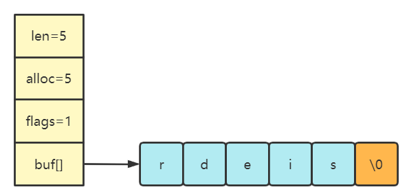

##### O(1)复杂度获取字符串长度

> len记录了字符串长度

在redis中**len记录了字符串长度**。获取字符串长度的时候只需要返回len的值就可以，时间复杂度为 O(1)。

C 语言的字符串底层是一个字符数组，与Java字符串类似。如下图`char* str = redis`字符串数组结构：

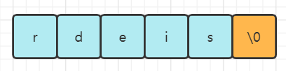

在 C 语言里，char * 指针只是指向字符数组的起始位置，而数组末尾用“\0”表示字符串结束的位置。因此，C字符串并不能记录自身的长度，为了获取字符串的长度需要遍历整个字符串，直到遇到空白字符“\0”为止，这个操作的复杂度为O(N)。所以字符串中不能含有“\0”字符，否则会被认为是字符串的结尾，这也导致C语言字符串只能保存文本数据，而不能保存图片、音频、视频等二进制数据。

##### 避免缓冲区溢出

 C 语言标准库中字符串的操作函数是很不安全的，对程序员很不友好，稍微一不注意，就会导致缓冲区溢出。

举个例子，strcat 函数是可以将两个字符串拼接在一起

```c
//将 src 字符串拼接到 dest 字符串后面
char *strcat(char *dest, const char* src);
```

在执行这个strcat函数时，如果没有分配足够多的内存可以容纳拼接后的字符串内容，就会产生缓冲区溢出；而且由于没有记录字符串长度，在操作字符串时都要遍历字符串的长度才能操作，**对字符串的操作效率不高**，

与C字符串不同，Redis 中空间分配策略完全杜绝了发生缓冲区溢出的可能， SDS 结构里引入了 alloc 和 len 成员变量，当 SDS API 需要对SDS进行修改时，会先通过 `alloc - len` 计算来检查SDS空间是否满足要求，**当判断出缓冲区大小不够用时，Redis 会自动将扩大 SDS 的空间大小**，然后才执行实际修改操作。

SDS 扩容的规则：

```c
hisds hi_sdsMakeRoomFor(hisds s, size_t addlen) {
    void *sh, *newsh;
    /* 返回SDS中未使用的空间字符数 */
    size_t avail = hi_sdsavail(s);
    size_t len, newlen;
    char type, oldtype = s[-1] & HI_SDS_TYPE_MASK;
    int hdrlen;

    /* 若的剩余空间已足够，无需扩展，直接返回. */
    if (avail >= addlen) return s;

    len = hi_sdslen(s);
    sh = (char*)s-hi_sdsHdrSize(oldtype);
    newlen = (len+addlen);
    if (newlen < HI_SDS_MAX_PREALLOC)
        /* 新长度小于HI_SDS_MAX_PREALLOC，则分配两倍的空间 HI_SDS_MAX_PREALLOC = 1024*1024 = 1M*/
        newlen *= 2;
    else
        newlen += HI_SDS_MAX_PREALLOC;

    type = hi_sdsReqType(newlen);

    /* Don't use type 5: 不要使用类型 HI_SDS_TYPE_5*/
    if (type == HI_SDS_TYPE_5) type = HI_SDS_TYPE_8;

    ···
    /* newlen被赋值给alloc*/
    hi_sdssetalloc(s, newlen);
    return s;
}
```

##### 减少内存重分配

由于C字符串长度和底层数组之间存在着关联性，所以每次增长或缩短一个以字符串都要对这个数组做一次内存重分配

- 如果是增长字符串，如字符串拼接，需要先扩展数组空间，否则会产生缓冲区溢出
- 如果是缩短字符串，如字符串截断，需要选释放空间，否则就会产生内存泄漏

而SDS则使用一个len属性来记录字符串的长度，底层数组的长度不一定就是字符串的数量加一（包含结束符\0），通过未使用空间，SDS实现了空间预分配和惰性释放空间

空间预分配：

1. **如果修改SDS字符串后，字符串的长度小于1MB，那么程序会分配2*len+1的空间**（包含结束符\0）
2. **如果修改SDS字符串后，字符串的长度大于1MB，那么程序会多分配1MB的未使用空间**

通过空间预分配策略，Redis会减少执行字符串增长时的内存重分配次数；

如图当SDS执行`sdscat(s,”cluster”)`,SDS 将执行一次空间预分配策略，SDS的长度修改为12字节，预分配空间长度为24字节，当再次调用`sdscat(s,”tutorial”)`时，由于剩余空间`alloc - len`的长度足够新增字符串使用，Redis会直接使用未使用空间而无需执行内存重分配

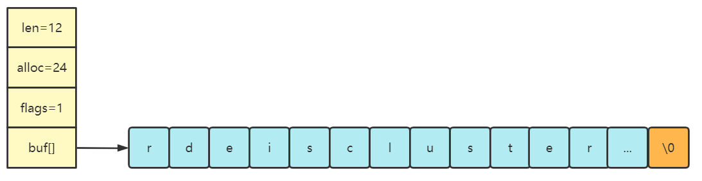

惰性释放空间:

当SDS需要缩短字符串时，Redis不会立即执行内存重分配来回收空间，而是修改len属性的长度，剩余空间用来以后增长字符串时使用。

##### 二进制安全

C语言字符串中的字符必须符合编码规范并且不能出现空字符\0，而SDS不需要用 “\0” 字符来标识字符串结尾，而是用一个专门的len成员变量来记录数组长度，所以可存储包含 “\0” 的数据。但是 SDS 为了兼容部分 C 语言标准库的函数， SDS 字符串结尾还是会加上 “\0” 字符。

SDS的API都是二进制安全的，所有SDS API都会以处理二进制的方式来处理SDS存放在buf[]数组中的数据，程序不会对其中的数据做任何限制，数据写入的时候时什么样的，它被读取时就是什么样的，因此Redis 不仅可以保存文本数据，也可以保存任意格式的二进制数据。

## 链表

### 链表结构

### 链表节点

```c
typedef struct listNode {
    struct listNode *prev;
    struct listNode *next;
    void *value;
} listNode;

```

节点之间通过前置指针(prev)和后置指针相连接(next)，组成一个双向链表

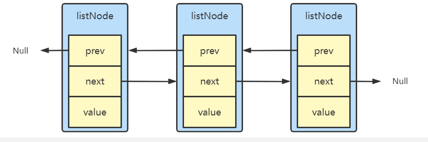

##### 链表

```c
typedef struct list {
    listNode *head; // 头结点
    listNode *tail; // 尾节点
    void *(*dup)(void *ptr); //节点值复制函数
    void (*free)(void *ptr); //节点值释放函数
    int (*match)(void *ptr, void *key); //节点值比较函数
    unsigned long len; //链表节点数量
} list;
```

list链表结构包含了头指针head、为指针tail、链表节点数量len、以及dup、free、match三个链表操作的函数

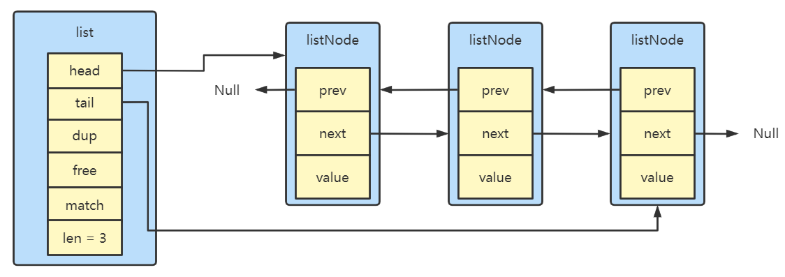

### 链表的特点

- 双端： 链表节点里带有 prev 和 next 指针，获取某个节点的前置节点或后置节点的时间复杂度只需O(1)；
- 无环：表头节点的 prev指针和表尾节点的 next 指针都指向null；
- 带表头表尾指针：list 结构中包含 head 指针 head 和 tail 指针，获取链表的表头节点和表尾节点的时间复杂度都是O(1)；
- 带链表长度计数器：List结构中用一个len属性来统计链表节点的数量，获取链表节点数量的复杂度是O(1)；
- 多种类型：listNode 链表节使用 void* 指针保存节点值，并且可以通过 list 结构的 dup、free、match 函数指针为节点设置该节点类型特定的函数，所以链表节点可以保存各种不同类型的值；

缺陷：

- 链表每个节点通过前后指针相连，**内存不连续，无法利用 CPU 的缓存**。
- 保存一个链表节点的值需要分配一个链表节点的空间，**内存开销较大**。

Redis 3.2 版本之前，Redis采用ZipList和LinkedList来实现List，当数据量较少的情况下会使用ZipList作为底层实现，可以节省空间，数据较多时采用LinkedList作为底层实现。

Redis 3.2 版本之后，Redis设计了一个新的数据结构quickList，并统一采用quickList来实现List。

## 压缩列表

ZipList是一种特殊的“双端链表”，与LinkedList一样可以在任意一端进行压入、弹出的操作（都是O(1)的复杂度），ZipList是一种内存紧凑型数据结构，占用一块连续的内存空间，可以充分利用CPU缓存，而且可以根据数据的长度选择不同的编码，更有效的节省内存空间。

### 压缩列表结构

压缩列表是 Redis 为了节约内存而开发的，它是由连续内存块组成的顺序型数据结构，


压缩列表属性：

- ***zlbytes***：记录整个压缩列表占用对内存字节数；占4字节
- ***zltail***，记录压缩列表尾点距离起始地址有多少字节，通过这个偏移量，程序无序遍历整个压缩列表就可以确定尾结点的地址；占4字节；
- ***zllen***，记录压缩列表包含的节点数量；占2字节，当这个属性值小于UINT16_MAX(65535)时，这个属性值就是压缩列表包含所有节点的数量，当大于这个值时，节点真实数量需要遍历才能计算出；
- ***zlend***，标记压缩列表的结束点，固定值 0xFF（十进制255）。

### 节点结构


节点属性：

- ***previous_entry_length***：前一个节点的长度，占1个或5个字节，目的是为了实现从后向前遍历；
  - 如果前一节点的长度小于254字节，则采用1个字节来保存这个长度值
  - 如果前一节点的长度大于254字节，则采用5个字节来保存这个长度值，第一个字节为0xf,后四个字节才是真实长度数据

- ***encoding***：编码属性，记录content的数据类型（字符串还是整数）以及长度，占用1个、2个或5个字节
- ***content***：负责保存节点的数据，可以是字符串或整数

##### previous_entry_length

> 压缩列表 特殊 “双端列表” A–> B –> C
>
> 正向：B的地址 = A的地址+***B.previous_entry_length***的长度+***B.encoding***长度+***B.content***长度(encoding编码对应的长度)
>
> 反向：B的地址 = C的地址-***C.previous_entry_length***的长度

##### encoding

- 字符串：如果encoding是以“00”、“01”、“10”开头，则contents是字符串

  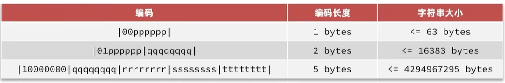

- 整数：如果encoding是以“11”开头，则contents是整数，切encoding固定占用一个字节

  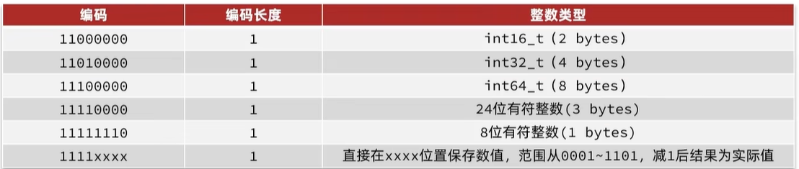

##### content

content负责保存节点的值，节点的值可以是一个字节数组或者整数，值的类型和长度有encoding决定。

- 如果**当前节点的数据是整数**，则 encoding 会使用 **1 字节的空间**进行编码，也就是 encoding 长度为 1 字节。通过 encoding 确认了整数类型，就可以确认整数数据的实际大小了，比如如果 encoding 编码确认了数据是 int16 整数，那么 data 的长度就是 int16 的大小。

  

- 如果**当前节点的数据是字符串，根据字符串的长度大小**，encoding 会使用 **1 字节/2字节/5字节的空间**进行编码，encoding 编码的前两个 bit 表示数据的类型，后续的其他 bit 标识字符串数据的实际长度，即 data 的长度。

  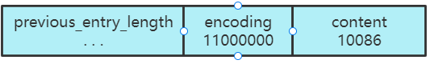

### 连锁更新

ZipList每个节点previous_entry_length属性都保存着前一个节点的长度，previous_entry_length占用1或5个字节长度，

- 如果前一个**节点的长度小于 254 字节**，那么 previous_entry_length属性需要用 **1 字节的空间**来保存这个长度值；
- 如果前一个**节点的长度大于等于 254 字节**，那么 previous_entry_length属性需要用 **5 字节的空间**来保存这个长度值；

假设一个压缩列表中有多个连续的、长度在 250～253 之间的节点：


因为entey1~entryN节点长度都小于254字节，所以previous_entry_length只需要一个字节长度来记录前一个节点的长度，这时我们将一个大于等于254字节的新节点new设置为压缩列表的头节点，即entry1的前置节点，

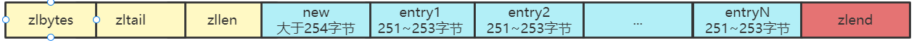

由于entry1的previous_entry_length的属性长度仅为1个字节，无法保存新节点的长度，所以需要对压缩列表执行空间重分配工作，entry1的previous_entry_length属性从1字节扩展到5字节。经过扩展后entry1的字节长度就超过了254字节，所以需要扩展entry2节点的长度，正如扩展 entry1引发了对 entry2扩展一样，扩展 entry2 也会引发对 entry3 的扩展，…… 一直持续到entryN节点。

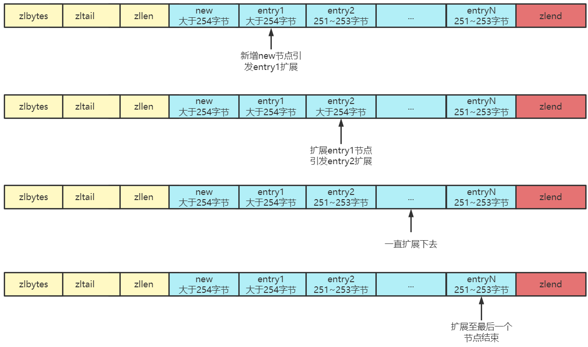

这种特殊情况下产生多次空间扩展操作称之为“**连锁更新**”

## quickList

在 Redis 3.0 之前，List 对象的底层数据结构是双向链表或者压缩列表。子啊3.2版本中引入了一个新的数据结构quickList。 quicklist s是一个双向链表，链表中每个节点都是一个ZipList结构。

### quickList结构

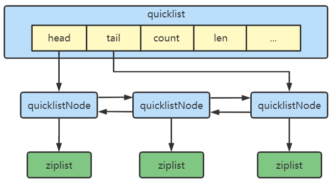

```c
typedef struct quicklist {
    quicklistNode *head;	/* 头指针 */
    quicklistNode *tail;	/* 尾指针 */
    unsigned long count;	/* ziplist节点个数 即列表中总元素个数 */
    unsigned long len;		/* quicklistNode节点个数 */
    int fill : QL_FILL_BITS;              /* 指明ziplist长度 */
    unsigned int compress : QL_COMP_BITS; /* 0:禁用压缩，否则代表quicklistnode在quicklist末尾未压缩的数量 */
    unsigned int bookmark_count: QL_BM_BITS; /*Bookmakrs是realloc这个结构体使用的可选特性，这样它们在不使用时就不会消耗内存*/
    quicklistBookmark bookmarks[];
} quicklist;
```

Redis提供了一个配置项：list-max-ziplist-size来限制。

- 如果值为正，则代表ziplist的允许的entry个数的最大值

- 如果值为负，则代表ziplist的最大内存大小，分5种情况：

  1. -1：每个ziplist的内存占用不能超过4kb
  2. -2：每个ziplist的内存占用不能超过8k
  3. -3：每个ziplist的内存占用不能超过16kb
  4. -4：每个ziplist的内存占用不能超过32kb
  5. -5：每个ziplist的内存占用不能超过64kb
     其默认值为-2：

  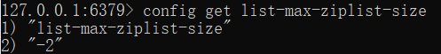

### quickList节点结构

```c
typedef struct quicklistNode {
    struct quicklistNode *prev;	/* 前一个quicklistNode */
    struct quicklistNode *next;	/* 后前一个quicklistNode */
    unsigned char *zl;			/* quicklistNode指向的ziplist */
    unsigned int sz;             /* ziplist 字节大小 */
    unsigned int count : 16;     /* count of items in ziplist */
    unsigned int encoding : 2;   /* 编码方式：1：原生 or 2：LZF压缩 */
    unsigned int container : 2;  /* NONE==1 or ZIPLIST==2 */
    unsigned int recompress : 1; /* 这个节点之前是否为压缩节点 */
    unsigned int attempted_compress : 1; /* node can't compress; too small */
    unsigned int extra : 10; /* more bits to steal for future usage */
} quicklistNode;
```

quick list的每个节点的实际数据是ziplist，这这种结构的优势在于节省空间，为了进一步降低使用空间，Redis可以采取LZF算法对ziplist进一步压缩。

## 跳表

Redis  中只有 Zset 对象的底层用到了跳表，Zset 结构体里包含两个两个数据结构：一个是跳表，一个是哈希表。跳表节点查找的时间复杂度为 O(logN)，并且支持范围查找。哈希表支持O(1)复杂度的节点查找，所以Zset即支持快速单节点查询也能够快速进行范围查找。

```c
/* server.h */
typedef struct zset {
    dict *dict; /* 哈希表 */
    zskiplist *zsl; /* 跳表哈希表 */
} zset;
```

Zset 对象在执行数据插入或是数据更新的过程中，会依次在跳表和哈希表中插入或更新相应的数据，Zset 使用调表可以进行快速范围查询（如 ZRANGEBYSCORE 操作），使用哈希表可以快速查询节点权重（如 ZSCORE 操作）。

### 跳表结构

链表在查找节点元素的时候，需要从头节点逐一遍历查找，时间复杂度是O(N)。**跳表则是在链表基础上进行改进，实现了一种「多层」的有序链表**，通过层级遍历，查找节点的复杂度平均为O(logN)。

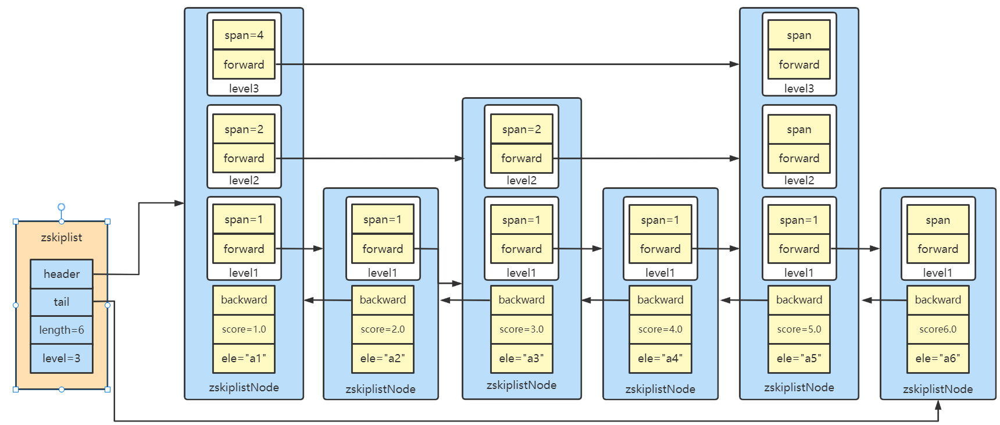

```c
typedef struct zskiplist {
    struct zskiplistNode *header, *tail; /* 头尾节点指针 */
    unsigned long length; /* 节点数量 */
    int level; /* 最大索引层级，默认为1 最大为32*/
} zskiplist;
```

### 跳表节点结构

```c
typedef struct zskiplistNode {
    sds ele; /* 节点值 */
    double score; /* 节点分数，用于排序、查找 */
    struct zskiplistNode *backward; /* 前一个节点指针 */
    struct zskiplistLevel {
        struct zskiplistNode *forward; /* 下一个节点指针 */
        unsigned long span; /* 指针跨度 */
    } level[]; /* 多级指针数组 */
} zskiplistNode;
```

### 节点层高

> 跳表最高支持32级。

```c
#define ZSKIPLIST_MAXLEVEL 32
#define ZSKIPLIST_P 0.25
```

> Redis用一个函数随机生成一个1~32之间的值作为新节点的高度，值越大出现的概率越低，默认为1级

```c
int zslRandomLevel(void) {
    int level = 1;
    while ((random()&0xFFFF) < (ZSKIPLIST_P * 0xFFFF)) /* 0xFFFF = 65535 */
        level += 1;
    return (level<ZSKIPLIST_MAXLEVEL) ? level : ZSKIPLIST_MAXLEVEL;
}
```

level的初始值为1，通过while循环，每次生成一个随机数，取这个随机数的低16位与`ZSKIPLIST_P * 0xFFFF`比较，小于则加1继续循环，否则退出，

- 节点层高为1的概率为1-p。
- 节点层高为2的概率为p(1-p)。
- 节点层高为3的概为p^2^(1-p)。
- ......
- 节点层高为n的概为p^n^(1-p)。

所以节点的期望层高为：

E=1*(1-p)+2*p(1-p)+3*p^2^(1-p)+…+n*p^n-1^(1-p) = (1-p)$\sum_{i=1}^n$ ip^i-1^​=1/(1-p)

- 当p=1/2时，每个节点所包含的平均指针数目为2；
- 当p=1/4时，每个节点所包含的平均指针数目为1.33。

### 跳表而不是平衡树？

对于这个问题，Redis的作者 @antirez 是怎么说的：

> There are a few reasons:
>
> 1) They are not very memory intensive. It's up to you basically. Changing parameters about the probability of a node to have a given number of levels will make then less memory intensive than btrees.
>
> 2) A sorted set is often target of many ZRANGE or ZREVRANGE operations, that is, traversing the skip list as a linked list. With this operation the cache locality of skip lists is at least as good as with other kind of balanced trees.
>
> 3) They are simpler to implement, debug, and so forth. For instance thanks to the skip list simplicity I received a patch (already in Redis master) with augmented skip lists implementing ZRANK in O(log(N)). It required little changes to the code.

1. **内存占用更低**，平衡树每个节点包含两个指针，而跳表每个节点平均包含1.33个指针，
2. **适合范围查找**，在平衡树上，查询单个节点可以直接用前序遍历(**根-左-右**)，如果要进行范围查找则需要以中序遍历(**左-根-右**)的方式，而在调表上，只需要在找到最小值之后，顺着leve1层的后置指针遍历就可以实现。
3. **算法实现比平衡树简单**，跳表更易于实现、调试，平衡树的插入和删除操作都可能引起子树的调整，逻辑复杂，而跳表则可以像普通链表一样只需要修改相邻节点的指针就完成了插入删除操作。

## 整数集合

整数集合(IntSet)是 Set 对象的底层实现之一。当一个 Set 对象只包含整数值元素，并且元素数量不大时，就会使用整数集这个数据结构作为底层实现。

### 整数集合结构

```c
typedef struct intset {
    uint32_t encoding; /*编码方式 支持存放16位、32位、64位整数*/
    uint32_t length; /*元素个数*/
    int8_t contents[]; /*整数数组，存放集合数据*/
} intset;
```

encoding包含三种模式

```c
/* Note that these encodings are ordered, so:
 * INTSET_ENC_INT16 < INTSET_ENC_INT32 < INTSET_ENC_INT64. */
#define INTSET_ENC_INT16 (sizeof(int16_t))  /*16位 2字节 类似Java中的short*/
#define INTSET_ENC_INT32 (sizeof(int32_t))  /*32位 4字节 类似Java中的int*/
#define INTSET_ENC_INT64 (sizeof(int64_t))  /*64位 8字节 类似Java中的long*/
```

为了方便查找，contents中的数值按照从小到大排列，并且数组中不包含任何重复的数据；

如图数组中每个元素都是16位2字节大小，

-   encoding：4字节
-   length：4字节
-   contents：2字节*4 = 8字节
-   总共4+4+8字节 = 16字节

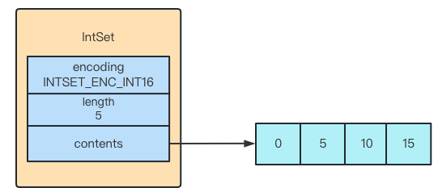

### 集合升级

当我们将一个新元素加入到整数结合中时，如果新元素类型比整数集合中的所有元素的类型都要长，整数集合需要先进行升级，也就是按照新元素类型的长度扩展contents数组的空间大小，然后才能将新元素插入到整数集合里。升级过程共分为三步：

1.   根据新元素类型扩展整数数组的空间大小，并为新元素分配空间

2.   将底层数组先有的所有元素都转换成与新元素相同的类型，并将类型转换后的元素放置到正确的位置上，并且要维持顶层数组的有序性不变；

3.   将新元素添加到底层数组里面

     ```c
     /* Upgrades the intset to a larger encoding and inserts the given integer. */
     static intset *intsetUpgradeAndAdd(intset *is, int64_t value) {
         //获取当前intset编码
         uint8_t curenc = intrev32ifbe(is->encoding);
         //获取新元素编码  
         uint8_t newenc = _intsetValueEncoding(value);
         int length = intrev32ifbe(is->length);
         //判断value是否大于0决定value放在数组最前还是最后，value是正数一定是最大的，value时负数一定是最小的
         int prepend = value < 0 ? 1 : 0;
         /* First set new encoding and resize 重置编码为新编码*/
         is->encoding = intrev32ifbe(newenc);
         //重置数组大小
         is = intsetResize(is,intrev32ifbe(is->length)+1);
         /* 倒序遍历，将元素依次移动到新位置 _intsetGetEncoded按照旧编码方式查找元素*/
         while(length--)
             _intsetSet(is,length+prepend,_intsetGetEncoded(is,length,curenc));
         /*决定将新元素插入到数组最前还是最后的位置*/
         if (prepend)
             _intsetSet(is,0,value);
         else
             _intsetSet(is,intrev32ifbe(is->length),value);
         //修改数组长度
         is->length = intrev32ifbe(intrev32ifbe(is->length)+1);
         return is;
     }
     ```

举个例子，假设现在有个INTSET_ENC_INT16编码的整数集合，集合中包含了三个into6_t类型的元素

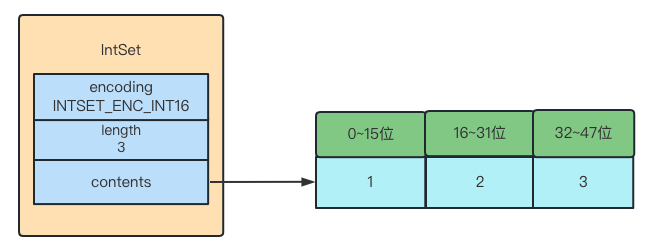

现在假设要将一个类型为int32_t的整数65535添加到集合里面，因为新元素的类型int32_t比所有元素都长，所以整数集合要进行升级操作，需要为 contents 数组扩容，在原本空间的大小之上再扩容多 80 位（4x32-3x16=80），才能保存下 4 个类型为 int32_t 的元素

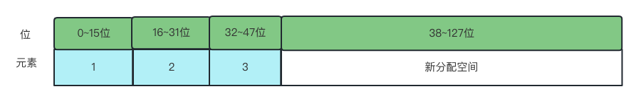

扩容数组大小之后，将之前的三个元素转换成int32_t编码，倒序遍历将转换之后的元素重新放入到正确的位置，并且维持数组的有序性不变，转换过程：

1.   将元素3转换为int32_t类型然后移动到新位置

     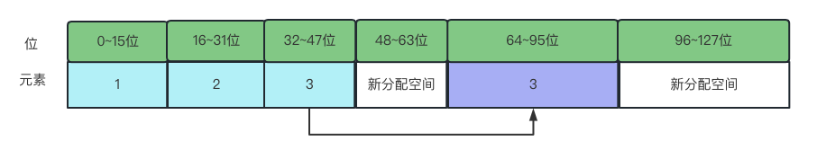

2.   将元素2转换为int32_t类型然后移动到新位置

     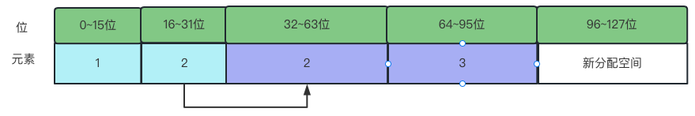

3.   将元素1转换为int32_t类型

     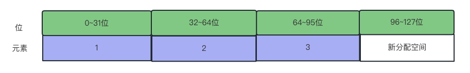

4.   插入新元素

     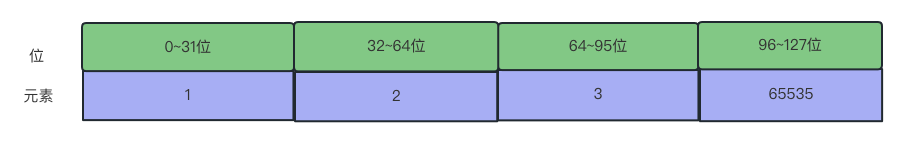

#### 数组升级的好处

**提升灵活性**

整数集合可以通过自动升级底层数组来适应新元素，所有可以随意的将int16_t、int32_t、int64_t类型的证书添加到集合中而不必担心类型错误

**节约内存**

要让一个数组同时保存int16_t、int32_t、int64_t类型的值，最简答的做法是直接使用int64_t类型作为数组底层的实现，这样即使是int16_t类型的值都需要使用int64_t来保存，从而出现浪费内存的情况，而整数集合升级就可以避免这种情况，如果一直向整数集合添加 int16_t 类型的元素，那么整数集合的底层实现就一直是用 int16_t 类型的数组，只有在我们要将 int32_t 类型或 int64_t 类型的元素添加到集合时，才会对数组进行升级操作

>   数组不支持降级，

数组一旦升级就会一直保持升级后的状态，即使删除了65535这个元素，数组依然会使用int32_t类型来保存数值 
