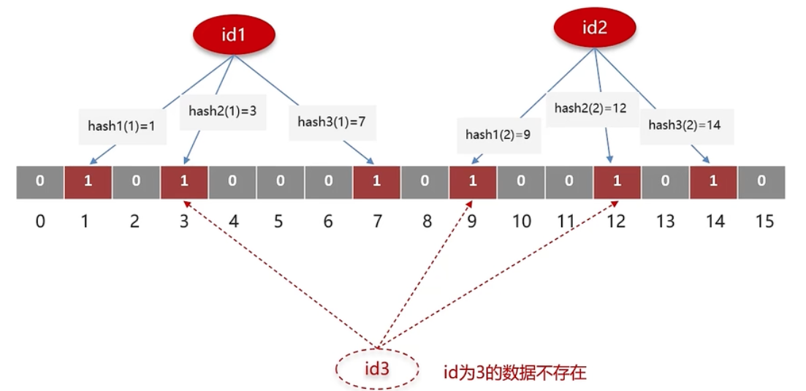

## 缓存一致性

### 缓存一致性更新策略

#### 更新缓存

##### 先更新数据库再更新缓存


线程1先将数据库的数据更新为 1，然后在更新缓存前，线程2 将数据库的数据更新为 2，并且将缓存更新为 2，然后线程1继续执行将缓存的数据更新为1。

此时，数据库中的数据是 2，而缓存中的数据却是 1，**<span style="color: red;">出现了缓存和数据库中的数据不一致的现象</span>**。

##### 先更新缓存再更新数据库


线程1先将缓存的数据更新为 1，然后在更新数据库前，线程2 将缓存的数据更新为 2，并且将数据库的数据更新为 2，然后线程1继续执行将数据库的数据更新为1。

此时，数据库中的数据是 2，而缓存中的数据却是 1，**<span style="color: red;">出现了缓存和数据库中的数据不一致的现象</span>**。

从以上分析来看无论是<span style="color: rgb(0, 150, 255);">【先更新数据库，在更新缓存】</span>还是<span style="color: rgb(0, 150, 255);">【先更新缓存，再更新数据库】</span>都会出现缓存和数据库数据不一致的问题，两种方案相比较，<span style="color: rgb(0, 150, 255);">【先更新数据库，再更新缓存】</span>出现的概率更低，因为更新缓存相较于更新数据库要快很多，所以并容易出现线程2已经更新完数据库并且更新完缓存的情况下，线程1才更新完缓存。而且业务上一般以数据库的数据为准，<span style="color: rgb(0, 150, 255);">【先更新缓存，再更新数据库】</span>数据库的让然是旧值，所以<span style="color: red;">不推荐【先更新缓存，再更新数据库】</span>；

#### 删除缓存

##### 先删除缓存再更新数据库


线程1先删除缓存中的数据，此时线程2过来查询，发现缓存不存在数据则会去数据库查询，然后将查询的结果更新到缓存，然后线程1继续执行去更新数据库

此时，数据库中的数据是 2，而缓存中的数据仍然是旧值 1，**<span style="color: red;">出现了缓存和数据库中的数据不一致的现象</span>**。

###### 解决方案延时双删

```java
    public void updateOrder(Order order) {
        redisTemplate.delete(String.valueOf(order.getId()));

        orderDao.update(order);
        try {
            TimeUnit.SECONDS.sleep(2);
        } catch (InterruptedException e) {
            logger.debug(e.getMessage());
        }
        redisTemplate.delete(String.valueOf(order.getId()));
    }
```

加上sleep的这段时间，就是为了让线程1在水面的这段时间内，线程2能够先从数据库读取数据，再把数据写回缓存，然后线程1再进行删除，索引线程1 的sleep的时间必须大于线程2从数据库读取数据并写回缓存的时间。这样其他线程来查询数据时法相缓存失效，则会从数据库取最新数据并重新写回缓存，

##### 先更新数据库再删除缓存


线程2先来查询数据，正好此时缓存中数据过了有效期，索引线程2需要去查询数据库，查询到的数据是1，准备更新缓存时，线程1过来更新了数据库的数据并且删除了缓存，线程1执行完成后，线程2继续执行更新缓存的操作。

此时，数据库中的数据是 2，而缓存中的数据仍然是旧值 1，**<span style="color: red;">出现了缓存和数据库中的数据不一致的现象</span>**。

从以上分析来看无论是<span style="color: rgb(0, 150, 255);">【先删除缓存，再更新数据库】</span>还是<span style="color: rgb(0, 150, 255);">【先更新数据库，再删除缓存】</span>都会出现缓存和数据库数据不一致的问题，两种方案相比较，<span style="color: rgb(0, 150, 255);">【先更新数据库，再删除缓存】</span>出现的概率更低，因为更新缓存相较于更新数据库要快很多，所以很难出现线程1已经更新完数据库并且删除完缓存的情况下，线程1才更新完缓存

所以<span style="color: rgb(0, 150, 255);">【先更新数据库，再删除缓存】</span>是可以保证缓存一致性的，为了避免出现上述不一致的情况，还可以给缓存加一个过期时间进行兜底，即使真的出现不一致的情况，等缓存失效后也可以重新将新数据从数据库查询回来更新到缓存中

#### 小结

一致性要求高

<mark>先更新数据库再删除缓存</mark>可以保证较强的一致性，在读数据的时候加上读锁，允许多个线程同时读取缓存的数据，当有数据更新是可以加上写锁，只允许一个线程更新数据库和缓存.

采用Redisson提供的读写锁

-   共享锁，读锁ReadLock，加锁之后，其它线程可以共享读操作不允许写操作。
-   排它锁，独占锁WriteLock,加锁之后不允许其它线程读和写操作。

允许延迟一致

-   异步通知更新缓存，使用MQ中间件，在数据更新之后通知缓存服务更新缓存
-   使用canal中间件，不需要修改业务代码，伪装为一个MySQL的从节点，canal通过读取MySQL的Binlog日志更新缓存

### 数据库和缓存操作的原子性

先更新数据库，再删除缓存是两个操作，如果更新数据库成功，但后续删除缓存失败，就会导致数据库中已经更新为新值了，而缓存中还是旧值；


如图，线程1来更新缓存后删除缓存，但是删除缓存时失败，导致缓存中还是旧值 1，现成2过来查询，因为缓存没有删除，所以查询可以命中缓存，然后返回的缓存中的旧值

其实无论那种策略，两个操作是非原子性的，只要有一个失败必定会出现缓存不一致的情况

解决办法:

1.   重试机制；
2.   两个操作放在一个事务中，单体应用可以采用数据库事务，分布式应用可以采用分布式事务；
3.   订阅MySQL binlog

### 结论

1.   更新缓存还是删除缓存；

2.   先操作数据库还是先操作缓存；

     -   更新缓存：每次更新缓存都需要更新数据库，如果这中间没有查询操作，那么对缓存的更新都是无效的操作；可以确保每次请求都可以命中缓存；
     -   删除缓存：更新数据库时让缓存失效，查询时再更新缓存，可以减少对缓存的无效操作，但删除缓存会影响缓存命中率，如果这时出现并发请求会导致数据库承担较大压力

3.   如何保证数据库操作和缓存操作的原子性；

     单体应用可以选择数据库事务，将缓存操作和数据库操作都放在数据库事务中

     分布式系统可以选择分布式事务

## 缓存问题

### 缓存穿透

缓存穿透是指用户访问的数据，<mark>既不在缓存中也不在数据库中</mark>，请求先去访问缓存，发现缓存中不存在数据，再去访问数据库时，发现数据库中也不存在数据，因此无法构建缓存，后续所有的请求都会穿过缓存去访问数据库。如果此时有大量的请求过来，就会导致数据库的压力骤增进而导致数据库崩溃。

解决方案：

1.   限制非法请求

     用户请求的数据几步存在缓存中也不存在数据库中，说明这个请求可能是非法的，所以在请求API时我们需要判断请求参数是否合理，如果判断请求非法就直接返回错误，避免再去请求缓存和数据库。
2.   缓存空数据
     
     当查询的数据不存在时，可以在缓存中设置一个空数据或默认值，当后续发生相同的请求时就可以从缓存中读取数据，避免请求发到数据库。

     优点：简单

     缺点：

     -   可能需要缓存很多空数据小号较多 的内存，
     -   会造成数据不一致，第一次查询数据不存在缓存了空数据，后续新增了这条数据，但是缓存中数据的值还是空的。
     
3.   布隆过滤器

     优点：内存占用较少，没有多余key

     缺点：实现复杂，存在误判，当出现哈希冲突时，查询布隆过滤器数据存在，但是数据库和缓存中却不存在数据，仍然有可能发生缓存穿透。
     
     

#### 布隆过滤器

布隆过滤器是一个bitmap位图，相当于是一个一bit位为单位的数组，数组中每个单元只能存储二进制数0或1；

存储数据时，将key值经过多个不同的哈希算法过得哈希值，根据哈希计算数组对应的位置改为1；

查询数据时，使用相同的哈希函数获得多个哈希值，判断数组对应位置是否都为1，只要有一个不为1，说明数据不存在数据库中；

布隆过滤器由于是基于哈希函数实现查找的，所以可能会产生哈希冲突的情况，比如两个不同的key1和key2经过哈希之后可能都落在相同的位置或者当前key经过多个哈希之后每个哈希索引的位置正好都是1，而数据库中却不存在当前数据，存在误判的情况。

所以，**查询布隆过滤器说数据存在，并不一定证明数据库中存在这个数据，但是查询到数据不存在，数据库中一定就不存在这个数据**。

### 缓存击穿

给一个key设置了过期时间，当这个key过期时，大量的请求过来查询这个key，由于缓存过期，这些请求都会请求数据库，大量的请求击垮数据库

解决方案：

1.   互斥锁，保证同一时刻只有一个线程去查询数据库更新缓存，其它没有获取互斥锁的线程等待锁释放后重新读取缓存
2.   异步更新缓存，不给热点数据设置过期时间，由后台线程异步更新缓存，
3.   逻辑过期，给热点数据设置逻辑过期时间，每次查询数据后判断数据的逻辑时间是否过期，如果过期则开启一个线程去更新缓存。

### 缓存雪崩

缓存雪崩是指同一时间大量的缓存<mark>同时失效</mark>或者<mark>Redis服务宕机</mark>，此时有大量的请求到达无法再缓存中处理，这些请求都会发送到数据库，导致数据库压力骤增进而会造成数据库崩溃。

#### 大量数据同时过期

解决方案：

1.   设置不同的过期时间，**给这些数据的过期时间加一个随机数**，保证数据不会在同一时间过期，避免大量的请求都发送到数据库；
2.   异步更新缓存，不给缓存设置有效期，后台开启一个线程定时去更新缓存，使缓存永久有效。

#### Redis宕机

解决方案：

1.   配置Redis集群提高服务可用性，当Redis主节点宕机后，可以将从节点切换成主节点。
2.   熔断限流，为当前缓存业务设置熔断限流策略，当Redis发生缓存雪崩时，开启熔断机制，降级请求或直接返回错误，避免请求发送到数据库，等待Redis恢复后再重新提供服务。

## Redis过期删除策略

>    惰性删除

不主动删除过期的key，每次从数据库访问key时，都检查key是否过期，如果过期则删除该key,

**优点：**

-   每次访问key时才检查key是否过期，只会使用很少的系统资源，对CPU友好

**缺点：**

-   如果一个key已经过期了，而这个key仍然保留在数据库中，如果这个过期key一直没有被访问，它所占用的内存就不会释放，会造成内存空间的浪费

>   定期删除

定期删除策略是每隔一段时间从一定量的数据库中取出一定数量的随机 key 进行检查，并删除其中的过期key。

**两种模式：**

1.   SLOW模式是定时任务，执行频率默认为10hz，每次不超过25ms，可以通过修改redis.conf中hz选项来调整频率

     ```
     # The range is between 1 and 500, however a value over 100 is usually not
     # a good idea. Most users should use the default of 10 and raise this up to
     # 100 only in environments where very low latency is required.
     hz 10
     ```

2.   FAST模式执行频率不固定，但两次间隔不低于2ms，每次耗时不超过1ms

**优点**：

-   通过限制删除操作执行的时长和频率，来减少删除操作对 CPU 的影响，同时也能删除一部分过期的数据减少了过期键对空间的无效占用。

**缺点**：

-   内存清理方面没有定时删除效果好，同时没有惰性删除使用的系统资源少。
-   难以确定删除操作执行的时长和频率。如果执行的太频繁，定期删除策略变得和定时删除策略一样，对CPU不友好；如果执行的太少，那又和惰性删除一样了，过期 key 占用的内存不会及时得到释放。

>   Redis过期删除策略

Redis使用惰性删除 + 定期删除两种策略进行配合使用

```c
int expireIfNeeded(redisDb *db, robj *key, int flags) {
    if (!keyIsExpired(db,key)) return 0;

    /* If we are running in the context of a replica, instead of
     * evicting the expired key from the database, we return ASAP:
     * the replica key expiration is controlled by the master that will
     * send us synthesized DEL operations for expired keys. The
     * exception is when write operations are performed on writable
     * replicas.
     *
     * Still we try to return the right information to the caller,
     * that is, 0 if we think the key should be still valid, 1 if
     * we think the key is expired at this time.
     *
     * When replicating commands from the master, keys are never considered
     * expired. */
    if (server.masterhost != NULL) {
        if (server.current_client == server.master) return 0;
        if (!(flags & EXPIRE_FORCE_DELETE_EXPIRED)) return 1;
    }

    /* In some cases we're explicitly instructed to return an indication of a
     * missing key without actually deleting it, even on masters. */
    if (flags & EXPIRE_AVOID_DELETE_EXPIRED)
        return 1;

    /* If clients are paused, we keep the current dataset constant,
     * but return to the client what we believe is the right state. Typically,
     * at the end of the pause we will properly expire the key OR we will
     * have failed over and the new primary will send us the expire. */
    if (checkClientPauseTimeoutAndReturnIfPaused()) return 1;

    /* Delete the key */
    deleteExpiredKeyAndPropagate(db,key);
    return 1;
}
```


## Redis内存淘汰策略

当Redis中内存不够用时，此时再向Redis中添加新的key，Redis就会按照某种规则将内存中的数据删除，这种数据的删除策略被称之为<mark>内存淘汰策略</mark>

Redis8中不同淘汰策略

```
# MAXMEMORY POLICY: how Redis will select what to remove when maxmemory
# is reached. You can select one from the following behaviors:
#
# volatile-lru -> Evict using approximated LRU, only keys with an expire set.
# allkeys-lru -> Evict any key using approximated LRU.
# volatile-lfu -> Evict using approximated LFU, only keys with an expire set.
# allkeys-lfu -> Evict any key using approximated LFU.
# volatile-random -> Remove a random key having an expire set.
# allkeys-random -> Remove a random key, any key.
# volatile-ttl -> Remove the key with the nearest expire time (minor TTL)
# noeviction -> Don't evict anything, just return an error on write operations.
#
# LRU means Least Recently Used
# LFU means Least Frequently Used
#
# Both LRU, LFU and volatile-ttl are implemented using approximated
# randomized algorithms.
```

1.   **volatile-lru**：淘汰所有设置了过期时间的键值中，最久未使用的键值；
2.   **allkeys-lru**：淘汰整个键值中最久未使用的键值；
3.   **volatile-lfu **：淘汰所有设置了过期时间的键值中，最少使用的键值；
4.   **allkeys-lfu**：淘汰整个键值中最少使用的键值。
5.   **volatile-random**：随机淘汰设置了过期时间的任意键值；
6.   **allkeys-random**：随机淘汰任意键值;
7.   **volatile-ttl**：优先淘汰更早过期的键值。
8.   **noeviction**：不淘汰任何key，但内存满时写入数据会报错，**默认策略**

>   LRU（Least Recently Used）

最近最少使用，用当前时间减去最后使用时间，这个值越大则淘汰的优先级有越高

>   LFU（Least Frequently Used）

最少频率使用，会统计每个key的访问频率，值越小淘汰优先级越高