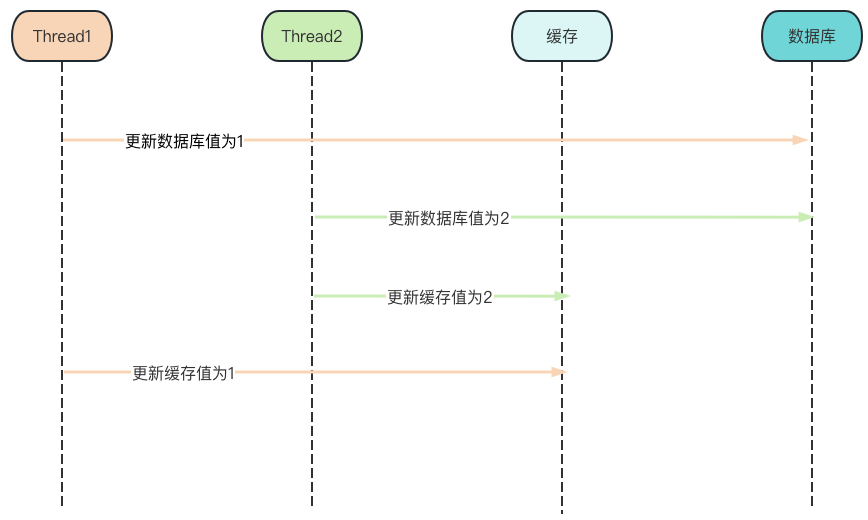
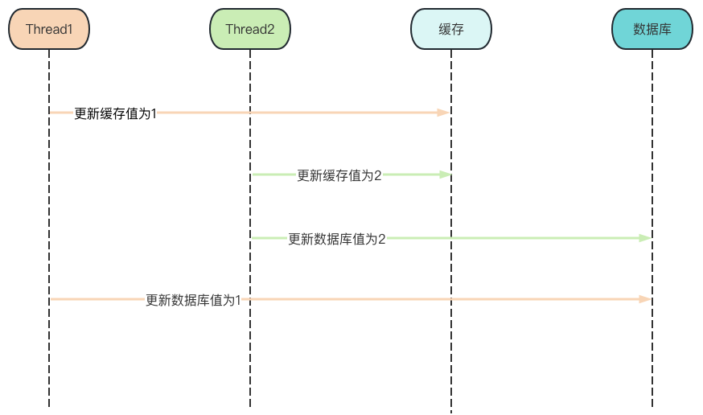
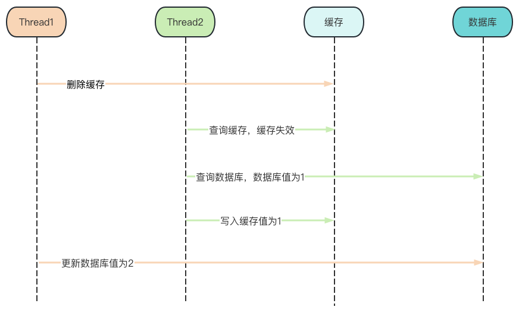
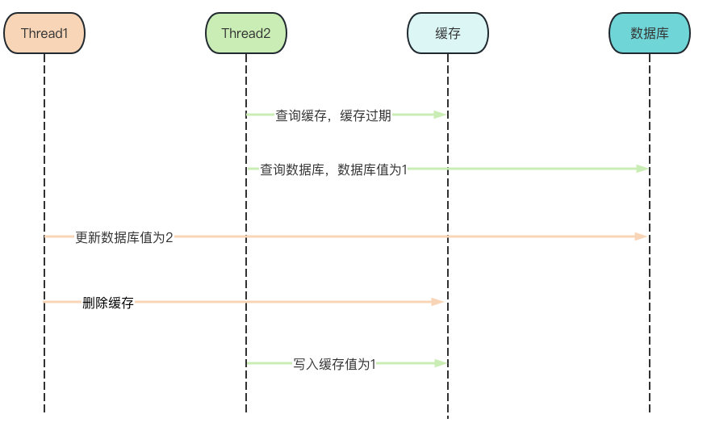
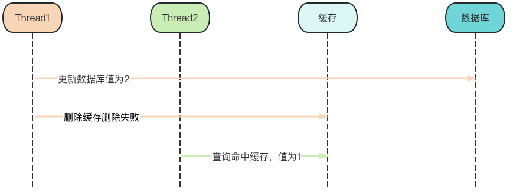

## 缓存一致性

### 缓存一致性更新策略

#### 更新缓存

##### 先更新数据库再更新缓存



线程1先将数据库的数据更新为 1，然后在更新缓存前，线程2 将数据库的数据更新为 2，并且将缓存更新为 2，然后线程1继续执行将缓存的数据更新为1。

此时，数据库中的数据是 2，而缓存中的数据却是 1，**<span style="color: red;">出现了缓存和数据库中的数据不一致的现象</span>**。


##### 先更新缓存再更新数据库



线程1先将缓存的数据更新为 1，然后在更新数据库前，线程2 将缓存的数据更新为 2，并且将数据库的数据更新为 2，然后线程1继续执行将数据库的数据更新为1。

此时，数据库中的数据是 2，而缓存中的数据却是 1，**<span style="color: red;">出现了缓存和数据库中的数据不一致的现象</span>**。

从以上分析来看无论是<span style="color: rgb(0, 150, 255);">【先更新数据库，在更新缓存】</span>还是<span style="color: rgb(0, 150, 255);">【先更新缓存，再更新数据库】</span>都会出现缓存和数据库数据不一致的问题，两种方案相比较，<span style="color: rgb(0, 150, 255);">【先更新数据库，再更新缓存】</span>出现的概率更低，因为更新缓存相较于更新数据库要快很多，所以并容易出现线程2已经更新完数据库并且更新完缓存的情况下，线程1才更新完缓存。而且业务上一般以数据库的数据为准，<span style="color: rgb(0, 150, 255);">【先更新缓存，再更新数据库】</span>数据库的让然是旧值，所以<span style="color: red;">不推荐【先更新缓存，再更新数据库】</span>；

#### 删除缓存

##### 先删除缓存再更新数据库



线程1先删除缓存中的数据，此时线程2过来查询，发现缓存不存在数据则会去数据库查询，然后将查询的结果更新到缓存，然后线程1继续执行去更新数据库

此时，数据库中的数据是 2，而缓存中的数据仍然是旧值 1，**<span style="color: red;">出现了缓存和数据库中的数据不一致的现象</span>**。

###### 解决方案延时双删

```java
    public void updateOrder(Order order) {
        redisTemplate.delete(String.valueOf(order.getId()));

        orderDao.update(order);
        try {
            TimeUnit.SECONDS.sleep(2);
        } catch (InterruptedException e) {
            logger.debug(e.getMessage());
        }
        redisTemplate.delete(String.valueOf(order.getId()));
    }
```

加上sleep的这段时间，就是为了让线程1在水面的这段时间内，线程2能够先从数据库读取数据，再把数据写回缓存，然后线程1再进行删除，索引线程1 的sleep的时间必须大于线程2从数据库读取数据并写回缓存的时间。这样其他线程来查询数据时法相缓存失效，则会从数据库取最新数据并重新写回缓存，

##### 先更新数据库再删除缓存



线程2先来查询数据，正好此时缓存中数据过了有效期，索引线程2需要去查询数据库，查询到的数据是1，准备更新缓存时，线程1过来更新了数据库的数据并且删除了缓存，线程1执行完成后，线程2继续执行更新缓存的操作。

此时，数据库中的数据是 2，而缓存中的数据仍然是旧值 1，**<span style="color: red;">出现了缓存和数据库中的数据不一致的现象</span>**。

从以上分析来看无论是<span style="color: rgb(0, 150, 255);">【先删除缓存，再更新数据库】</span>还是<span style="color: rgb(0, 150, 255);">【先更新数据库，再删除缓存】</span>都会出现缓存和数据库数据不一致的问题，两种方案相比较，<span style="color: rgb(0, 150, 255);">【先更新数据库，再删除缓存】</span>出现的概率更低，因为更新缓存相较于更新数据库要快很多，所以很难出现线程1已经更新完数据库并且删除完缓存的情况下，线程1才更新完缓存

所以<span style="color: rgb(0, 150, 255);">【先更新数据库，再删除缓存】</span>是可以保证缓存一致性的，为了避免出现上述不一致的情况，还可以给缓存加一个过期时间进行兜底，即使真的出现不一致的情况，等缓存失效后也可以重新将新数据从数据库查询回来更新到缓存中

#### 小结


### 如何保证数据库和缓存操作的原子性

先更新数据库，再删除缓存是两个操作，如果更新数据库成功，但后续删除缓存失败，就会导致数据库中已经更新为新值了，而缓存中还是旧值；



如图，线程1来更新缓存后删除缓存，但是删除缓存时失败，导致缓存中还是旧值 1，现成2过来查询，因为缓存没有删除，所以查询可以命中缓存，然后返回的缓存中的旧值

其实无论那种策略，两个操作是非原子性的，只要有一个失败必定会出现缓存不一致的情况

解决办法:

1.   重试机制；
2.   两个操作放在一个事务中，单体应用可以采用数据库事务，分布式应用可以采用分布式事务；
3.   订阅MySQL binlog

### 结论

1.   更新缓存还是删除缓存；

2.   先操作数据库还是先操作缓存；

     -   更新缓存：每次更新缓存都需要更新数据库，如果这中间没有查询操作，那么对缓存的更新都是无效的操作；可以确保每次请求都可以命中缓存；
     -   删除缓存：更新数据库时让缓存失效，查询时再更新缓存，可以减少对缓存的无效操作，但删除缓存会影响缓存命中率，如果这时出现并发请求会导致数据库承担较大压力

3.   如何保证数据库操作和缓存操作的原子性；

     单体应用可以选择数据库事务，将缓存操作和数据库操作都放在数据库事务中

     分布式系统可以选择分布式事务