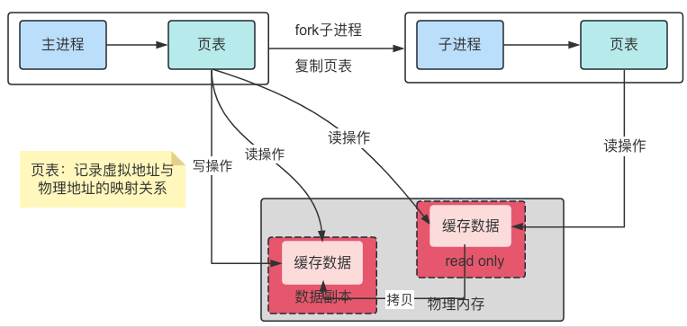
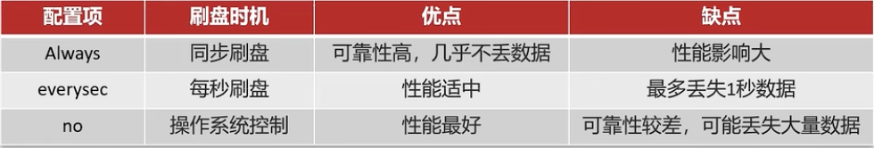
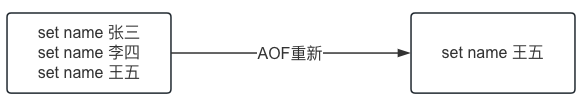

## RDB持久化

### Redis数据备份

RDB(Redis Database Backup file),Redis数据备份文件，也称为Redis数据快照，它会将内存中所有的数据都记录在磁盘中，当Redis宕机重启后，从磁盘中读取快照文件恢复数据。

```shell
# 由Redis主进程来执行RDB，会阻塞所有命令
127.0.0.1:6379> save
# 开启子进程执行RDB，不会阻塞主进程
127.0.0.1:6379>bgsave
```


```
# 配置多少秒内有多少个key被修改则执行bgsave命令
save <seconds> <changes>
save 900 1
save 300 10
save 60 1000
```

### RDB执行原理

bgsave开始时会fork主进程得到子进程，子进程共享主进程的内存数据，完成fork后读取内存数据并写入RDB文件

-   主进程和子进程具有相同的页表，相同的页表会映射相同的物理内存

-   fork采用的是copy-on-write技术，

    -   当主进程执行读操作时，访问共享内存
    -   当主进程执行写操作时，则会先拷贝一份数据，然后执行写操作。

    

## AOF持久化

### AOF配置

AOF默认是关闭的，需要修改Redis.conf配置文件来开启AOF;

```
# 是否开启AOF功能。默认为no
appendonly yes
# AOF文件名称
appendfilename "appendonly.aof"
```

AOF的命令记录评率也可以通过redis.conf文件来陪

-   always：表示每写一次命令就立即记录到AOF文件中
-   everysec：写完命令会先记录到AOF缓冲区，然后每隔1秒将缓冲区的文件写到AOF文件中，默认方案
-   no：写完命令会先记录到AOF缓冲区，由操作系统决定何时将缓冲区内容写回磁盘

```
# More details please check the following article:
# http://antirez.com/post/redis-persistence-demystified.html
#
# If unsure, use "everysec".

# appendfsync always
appendfsync everysec
# appendfsync no
```



### AOF重写

因为AOF是记录命令，所以AOF文件会比RDB文件大的多，而且AOF文件会记录对同一个key的多次写操作，但只有最后一次写操作才有意义，通过执行`bgrewriteaof`命令，可以让AOF文件执行重写功能。



#### 配置

```
# Specify a percentage of zero in order to disable the automatic AOF
# rewrite feature.
# AOF文件比上次文件增长超过多少百分比则触发重写
auto-aof-rewrite-percentage 100
# AOF文件体积最小多大以上才触发重写
auto-aof-rewrite-min-size 64mb
```

## 混合持久化

### 配置

实际开发中需要将两者都开启，开启混合持久化功能

```
# Redis can create append-only base files in either RDB or AOF formats. Using
# the RDB format is always faster and more efficient, and disabling it is only
# supported for backward compatibility purposes.
aof-use-rdb-preamble yes
```

当开启了混合持久化时，在 AOF 重写日志时，`fork` 出来的重写子进程会先将与主线程共享的内存数据以 RDB 方式写入到 AOF 文件，然后主线程处理的操作命令会被记录在重写缓冲区里，重写缓冲区里的增量命令会以 AOF 方式写入到 AOF 文件，写入完成后通知主进程将新的含有 RDB 格式和 AOF 格式的 AOF 文件替换旧的的 AOF 文件。

也就是说，使用了混合持久化，AOF 文件的**前半部分是 RDB 格式的全量数据，后半部分是 AOF 格式的增量数据**。

这样的好处在于，重启 Redis 加载数据的时候，由于前半部分是 RDB 内容，这样**加载的时候速度会很快**。

加载完 RDB 的内容后，才会加载后半部分的 AOF 内容，这里的内容是 Redis 后台子进程重写 AOF 期间，主线程处理的操作命令，可以使得**数据更少的丢失**。

