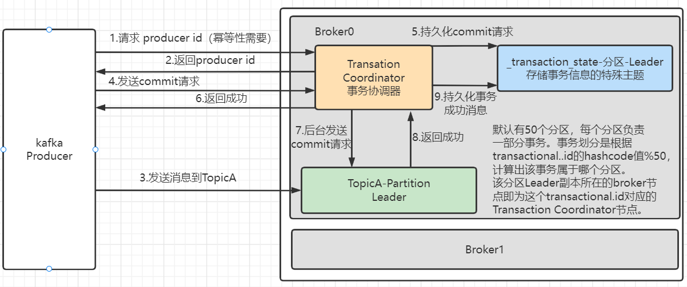

## 消息队列

### 应用场景

1. 缓冲/削封：有助于控制和优化数据流经过系统的速度，解决生产消息和消费消息处理不一致的情况
2. 解耦：运行你独立的修改或扩展两边的处理过程，只要确保他们遵守同样的接口约束；
3. 异步通信：允许用户将一个消息放入消息队列，但并不立即处理它，然后再需要的时候再处理。

### 模式

1. 点对点模式：

   - 主动拉去数据，消息收到后清除消息

     

2. 发布订阅模式：

   - 可以有多个topic

   - 消费者消费数据后不删除数据

   - 每个消费者想好独立，都可以消费到数据

     

## kafka

### kafka基础架构

1. 为了方便扩展，提高吞吐量，一个topic分为多个partition，每个partition只能由一个consumer消费
2. 配合分区设计，提出消费者组的概念，组内每个消费者并行消费
3. 为提高可用性，为每个partition增加若干个副本，生产和消费只针对leader，只有当leader挂了follower才有机会成为leader


### kafka安装部署

#### 配置server.properties文件

1. 修改node.id

   ```shell
   node.id=1
   #@前面的数字与node.id保持一致
   #controller.quorum.voters=1@hadoop102:9093,2@hadoop103:9093,3@hadoop104:9093
   controller.quorum.voters=1@centos7:9093,2@centos7_2:9093,3@centos7_3:9093
   ```

2. broker对外保留地址

   ```shell
   # Listener name, hostname and port the broker will advertise to clients.
   # If not set, it uses the value for "listeners".
   advertised.listeners=PLAINTEXT://centos7_3:9092
   ```

3. 修改log.dirs

   ```shell
   # A comma separated list of directories under which to store log files
   log.dirs=/opt/module/kafka/datas
   ```

#### 初始化集群数据目录

1. 生成存储目录唯一ID

   ```shell
   bin/kafka-storage.sh random-uuid
   ```

2. 用该ID格式化kafka存储目录

   ```shell
   bin/kafka-storage.sh format -t kOFw24HOQ4yKpMnrtsGu2Q -c /opt/module/kafka/config/kraft/server.properties
   ```

3. 启动kafka

   ```shell
   bin/kafka-server-start.sh -daemon config/kraft/server.properties
   ```

4. kafka启动集群失败(端口未开放)

   ```shell
   #查看端口是否开放
   firewall-cmd --query-port=9093/tcp
   #添加指定需要开放的端口：
   firewall-cmd --add-port=9093/tcp --permanent
   #对指定ip开放指定端口
   firewall-cmd --permanent --add-rich-rule="rule family="ipv4" source address="centos7" port protocol="tcp" port="6379" accept"
   #重载入添加的端口：
   firewall-cmd --reload
   #移除指定端口：
   firewall-cmd --permanent --remove-port=9093/tcp
   #重启防火墙
   systemctl restart firewalld.service
   #关闭防火墙
   systemctl stop firewalld.service
   ```


#### 启停脚本

```shell
#!/bin/bash
case $1 in
"start")
	for i in centos7 centos7_2 centos7_3
	do 
		echo "====== 启动 $i kafka"
		ssh $i "/opt/module/kafka/bin/kafka-server-start.sh -daemon /opt/module/kafka/config/kraft/server.properties"
	done
;;
"stop")
for i in centos7 centos7_2 centos7_3
	do 
		echo "====== 停止 $i kafka"
		ssh $i "/opt/module/kafka/bin/kafka-server-stop.sh"
	done
;;
esac
```

#### 集群执行命令

```shell
#!/bin/bash
# 判断参数个数
if [ $# -lt 1 ]
then
	echo 缺少参数 !
	exit!
fi
# 遍历集群所有机器
for host in centos7 centos7_2 centos7_3
do
	echo =============== 执行命令 $1 =================
    ssh $host "$1"		
done
```

### kafka命令操作

#### topic命令操作

| 参数                                            | 描述                               |
| ----------------------------------------------- | ---------------------------------- |
| --bootstrap-server <String:server toconnect to> | 连接的Kafka Broker主机名称和端口号 |
| --topic \<String:topic>                         | 操作的topic名称                    |
| --create                                        | 创建topic                          |
| --delete                                        | 删除topic                          |
| --altere                                        | 修改topic                          |
| --list                                          | 查看所有topic                      |
| --describe                                      | 查看topic详细描述                  |
| --partitions <Integer:of partitions>            | 设置分区数                         |
| --replication-factor<Integer:replication factor | 设置分区副本                       |
| --config \<String:name=value>                   | 更新系统默认的配置。               |

1. 查看当前服务器所以topic

   ```shell
   # 多台服务器逗号分隔
   bin/kafka-topics.sh --bootstrap-server centos7:9092,centos7_2:9092 --list
   ```

2. 创建first topic

   ```shell
   # 创建first topic 一个分区，三个副本
   bin/kafka-topics.sh --bootstrap-server centos7:9092 --topic first --create --partitions 1 --replication-factor 3
   ```

3. 删除topic

   ```shell
   bin/kafka-topics.sh --bootstrap-server centos7:9092 --topic first --delete
   ```

4. topic描述

   ```shell
   bin/kafka-topics.sh --bootstrap-server centos7:9092 --topic first --describe
   ```
   
5. 修改分区

   ```shell
   # 分区可以增加不可以减少
   bin/kafka-topics.sh --bootstrap-server centos7:9092 --topic first --alter --partitions 3
   ```

#### 生产者命令操作

1. 创建生产者

   ```shell
   bin/kafka-console-producer.sh --bootstrap-server centos7:9092 --topic first
   ```

#### 消费者命令操作

1. 创建消费者

   > 默认增量消费，不会消费历史消息

   ```shell
   bin/kafka-console-consumer.sh --bootstrap-server centos7:9092 --topic first
   ```

2. 创建消费者

   > 增加命令- -from beginning消费历史消息

   ```shell
   bin/kafka-console-consumer.sh --bootstrap-server centos7:9092 --topic first --fromom-beginning
   ```

### kafka生产者

#### 发送流程


- batch.size：只有数据累积到bach.size之后，sender才会发送数据，默认16k；
- linger.ms：如果数据迟迟未达到batch.size，sender等待linger.ms之后就会发送数据。单位：ms，默认0ms，表述没有延迟；
- 应答acks
  - 0：生产者发送过来的数据，不需要等待数据落盘就应答；
  - 1：生产者发送过来的数据，Leader收到数据后应答；
  - -1(all)：生产者发送过来的数据，Leader和isr队列里面的所有节点收齐数据后应答。-1和all等价

> leader维护了一个动态的in-sync replia set(ISR),意为何Leader保持同步的Follower+Leader集合(leader:0,isr:0,1,2)
>
> 如果Follower长时间未向Leader发送通信请求或同步数据，则该follower将被提出ISR。该时间有replica.lag.time.max.ms参数设定，默认30s.，例如2超时，(leader:0,isr:0,1)。

==**数据完全可靠条件 = ACK级别设置为-1 + 分区副本数大于等于2 + ISR里应答副本数量大于等于2**==

#### 异步发送

##### 普通异步发送

```java
public class CustomProducer {
    public static void main(String[] args) {
        Properties properties = new Properties();
        //连接集群
   properties.setProperty(ProducerConfig.BOOTSTRAP_SERVERS_CONFIG,"centos7:9092,192.168.192.102:9092,192.168.192.103:9092");
        //序列化
        properties.setProperty(ProducerConfig.KEY_SERIALIZER_CLASS_CONFIG, StringSerializer.class.getName());
        properties.setProperty(ProducerConfig.VALUE_SERIALIZER_CLASS_CONFIG, StringSerializer.class.getName());
        //创建kafka生产者
        KafkaProducer<String, String> kafkaProducer = new KafkaProducer<>(properties);

        for (int i = 0; i < 3; i++) {
            kafkaProducer.send(new ProducerRecord<>("first","cangxiao"+i));
        }
        //关闭kafka
        kafkaProducer.close();
    }
}
```

##### 带回调函数的异步发送

> 如果SpringBoot版本大于2.7会抛kafka异常：Cannot execute transactional method because we are in an error state
>
> 降低版本

```java
public class CustomProducerCallback {
    public static void main(String[] args) {
        Properties properties = new Properties();
        //连接集群
        properties.setProperty(ProducerConfig.BOOTSTRAP_SERVERS_CONFIG,"centos7:9092,192.168.192.102:9092,192.168.192.103:9092");
        //序列化
        properties.setProperty(ProducerConfig.KEY_SERIALIZER_CLASS_CONFIG, StringSerializer.class.getName());
        properties.setProperty(ProducerConfig.VALUE_SERIALIZER_CLASS_CONFIG, StringSerializer.class.getName());
        //创建kafka生产者
        KafkaProducer<String, String> kafkaProducer = new KafkaProducer<>(properties);

        for (int i = 0; i < 3; i++) {
            kafkaProducer.send(new ProducerRecord<>("first", "cangxiao" + i), new Callback() {
                @Override
                public void onCompletion(RecordMetadata recordMetadata, Exception e) {
                    if (e==null){
                        System.out.println("发送成功；主题："+recordMetadata.topic()+"分区："+recordMetadata.partition());
                    }
                }
            });
        }
        //关闭kafka
        kafkaProducer.close();
    }
}
```

> 事务执行

```java
public class CustomProducerCallback2 {
    public static void main(String[] args) {
//        Map<String,Object> config = new HashMap<>();
//        config.put(ProducerConfig.BOOTSTRAP_SERVERS_CONFIG,"centos7:9092,192.168.192.102:9092,192.168.192.103:9092");
//        config.put(ProducerConfig.ENABLE_IDEMPOTENCE_CONFIG,"true");
//        config.put(ProducerConfig.KEY_SERIALIZER_CLASS_CONFIG, StringSerializer.class.getName());
//        config.put(ProducerConfig.VALUE_SERIALIZER_CLASS_CONFIG, StringSerializer.class.getName());
//        config.put(ProducerConfig.TRANSACTIONAL_ID_CONFIG, "transaction_1");
        //创建事务
        Properties properties = new Properties();
        //连接集群
        properties.setProperty(ProducerConfig.BOOTSTRAP_SERVERS_CONFIG,"centos7:9092,192.168.192.102:9092,192.168.192.103:9092");
        //序列化
        properties.setProperty(ProducerConfig.KEY_SERIALIZER_CLASS_CONFIG, StringSerializer.class.getName());
        properties.setProperty(ProducerConfig.VALUE_SERIALIZER_CLASS_CONFIG, StringSerializer.class.getName());
        //必须设置事务id
        properties.setProperty(ProducerConfig.TRANSACTIONAL_ID_CONFIG, "transaction_1");

        //创建kafka生产者
        KafkaProducer<String, String> kafkaProducer = new KafkaProducer<>(properties);
        kafkaProducer.initTransactions();
        kafkaProducer.beginTransaction();

        for (int i = 0; i < 3; i++) {
            kafkaProducer.send(new ProducerRecord<>("first", "cangxiao" + i), new Callback() {
                @Override
                public void onCompletion(RecordMetadata recordMetadata, Exception e) {
                    if (e==null){
                        System.out.println("发送成功；主题："+recordMetadata.topic()+"分区："+recordMetadata.partition());
                    }
                }
            });
        }
        //关闭kafka
        kafkaProducer.commitTransaction();
        kafkaProducer.close();
    }
}
```

#### 同步发送

> 在最后调用get()方法变为同步发送

```java
 RecordMetadata recordMetadata = kafkaProducer.send(new ProducerRecord<>("first","cangxiao"+i)).get();
```

#### 生产者分区

##### kafka分区的好处

1. ==便于合理使用存储资源==，每个Partition在一个Broker上存储，可以把海量的数据按照分区且开个成一块一块数据存储在多个Broker上，合理控制分区的任务，可以实现==负载均衡的==效果。
2. ==提高并行度==，生产者可以以分区为单位发送数据，消费者可以以分区为单位进行消费

##### 发送消息分区策略

1. 如果指定了分区则使用指定分区

2. 如果没有指定分区但是指定了key，则使用key的hash值对分区数取模

3. 如果都没指定，则采用sticky partition(黏性分区)，会随机选择一个分区，并尽可能一直使用该分区，待该分区的batch已满或已完成，kafka再随机一个分区进行使用(和上一次的分区不同)

   如第一次随机选择0号分区，等0号分区当前批次满了（默认16k）或者linger.ms设置的时间到了，kafka再随机一个分区（如果还是0则会继续随机）

#### 自定义分区器

```java
public class MyPartitioner implements Partitioner {
    @Override
    public int partition(String topic, Object key, byte[] keyBytes, Object value, byte[] valueBytes, Cluster cluster) {
        if (value.toString().contains("hello")){
            return 1;
        }else {
            return 0;
        }
    }
    @Override
    public void close() {}
    @Override
    public void configure(Map<String, ?> configs) {}
}
```

#### 提高吞吐量

> 自定义配置参数

```java
public class CustomProducerParameters {
    public static void main(String[] args) {
        Properties properties = new Properties();
        //连接集群
     properties.put(ProducerConfig.BOOTSTRAP_SERVERS_CONFIG,"centos7:9092,192.168.192.102:9092,192.168.192.103:9092");
        //序列化
        properties.put(ProducerConfig.KEY_SERIALIZER_CLASS_CONFIG, StringSerializer.class.getName());
        properties.put(ProducerConfig.VALUE_SERIALIZER_CLASS_CONFIG, StringSerializer.class.getName());
        /*
            提高kafka吞吐量的四个参数
         */
        //缓冲区大小 RecordAccumulator 默认32m 32 * 1024 * 1024L
        properties.put(ProducerConfig.BUFFER_MEMORY_CONFIG, 64 * 1024 * 1024L);
        //批次大小 batch.size 默认16k
        properties.put(ProducerConfig.BATCH_SIZE_CONFIG, 16384 * 2);
        //linger.ms 等待时间 默认 0
        properties.put(ProducerConfig.LINGER_MS_CONFIG, 100);
        //压缩 compresssion.type 默认none,可配置gzip,snappy,lz4,zstd
        properties.put(ProducerConfig.COMPRESSION_TYPE_CONFIG, "snappy");
        //创建kafka生产者
        KafkaProducer<String, String> kafkaProducer = new KafkaProducer<>(properties);
        for (int i = 0; i < 3; i++) {
            kafkaProducer.send(new ProducerRecord<>("first","cangxiao"+i));
        }
        //关闭kafka
        kafkaProducer.close();
    }
}
```

#### ACK 应答级别

- 0：生产者发送过来的数据，不需要等待数据落盘就应答；
- 1：生产者发送过来的数据，Leader收到数据后应答；
- -1(all)：生产者发送过来的数据，Leader和isr队列里面的所有节点收齐数据后应答。-1和all等价

> leader维护了一个动态的in-sync replia set(ISR),意为何Leader保持同步的Follower+Leader集合(leader:0,isr:0,1,2)
>
> 如果Follower长时间未向Leader发送通信请求或同步数据，则该follower将被提出ISR。该时间有replica.lag.time.max.ms参数设定，默认30s.，例如2超时，(leader:0,isr:0,1)。

==**数据完全可靠条件 = ACK级别设置为-1 + 分区副本数大于等于2 + ISR里应答副本数量大于等于2**==

```java
//acks
properties.put(ProducerConfig.ACKS_CONFIG, "1");
//重试次数
properties.put(ProducerConfig.RETRIES_CONFIG, 3);
```

#### 数据去重

幂等性值Producer不论想Broker发送多少次重复数据，Broker都只会持久哈一条，保证不重复

精确一次 = 幂等性 + 至少一次（ack=-1 + 分区副本数>=2 + ISR里应答副本数量>=2）

重复判断标准：具有==<PID,Partition,SeqNumber>==相同主键消息提交时，Broker只会持久化一条，PID是kafka每次启动都会分配一个新的，Partition表述分区号，SeqNumber是单调自增的

所以幂等性==只能保证是在但分区单会话内不重复==

##### kafka事务

> 开启事务必须开启幂等性

Producer在使用事务功能前，必须先自定义一个唯一的transaction.id。有了transaction.id。即使客户端挂了，它重启后也能继续处理未完成的事务。



#### 数据有序


##### 数据乱序


