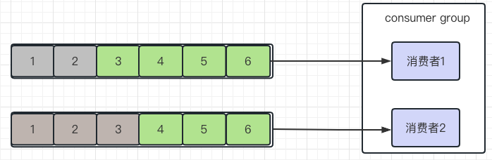
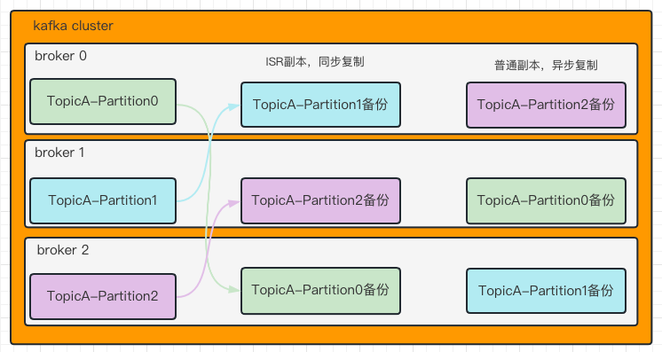

### kafka如何保证消息不丢失 

1.   生产者发送消息到Broker丢失

     -   设置异步发送消息
     -   如果出现异常则重试

2.   消息在Broker中存储丢失

     -   发送确认机制acks
         -   0：生产者发送过来的数据，不需要等待数据落盘就应答；消息有丢失风险，但是速度快
         -   1：生产者发送过来的数据，Leader收到数据后应答；能保证leader保存 一份数据
         -   -1(all)：生产者发送过来的数据，Leader和isr队列里面的所有节点收齐数据后应答。-1和all等价

3.   消费者从Broker消费消息丢失

     丢失问题：消费者默认是按期自动提交消费偏移量，默认是每5秒提交一次，如果出现重平衡可能会出现重复消费数据或丢失数据

     -   禁用自动提交，改为手动提交
     -   提交方式：同步+异步组合提交

### 重平衡

>   重平衡发送情况：
>
>   分区个数增加
>
>   对topic订阅发生变化
>
>   消费者组成员增加或者离开，消费者组中有消费者宕机或者增加消费者

1.   如果消费者2消费消息偏移量为5，但是只提交偏移量到3宕机，偏移量4、5的消息就会被重复消费，
2.   如果消费者2消费到3并且提交了偏移量，但是消费者2宕机了，消费者2消费的消息就会丢失

### kafka如何保证消费的顺序性

topic的每个分区只能有消费者组中的一个消费者消费。所以kafka只能保证单分区消息消费有序，如果需要消息消费有序则需要将所有的消息都放在相同的分区

-   发送消息时指定分区号
-   发送消息时按照相同的业务设置相同的key

### kafka高可用机制

1.   集群模式

     -   kafka服务端由Broker的服务进程构成，一个kafka集群有多个broker组成
     -   当集群上某一台服务器宕机了，其他机器上的Broker也能对外提供服务

2.   分区备份机制

     -   一个topic有多个分区，每个分区有多个副本，其中一个是leader，其它的为follower，副本存在不同的Broker中

     -   所有的分区副本内容都是相同的，如果leader发生了故障，会自动将其中一个follower提升为leader

         -   ISR副本，需要同步复制的副本，如果leader失效需要选出新的leader
         -   优先选举ISR副本中选择leader，因为ISR副本中的数据是与leader最接近的
         -   如果ISR副本的follower都不可用，则在普通副本中选取

         

### kafka中的高性能设计

1.   消息分区：不受单台服务器的限制，可以不受限的处理更多的数据
2.   顺序读写：磁盘顺序读写，提升读写效率
3.   页缓存：把磁盘中的数据缓存到内存中，把对磁盘的访问变为对内存的访问
4.   零拷贝：减少上下文切换以及数据拷贝
5.   消息压缩：家烧磁盘IO和网络IO
6.   分批发送：将消息打包批量发送，减少网络开销

